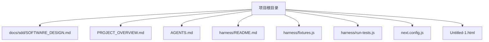
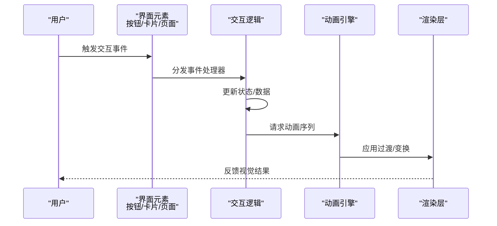
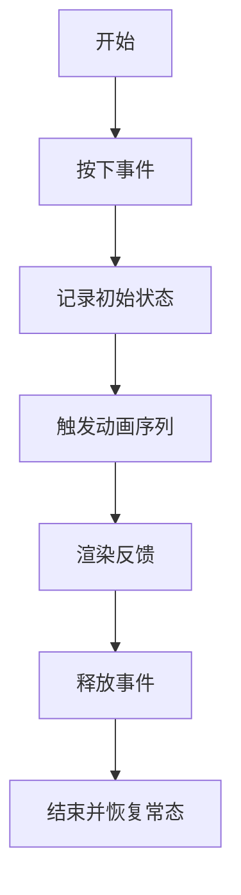
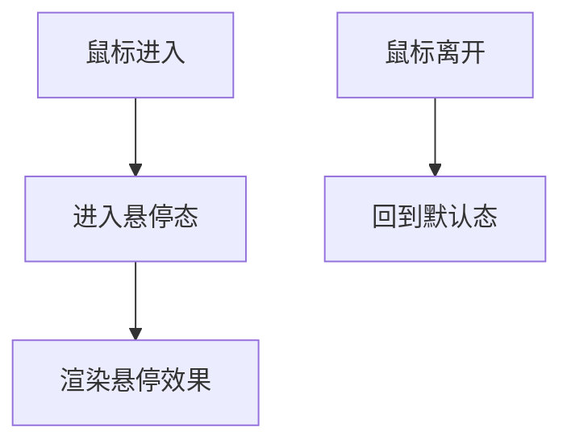
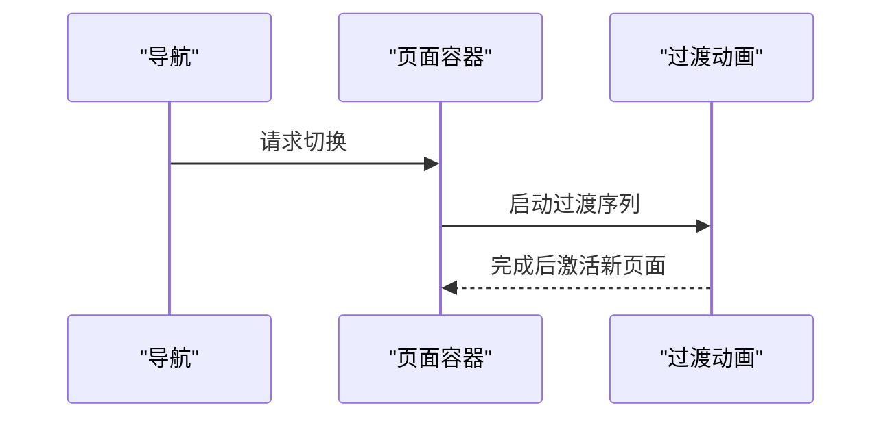
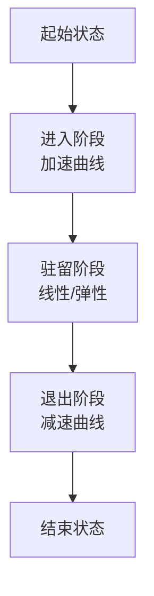
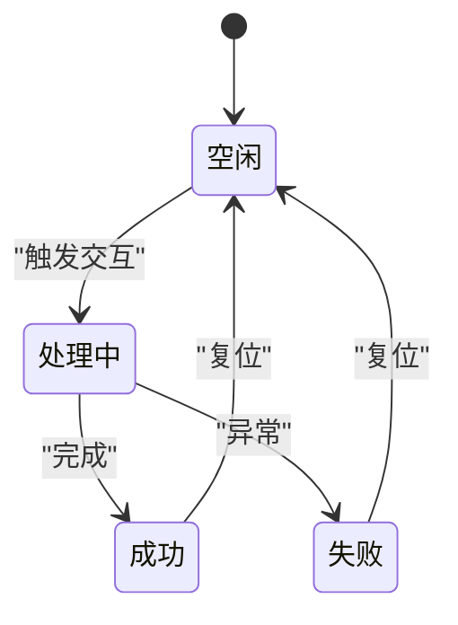
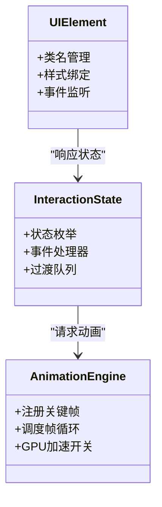
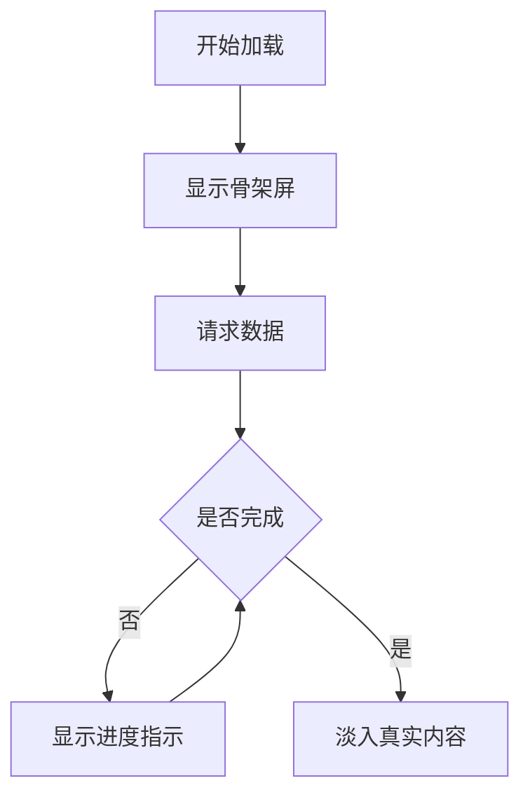
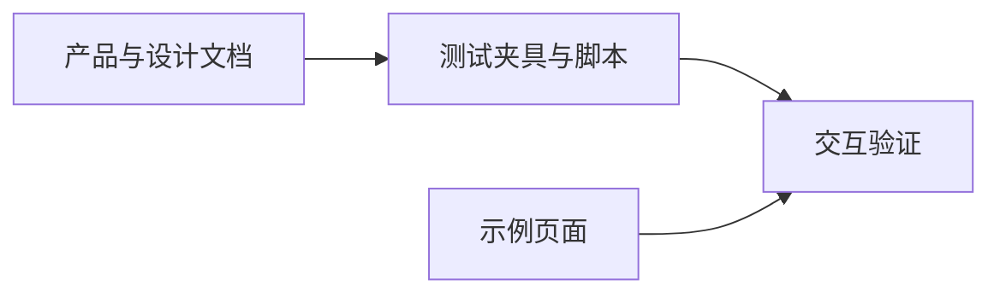

# 动画与交互设计

<cite>
**本文引用的文件**
- [PROJECT_OVERVIEW.md](file://PROJECT_OVERVIEW.md)
- [AGENTS.md](file://AGENTS.md)
- [docs\sdd\SOFTWARE_DESIGN.md](file://docs\sdd\SOFTWARE_DESIGN.md)
- [harness\README.md](file://harness\README.md)
- [harness\fixtures.js](file://harness\fixtures.js)
- [harness\run-tests.js](file://harness\run-tests.js)
- [next.config.js](file://next.config.js)
- [Untitled-1.html](file://Untitled-1.html)
</cite>

## 目录
1. [引言](#引言)
2. [项目结构](#项目结构)
3. [核心组件](#核心组件)
4. [架构总览](#架构总览)
5. [详细组件分析](#详细组件分析)
6. [依赖分析](#依赖分析)
7. [性能考虑](#性能考虑)
8. [故障排查指南](#故障排查指南)
9. [结论](#结论)
10. [附录](#附录)

## 引言
本设计文档面向用户体验设计师与前端开发者，围绕“城市漫步探索”应用的动画与交互进行系统化规范说明。内容涵盖微交互规范（按钮点击、卡片悬停、页面切换）、动画时序与效果实现、用户交互模式与反馈机制、状态管理与过渡效果、加载动画标准以及性能优化策略，旨在统一交互体验并提升可用性与流畅度。

## 项目结构
当前仓库包含产品概览、技术设计文档、测试夹具与运行脚本、以及一个示例 HTML 页面。整体呈现为多文档协作与测试驱动的结构，便于在不同阶段对交互与动画进行验证与迭代。

**图表来源**
- [PROJECT_OVERVIEW.md](file://PROJECT_OVERVIEW.md)
- [AGENTS.md](file://AGENTS.md)
- [docs\sdd\SOFTWARE_DESIGN.md](file://docs\sdd\SOFTWARE_DESIGN.md)
- [harness\README.md](file://harness\README.md)
- [harness\fixtures.js](file://harness\fixtures.js)
- [harness\run-tests.js](file://harness\run-tests.js)
- [next.config.js](file://next.config.js)
- [Untitled-1.html](file://Untitled-1.html)

**章节来源**
- [PROJECT_OVERVIEW.md](file://PROJECT_OVERVIEW.md)
- [docs\sdd\SOFTWARE_DESIGN.md](file://docs\sdd\SOFTWARE_DESIGN.md)

## 核心组件
- 产品与技术背景：通过产品概览与软件设计文档，明确应用目标、功能边界与技术栈方向，为动画与交互设计提供上下文依据。
- 测试与验证：Harness 提供测试夹具与运行脚本，支持对交互行为进行自动化验证，保障动画与交互的一致性与稳定性。
- 示例页面：示例 HTML 页面可用于快速验证基础交互与动画原型，便于在开发早期进行视觉与交互迭代。

**章节来源**
- [PROJECT_OVERVIEW.md](file://PROJECT_OVERVIEW.md)
- [docs\sdd\SOFTWARE_DESIGN.md](file://docs\sdd\SOFTWARE_DESIGN.md)
- [harness\README.md](file://harness\README.md)
- [harness\fixtures.js](file://harness\fixtures.js)
- [harness\run-tests.js](file://harness\run-tests.js)
- [Untitled-1.html](file://Untitled-1.html)

## 架构总览
下图展示从用户交互到动画执行的整体流程，包括事件捕获、状态更新、动画触发与渲染反馈等环节。

[此图为概念性流程示意，不直接映射具体源码文件]

## 详细组件分析

### 微交互规范：按钮点击
- 触发条件：鼠标按下/触摸按压、释放、取消等事件序列。
- 状态定义：默认态、悬停态、按下态、禁用态。
- 动效建议：
  - 按钮按下：轻微缩放或阴影变化，反馈按压力度。
  - 成功/失败：颜色渐变或波纹扩散，持续时间控制在合理区间。
- 时序要点：按下到释放的完整链路需保持连贯，避免长尾延迟。
- 可访问性：提供键盘可达性与高对比度反馈。

[此图为概念性流程示意，不直接映射具体源码文件]

### 微交互规范：卡片悬停
- 触发条件：鼠标进入/离开卡片区域。
- 状态定义：默认态、悬停态、选中态。
- 动效建议：
  - 卡片轻微上浮与阴影增强，突出层级关系。
  - 内容区出现工具栏或操作入口，采用淡入/滑入。
- 性能建议：使用 transform 与 opacity，避免触发布局抖动。

[此图为概念性流程示意，不直接映射具体源码文件]

### 微交互规范：页面切换
- 触发条件：导航点击、手势滑动、路由变更。
- 状态定义：当前页、目标页、过渡中。
- 动效建议：
  - 切换方向：左右滑动、淡入淡出、缩放进出等。
  - 过渡时序：起止速度曲线一致，避免突兀加速/减速。
- 资源管理：懒加载与骨架屏结合，减少白屏时间。

[此图为概念性流程示意，不直接映射具体源码文件]

### 动画时序与效果实现
- 时间轴管理：将动画拆分为多个阶段（进入、驻留、退出），每个阶段设定缓动函数与持续时间。
- 关键帧策略：优先使用 transform 与 opacity，配合 GPU 加速；避免频繁触发布局与绘制。
- 帧率与节流：在移动设备上建议维持稳定帧率，必要时启用 requestAnimationFrame 或 throttle/debounce。

[此图为概念性流程示意，不直接映射具体源码文件]

### 用户交互模式与反馈机制
- 即时反馈：点击、滑动、输入等动作应有即时视觉或触觉反馈。
- 渐进式披露：通过折叠/展开、模态弹窗等方式逐步暴露信息。
- 错误与重试：错误提示采用柔和色彩与可关闭操作，提供一键重试或自动重试策略。

[此图为概念性状态示意，不直接映射具体源码文件]

### 交互状态管理与过渡效果
- 状态机模型：将复杂交互抽象为有限状态机，明确状态间转换条件与动作。
- 过渡策略：页面级过渡采用统一时序曲线，组件级过渡根据重要性调整时长与缓动。
- 数据驱动：通过状态变更驱动 DOM 属性与类名切换，确保动画与业务逻辑解耦。

[此图为概念性类图示意，不直接映射具体源码文件]

### 加载动画标准规范
- 骨架屏：在数据未就绪时显示占位形状，降低感知延迟。
- 进度指示：小尺寸进度条或环形指示器，避免遮挡主要内容。
- 自适应策略：根据网络状况与资源大小动态调整加载策略。

[此图为概念性流程示意，不直接映射具体源码文件]

## 依赖分析
- 文档与设计：产品概览与软件设计文档为交互与动画提供需求与约束。
- 测试夹具：fixtures 与 run-tests 脚本用于验证交互行为与动画一致性。
- 示例页面：HTML 示例可用于快速原型验证与跨浏览器兼容性检查。

**图表来源**
- [PROJECT_OVERVIEW.md](file://PROJECT_OVERVIEW.md)
- [docs\sdd\SOFTWARE_DESIGN.md](file://docs\sdd\SOFTWARE_DESIGN.md)
- [harness\README.md](file://harness\README.md)
- [harness\fixtures.js](file://harness\fixtures.js)
- [harness\run-tests.js](file://harness\run-tests.js)
- [Untitled-1.html](file://Untitled-1.html)

**章节来源**
- [PROJECT_OVERVIEW.md](file://PROJECT_OVERVIEW.md)
- [docs\sdd\SOFTWARE_DESIGN.md](file://docs\sdd\SOFTWARE_DESIGN.md)
- [harness\README.md](file://harness\README.md)
- [harness\fixtures.js](file://harness\fixtures.js)
- [harness\run-tests.js](file://harness\run-tests.js)
- [Untitled-1.html](file://Untitled-1.html)

## 性能考虑
- 使用 transform 与 opacity 实现动画，避免触发布局与重绘。
- 控制动画数量与并发，优先保证关键路径动画的流畅性。
- 在移动端启用硬件加速开关，并监控帧率与内存占用。
- 对高频事件（如滚动、触摸）使用节流/去抖，减少不必要的计算。
- 采用懒加载与骨架屏策略，缩短首屏感知时间。

[本节为通用性能指导，不直接分析具体文件]

## 故障排查指南
- 动画卡顿：检查是否存在强制同步布局、频繁重排或大尺寸图片/视频参与动画。
- 事件冲突：确认事件冒泡与阻止策略，避免重复触发与竞态条件。
- 兼容性问题：针对不同浏览器核对 CSS 动画属性前缀与默认值差异。
- 测试验证：利用测试夹具与运行脚本对关键交互路径进行回归验证。

**章节来源**
- [harness\README.md](file://harness\README.md)
- [harness\fixtures.js](file://harness\fixtures.js)
- [harness\run-tests.js](file://harness\run-tests.js)

## 结论
通过建立统一的微交互规范、明确动画时序与状态管理策略，并结合测试验证与性能优化手段，“城市漫步探索”应用可在多端提供一致且流畅的交互体验。建议在后续迭代中持续收集用户反馈，完善动画细节与过渡效果，确保交互自然、高效且富有表现力。

## 附录
- 示例页面：可用于快速验证交互原型与动画效果。
- 技术配置：Next.js 配置文件可用于统一构建与打包策略，间接影响动画与交互的加载与渲染性能。

**章节来源**
- [next.config.js](file://next.config.js)
- [Untitled-1.html](file://Untitled-1.html)