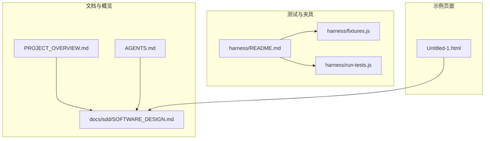
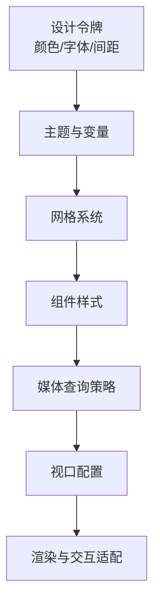
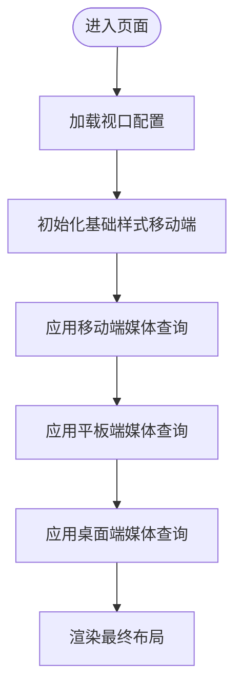
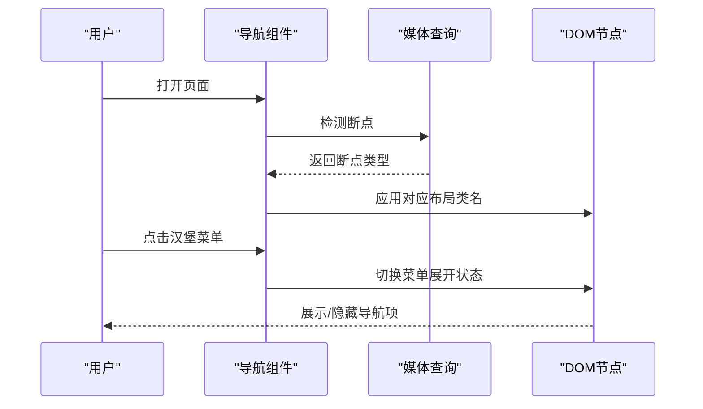
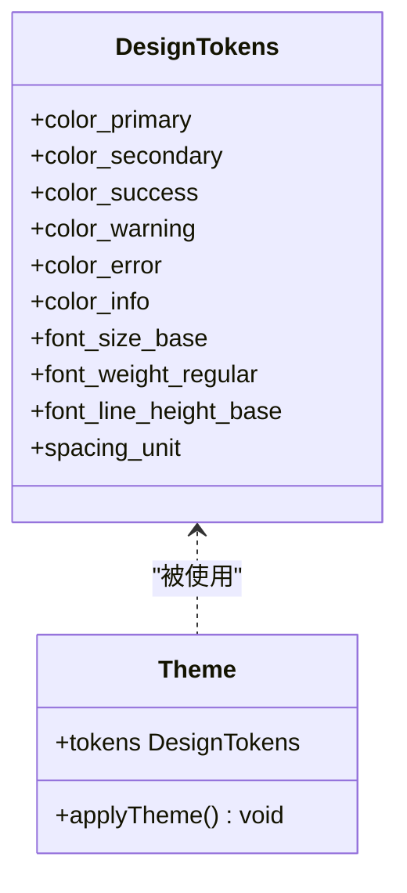
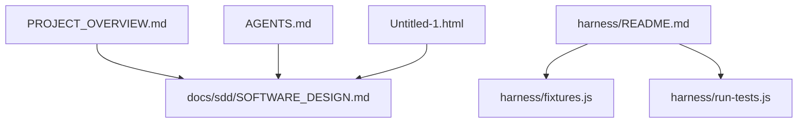

# 响应式设计规范

<cite>
**本文档引用的文件**
- [PROJECT_OVERVIEW.md](file://PROJECT_OVERVIEW.md)
- [AGENTS.md](file://AGENTS.md)
- [docs/sdd/SOFTWARE_DESIGN.md](file://docs/sdd/SOFTWARE_DESIGN.md)
- [harness/README.md](file://harness/README.md)
- [harness/fixtures.js](file://harness/fixtures.js)
- [harness/run-tests.js](file://harness/run-tests.js)
- [Untitled-1.html](file://Untitled-1.html)
</cite>

## 目录
1. [引言](#引言)
2. [项目结构](#项目结构)
3. [核心组件](#核心组件)
4. [架构总览](#架构总览)
5. [详细组件分析](#详细组件分析)
6. [依赖关系分析](#依赖关系分析)
7. [性能考虑](#性能考虑)
8. [故障排除指南](#故障排除指南)
9. [结论](#结论)
10. [附录](#附录)

## 引言
本规范面向UI/UX设计师与前端开发者，为“城市漫步探索”应用建立统一的响应式设计系统。内容涵盖断点策略、布局适配、组件响应式实现、移动优先原则、网格系统、媒体查询策略、视口配置、CSS类名规范、组件尺寸与交互适配、设计令牌（颜色、字体、间距）等，确保在移动端、平板端与桌面端的一致体验与可维护性。

## 项目结构
当前仓库包含以下与设计系统相关的关键文件：
- 文档与概览：PROJECT_OVERVIEW.md、AGENTS.md、docs/sdd/SOFTWARE_DESIGN.md
- 测试夹具与测试运行器：harness/README.md、harness/fixtures.js、harness/run-tests.js
- 示例页面：Untitled-1.html

下图展示与响应式设计相关的核心文件及其角色：

**图表来源**
- [PROJECT_OVERVIEW.md](file://PROJECT_OVERVIEW.md)
- [AGENTS.md](file://AGENTS.md)
- [docs/sdd/SOFTWARE_DESIGN.md](file://docs/sdd/SOFTWARE_DESIGN.md)
- [harness/README.md](file://harness/README.md)
- [harness/fixtures.js](file://harness/fixtures.js)
- [harness/run-tests.js](file://harness/run-tests.js)
- [Untitled-1.html](file://Untitled-1.html)

**章节来源**
- [PROJECT_OVERVIEW.md](file://PROJECT_OVERVIEW.md)
- [AGENTS.md](file://AGENTS.md)
- [docs/sdd/SOFTWARE_DESIGN.md](file://docs/sdd/SOFTWARE_DESIGN.md)
- [harness/README.md](file://harness/README.md)
- [harness/fixtures.js](file://harness/fixtures.js)
- [harness/run-tests.js](file://harness/run-tests.js)
- [Untitled-1.html](file://Untitled-1.html)

## 核心组件
- 断点策略：建议采用移动端优先的三段式断点，覆盖移动端（小屏）、平板端（中屏）、桌面端（大屏）。具体断点数值应在项目设计系统中明确并固化到CSS变量或主题令牌中。
- 网格系统：采用流式栅格或CSS Grid/Flexbox混合方案，保证在不同断点下的列数、间距与对齐方式自动调整。
- 媒体查询策略：以最小断点为主，使用min-width媒体查询；避免过度细分断点，减少重复样式。
- 视口配置：在HTML head中设置viewport元标签，确保移动端缩放与布局视口一致。
- 组件响应式实现：按钮、卡片、导航、表单等组件在不同断点下调整尺寸、内边距、字号与行高，并保持可点击目标尺寸符合无障碍要求。
- 设计令牌：颜色系统（主色、辅助色、语义色、灰度）、字体排版（字号、字重、行高、字间距）、间距系统（基础间距倍数、容器留白、组件间距）统一管理与命名。

**章节来源**
- [docs/sdd/SOFTWARE_DESIGN.md](file://docs/sdd/SOFTWARE_DESIGN.md)

## 架构总览
下图展示响应式设计系统的高层架构：从设计令牌到组件样式，再到媒体查询与布局适配的整体流程。

[此图为概念性架构示意，不直接映射具体源码文件]

## 详细组件分析

### 断点与布局适配
- 移动优先：默认样式针对小屏设备编写，随后通过媒体查询逐步增强到中屏与大屏。
- 断点分层：建议将断点命名为mobile、tablet、desktop，并在CSS中以变量形式集中管理，便于跨组件复用。
- 布局适配：卡片列表在小屏显示为单列，在中屏变为双列，在大屏变为三列或四列；导航在小屏折叠为汉堡菜单，在中屏以上展开为横向导航。

[此图为通用流程示意，不直接映射具体源码文件]

**章节来源**
- [docs/sdd/SOFTWARE_DESIGN.md](file://docs/sdd/SOFTWARE_DESIGN.md)

### 组件响应式实现
- 导航组件：小屏使用汉堡菜单，中屏以上使用水平导航；菜单项在小屏下垂直堆叠，内边距增大以满足触控目标尺寸。
- 卡片组件：小屏单列，中屏双列，大屏三列；卡片内间距按断点递增，图片比例自适应容器宽度。
- 表单组件：输入框与按钮在小屏下增大高度与内边距，标签与提示文字在中屏以上缩小以节省空间。
- 按钮组：在小屏下垂直排列，中屏以上水平排列并调整间距。

[此图为通用交互示意，不直接映射具体源码文件]

**章节来源**
- [docs/sdd/SOFTWARE_DESIGN.md](file://docs/sdd/SOFTWARE_DESIGN.md)

### CSS类名使用规范
- 命名约定：采用BEM或类似层级化命名，如“.btn”、“.btn--primary”、“.card__title”，确保可读性与可维护性。
- 布局类：以“layout-”前缀区分布局容器，如“.layout-container”、“.layout-grid”，避免与组件类冲突。
- 状态类：以“is-”或“has-”前缀表示状态，如“.is-active”、“.has-error”，便于调试与样式覆盖。
- 断点类：以“u-[breakpoint]-”前缀标识断点级样式，如“.u-mobile-hidden”、“.u-tablet-show”，减少媒体查询重复定义。

**章节来源**
- [docs/sdd/SOFTWARE_DESIGN.md](file://docs/sdd/SOFTWARE_DESIGN.md)

### 设计令牌（Design Tokens）
- 颜色系统：定义主色、辅助色、语义色（成功/警告/错误/信息）与灰度系统；为每种颜色提供明暗两套变体，满足深浅主题切换。
- 字体排版：定义字号等级（标题、正文、说明）、字重（常规/强调）、行高与字间距；确保在不同断点下字号与行高的可读性。
- 间距系统：定义基础间距单位（如4px/8px），并基于该单位生成组件间距、容器留白与网格间距的倍数序列。

[此图为概念性模型示意，不直接映射具体源码文件]

**章节来源**
- [docs/sdd/SOFTWARE_DESIGN.md](file://docs/sdd/SOFTWARE_DESIGN.md)

## 依赖关系分析
- 文档与设计系统：PROJECT_OVERVIEW.md与AGENTS.md提供项目背景与角色职责，SOFTWARE_DESIGN.md提供软件设计与组件规范，三者共同构成设计系统的基础文档链。
- 测试与夹具：harness目录下的README、fixtures.js与run-tests.js用于测试执行与夹具准备，间接保障响应式样式的稳定性与回归验证。
- 示例页面：Untitled-1.html作为示例页面，可用于快速验证断点与布局效果。

**图表来源**
- [PROJECT_OVERVIEW.md](file://PROJECT_OVERVIEW.md)
- [AGENTS.md](file://AGENTS.md)
- [docs/sdd/SOFTWARE_DESIGN.md](file://docs/sdd/SOFTWARE_DESIGN.md)
- [harness/README.md](file://harness/README.md)
- [harness/fixtures.js](file://harness/fixtures.js)
- [harness/run-tests.js](file://harness/run-tests.js)
- [Untitled-1.html](file://Untitled-1.html)

**章节来源**
- [PROJECT_OVERVIEW.md](file://PROJECT_OVERVIEW.md)
- [AGENTS.md](file://AGENTS.md)
- [docs/sdd/SOFTWARE_DESIGN.md](file://docs/sdd/SOFTWARE_DESIGN.md)
- [harness/README.md](file://harness/README.md)
- [harness/fixtures.js](file://harness/fixtures.js)
- [harness/run-tests.js](file://harness/run-tests.js)
- [Untitled-1.html](file://Untitled-1.html)

## 性能考虑
- 减少重绘与回流：避免在滚动过程中频繁修改布局属性；使用transform与opacity进行动画。
- 媒体查询优化：合并断点相关样式，减少CSS体积；仅在必要时引入额外样式。
- 资源加载：图片与图标采用懒加载与合适尺寸，避免在小屏上加载过大资源。
- 可访问性：确保触控目标尺寸与对比度满足无障碍标准，文本在小屏下可缩放而不截断。

[本节为通用指导，不直接分析具体文件]

## 故障排除指南
- 断点不生效：检查媒体查询语法与断点顺序；确认视口配置正确；核对CSS加载顺序与优先级。
- 布局错位：检查容器与子元素的盒模型与flex/grid属性；确认断点类是否正确应用。
- 交互异常：在小屏下验证触摸目标尺寸与事件绑定；检查JavaScript对断点的监听与状态切换逻辑。
- 测试验证：使用harness中的测试脚本与夹具进行自动化回归，确保关键断点下的布局稳定。

**章节来源**
- [harness/README.md](file://harness/README.md)
- [harness/fixtures.js](file://harness/fixtures.js)
- [harness/run-tests.js](file://harness/run-tests.js)

## 结论
通过统一的断点策略、移动优先原则、设计令牌与组件规范，结合严谨的媒体查询与测试流程，“城市漫步探索”应用可在多终端提供一致、高效且可维护的用户体验。建议在后续迭代中持续完善令牌体系与组件库，并加强自动化测试以保障质量。

## 附录
- 视口配置：在HTML head中设置viewport元标签，确保移动端缩放与布局视口一致。
- 示例页面：使用Untitled-1.html快速验证断点与布局效果，便于快速迭代与回归。

**章节来源**
- [Untitled-1.html](file://Untitled-1.html)