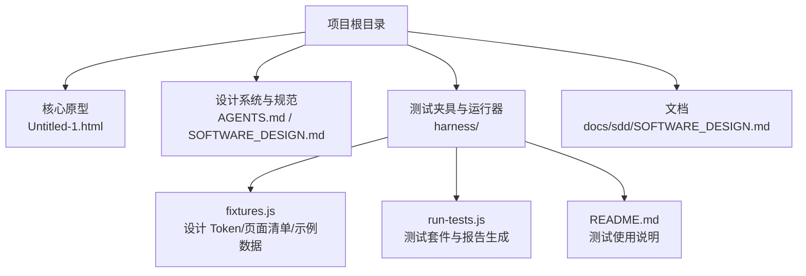
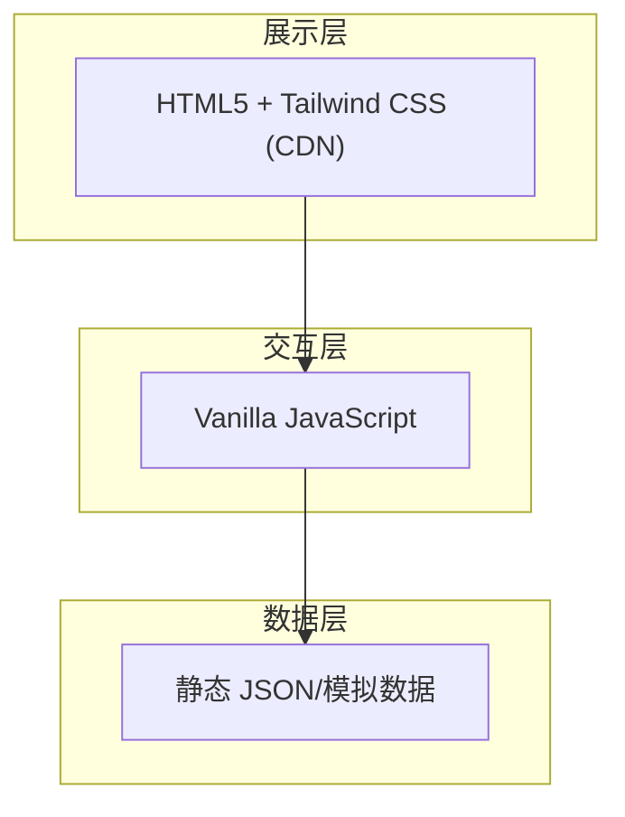
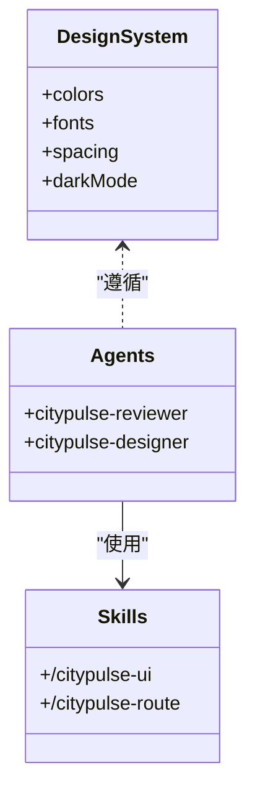
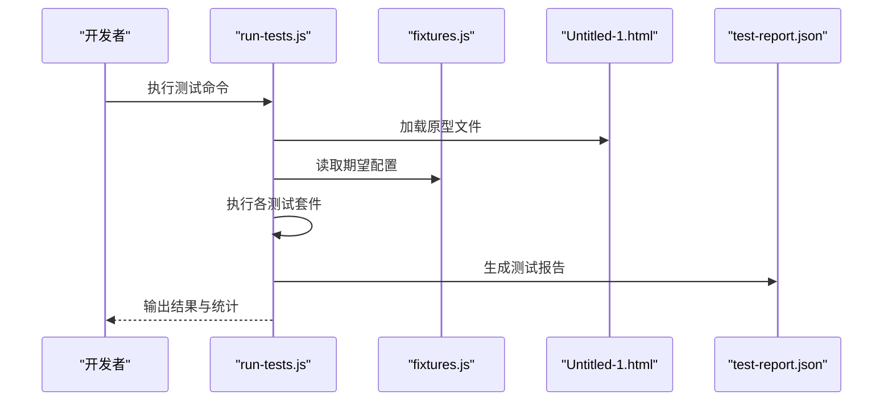
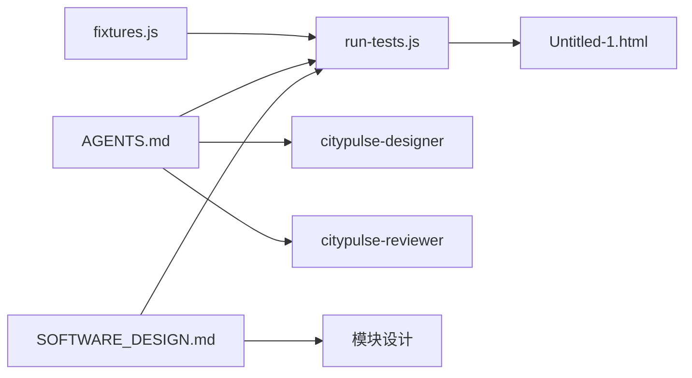

# 开发指南

<cite>
**本文引用的文件**
- [AGENTS.md](file://AGENTS.md)
- [PROJECT_OVERVIEW.md](file://PROJECT_OVERVIEW.md)
- [docs/sdd/SOFTWARE_DESIGN.md](file://docs/sdd/SOFTWARE_DESIGN.md)
- [harness/README.md](file://harness/README.md)
- [harness/fixtures.js](file://harness/fixtures.js)
- [harness/run-tests.js](file://harness/run-tests.js)
</cite>

## 目录
1. [引言](#引言)
2. [项目结构](#项目结构)
3. [核心组件](#核心组件)
4. [架构总览](#架构总览)
5. [详细组件分析](#详细组件分析)
6. [依赖关系分析](#依赖关系分析)
7. [性能考虑](#性能考虑)
8. [故障排查指南](#故障排查指南)
9. [结论](#结论)
10. [附录](#附录)

## 引言
本开发指南面向新加入的开发者，帮助快速理解并参与“城市漫步探索应用”项目的开发。项目采用纯 HTML + Tailwind CSS 的 UI 原型方式，包含 7 个页面设计（桌面端 + 移动端），并通过测试夹具与测试运行器保障设计系统合规性、响应式设计、可访问性与交互功能。文档涵盖项目设置与环境配置、开发工作流程与代码规范、开发约定（Agents 规范）、团队协作模式与版本控制策略、代码组织结构与命名规范、注释标准与最佳实践、开发环境搭建步骤、调试技巧与性能优化建议。

## 项目结构
项目采用“原型 + 测试夹具 + 设计系统”的组织方式：
- 核心原型文件：包含所有页面的单一 HTML 文件
- 设计系统与规范：通过 AGENTS.md 与 SOFTWARE_DESIGN.md 明确设计 Token、组件规范与交互模式
- 测试夹具与运行器：harness 目录提供测试夹具数据与自动化测试运行器
- 文档：docs/sdd 下的 SDD 文档详细描述模块设计、数据模型与响应式规范

图表来源
- [harness/README.md:1-27](file://harness/README.md#L1-L27)
- [harness/fixtures.js:1-136](file://harness/fixtures.js#L1-L136)
- [harness/run-tests.js:1-417](file://harness/run-tests.js#L1-L417)
- [AGENTS.md:28-59](file://AGENTS.md#L28-L59)
- [docs/sdd/SOFTWARE_DESIGN.md:1-378](file://docs/sdd/SOFTWARE_DESIGN.md#L1-L378)

章节来源
- [AGENTS.md:1-59](file://AGENTS.md#L1-L59)
- [PROJECT_OVERVIEW.md:155-224](file://PROJECT_OVERVIEW.md#L155-L224)
- [harness/README.md:1-27](file://harness/README.md#L1-L27)
- [harness/fixtures.js:1-136](file://harness/fixtures.js#L1-L136)
- [harness/run-tests.js:1-417](file://harness/run-tests.js#L1-L417)
- [docs/sdd/SOFTWARE_DESIGN.md:24-60](file://docs/sdd/SOFTWARE_DESIGN.md#L24-L60)

## 核心组件
- 设计系统与 Agents
  - 设计系统：颜色 Token、字体规范、间距 Token、暗色模式等
  - Agents：citypulse-reviewer（代码审查）、citypulse-designer（UI 设计）
  - Skills：/citypulse-ui、/citypulse-route
- 测试夹具与运行器
  - fixtures.js：设计 Token、字体、间距、页面清单、导航项、卡片类型、示例数据
  - run-tests.js：设计系统合规性、页面结构、响应式设计、可访问性、交互功能测试套件
- 文档与规范
  - SOFTWARE_DESIGN.md：模块设计、共享组件规范、数据模型、响应式与动画规范

章节来源
- [AGENTS.md:8-27](file://AGENTS.md#L8-L27)
- [AGENTS.md:28-59](file://AGENTS.md#L28-L59)
- [harness/fixtures.js:6-135](file://harness/fixtures.js#L6-L135)
- [harness/run-tests.js:48-401](file://harness/run-tests.js#L48-L401)
- [docs/sdd/SOFTWARE_DESIGN.md:63-161](file://docs/sdd/SOFTWARE_DESIGN.md#L63-L161)

## 架构总览
项目采用“展示层（HTML + Tailwind CSS）+ 交互层（Vanilla JavaScript）+ 数据层（静态 JSON/模拟）”的三层架构，强调设计系统一致性与移动端优先的响应式设计。

图表来源
- [docs/sdd/SOFTWARE_DESIGN.md:28-49](file://docs/sdd/SOFTWARE_DESIGN.md#L28-L49)
- [docs/sdd/SOFTWARE_DESIGN.md:51-59](file://docs/sdd/SOFTWARE_DESIGN.md#L51-L59)

章节来源
- [docs/sdd/SOFTWARE_DESIGN.md:24-60](file://docs/sdd/SOFTWARE_DESIGN.md#L24-L60)

## 详细组件分析

### 设计系统与 Agents 规范
- 设计系统
  - 颜色 Token：主色、容器色、辅助色、表面、背景、错误、轮廓等
  - 字体规范：标题使用 Plus Jakarta Sans，正文使用 Inter
  - 间距 Token：xs/sm/md/lg/xl/2xl、移动端边距、桌面端边距
  - 暗色模式：基于 class 的切换
- Agents 与 Skills
  - citypulse-reviewer：审查设计系统合规性（色彩 Token、字体、响应式、可访问性）
  - citypulse-designer：生成符合品牌的新页面与组件
  - Skills：/citypulse-ui（UI 组件）、/citypulse-route（路线相关页面）

图表来源
- [AGENTS.md:28-59](file://AGENTS.md#L28-L59)
- [docs/sdd/SOFTWARE_DESIGN.md:116-154](file://docs/sdd/SOFTWARE_DESIGN.md#L116-L154)

章节来源
- [AGENTS.md:28-59](file://AGENTS.md#L28-L59)
- [docs/sdd/SOFTWARE_DESIGN.md:116-154](file://docs/sdd/SOFTWARE_DESIGN.md#L116-L154)

### 测试夹具与测试运行器
- 测试夹具 fixtures.js
  - 设计 Token：颜色、字体、间距
  - 页面清单：7 个页面 ID、名称、标记符、期望组件
  - 导航项：底部导航、侧边导航
  - 卡片类型：精选路线、隐藏宝藏、拍照圣地、热门活动、建筑美学
  - 示例数据：路线、POI
- 测试运行器 run-tests.js
  - 设计系统合规性测试：颜色、字体、Material Symbols、Tailwind CDN、设计 Token 一致性、间距 Token
  - 页面结构测试：必需段落、多页面 DOCTYPE、lang 属性、viewport
  - 响应式设计测试：底部导航、移动端隐藏、桌面端侧边栏、响应式间距、网格
  - 可访问性测试：图片 alt、表单标签、按钮内容、语义化 HTML、焦点状态
  - 交互测试：JavaScript、事件监听、Bottom Sheet、滚动交互、悬停与激活状态、过渡与动画

图表来源
- [harness/run-tests.js:48-401](file://harness/run-tests.js#L48-L401)
- [harness/fixtures.js:6-135](file://harness/fixtures.js#L6-L135)

章节来源
- [harness/run-tests.js:88-338](file://harness/run-tests.js#L88-L338)
- [harness/fixtures.js:6-135](file://harness/fixtures.js#L6-L135)
- [harness/README.md:6-27](file://harness/README.md#L6-L27)

### 模块设计与共享组件
- 模块设计
  - 探索发现模块：全屏地图 + POI 推荐，包含 Bottom Sheet、MapMarker、SearchBar、CategoryChips
  - 路线规划模块：路线详情（桌面/移动端），包含 RouteHero、AuthorCard、TimelineStop、CommentSection、MiniMap、RelatedRoutes
  - 社区动态模块：瀑布流布局（桌面）与文章卡片（移动端），包含 FilterTabs、MasonryGrid、FeedCard、ArticleCard、PostFAB
  - 个人中心模块：Bento Grid 统计、保存路线、我的发布，包含 StatsGrid、SavedRoutes、MyPosts、LevelProgress、SideNav
- 共享组件规范
  - 导航组件：TopNavBar、BottomNavBar、SideNav
  - 通用组件：Card、PrimaryButton、Chip、FAB
- 数据模型
  - Route、RouteStop、UserProfile、Post、POI 的字段与类型定义

```mermaid
flowchart TD
Start(["进入模块"]) --> Explore["探索发现模块"]
Start --> Routes["路线规划模块"]
Start --> Community["社区动态模块"]
Start --> Profile["个人中心模块"]
Explore --> ES1["MapContainer"]
Explore --> ES2["SearchBar"]
Explore --> ES3["CategoryChips"]
Explore --> ES4["MapMarker"]
Explore --> ES5["BottomSheet"]
Explore --> ES6["RecommendationCard"]
Routes --> RS1["RouteHero"]
Routes --> RS2["AuthorCard"]
Routes --> RS3["TimelineStop"]
Routes --> RS4["CommentSection"]
Routes --> RS5["MiniMap"]
Routes --> RS6["RelatedRoutes"]
Community --> CS1["FilterTabs"]
Community --> CS2["MasonryGrid"]
Community --> CS3["FeedCard"]
Community --> CS4["ArticleCard"]
Community --> CS5["PostFAB"]
Profile --> PS1["StatsGrid"]
Profile --> PS2["SavedRoutes"]
Profile --> PS3["MyPosts"]
Profile --> PS4["LevelProgress"]
Profile --> PS5["SideNav"]
```

图表来源
- [docs/sdd/SOFTWARE_DESIGN.md:65-161](file://docs/sdd/SOFTWARE_DESIGN.md#L65-L161)
- [docs/sdd/SOFTWARE_DESIGN.md:163-224](file://docs/sdd/SOFTWARE_DESIGN.md#L163-L224)
- [docs/sdd/SOFTWARE_DESIGN.md:226-312](file://docs/sdd/SOFTWARE_DESIGN.md#L226-L312)

章节来源
- [docs/sdd/SOFTWARE_DESIGN.md:63-161](file://docs/sdd/SOFTWARE_DESIGN.md#L63-L161)
- [docs/sdd/SOFTWARE_DESIGN.md:163-224](file://docs/sdd/SOFTWARE_DESIGN.md#L163-L224)
- [docs/sdd/SOFTWARE_DESIGN.md:226-312](file://docs/sdd/SOFTWARE_DESIGN.md#L226-L312)

### 响应式设计与动画规范
- 响应式断点与容器宽度
  - 断点：Mobile（< 768px）、Tablet（768px - 1024px）、Desktop（> 1024px）
  - 容器最大宽度：max-w-[1280px]
  - 移动端边距：px-margin-mobile（16px），桌面端边距：px-margin-desktop（32px）
  - 网格系统：桌面路线详情 lg:grid-cols-12，统计 Bento Grid md:grid-cols-4，社区瀑布流 2/3/4 列
- 动画与微交互
  - 按钮点击 scale(0.95)，卡片悬停增强阴影，图片悬停 scale(1.05)
  - 时间线滚动揭示（700ms），Bottom Sheet 滑动（400ms cubic-bezier），地图标记脉冲（2s infinite）

章节来源
- [docs/sdd/SOFTWARE_DESIGN.md:316-334](file://docs/sdd/SOFTWARE_DESIGN.md#L316-L334)
- [docs/sdd/SOFTWARE_DESIGN.md:337-366](file://docs/sdd/SOFTWARE_DESIGN.md#L337-L366)

## 依赖关系分析
- 设计系统与测试夹具
  - run-tests.js 依赖 fixtures.js 中的期望配置进行断言
  - 测试运行器读取核心原型文件进行结构与内容校验
- Agents 与设计系统
  - citypulse-reviewer 与 citypulse-designer 严格遵循 AGENTS.md 中的颜色、字体、间距与响应式规范
- 文档与实现
  - SOFTWARE_DESIGN.md 描述模块与组件，为 run-tests.js 的页面结构与组件清单提供依据

图表来源
- [harness/run-tests.js:14-43](file://harness/run-tests.js#L14-L43)
- [harness/fixtures.js:6-84](file://harness/fixtures.js#L6-L84)
- [AGENTS.md:28-59](file://AGENTS.md#L28-L59)
- [docs/sdd/SOFTWARE_DESIGN.md:63-161](file://docs/sdd/SOFTWARE_DESIGN.md#L63-L161)

章节来源
- [harness/run-tests.js:14-43](file://harness/run-tests.js#L14-L43)
- [harness/fixtures.js:6-84](file://harness/fixtures.js#L6-L84)
- [AGENTS.md:28-59](file://AGENTS.md#L28-L59)
- [docs/sdd/SOFTWARE_DESIGN.md:63-161](file://docs/sdd/SOFTWARE_DESIGN.md#L63-L161)

## 性能考虑
- 构建与加载
  - 使用 Tailwind CDN 以减少构建时间，便于快速原型迭代
  - 静态资源（字体、图标）通过 CDN 加载，降低本地体积
- 响应式与交互
  - 移动端优先，使用 md: 前缀进行桌面端适配，避免过度的条件判断
  - 微交互使用 CSS 过渡与动画，减少 JavaScript 计算压力
- 测试驱动的质量保障
  - 通过测试夹具与测试运行器在开发阶段即发现设计系统与可访问性问题，降低后期重构成本

## 故障排查指南
- 测试失败定位
  - 设计系统测试失败：检查颜色 Token、字体加载、Material Symbols、Tailwind CDN 是否存在
  - 页面结构测试失败：确认必需段落标记、多页面 DOCTYPE 数量、lang 属性、viewport meta
  - 响应式测试失败：检查底部导航、移动端隐藏类、桌面端侧边栏、响应式间距与网格
  - 可访问性测试失败：为图片补充 alt 或 data-alt，为表单输入补充 placeholder 或 aria-label，确保按钮有内容，使用语义化 HTML，提供焦点状态
  - 交互测试失败：确认存在 JavaScript、事件监听、Bottom Sheet、滚动交互、悬停与激活状态、过渡与动画
- 生成测试报告
  - 测试运行器会在 harness 目录生成 test-report.json，包含详细结果与统计

章节来源
- [harness/run-tests.js:88-338](file://harness/run-tests.js#L88-L338)
- [harness/README.md:6-27](file://harness/README.md#L6-L27)

## 结论
本开发指南围绕“城市漫步探索应用”的设计系统、测试夹具与运行器、模块设计与共享组件、响应式与动画规范进行了系统梳理。通过 Agents 与 Skills 的引入，结合测试驱动的质量保障机制，团队可以高效地完成从原型到可维护代码的演进。建议新成员先熟悉 AGENTS.md 与 SOFTWARE_DESIGN.md，再通过 harness 进行本地验证，最后参考模块设计文档进行功能开发与组件复用。

## 附录
- 开发约定与规范
  - 文件结构：遵循 AGENTS.md 中的目录结构与文件命名
  - 编码规范：lang="zh-CN"、使用 Tailwind CDN、颜色使用设计 Token、标题字体 Plus Jakarta Sans、正文字体 Inter、图标 Material Symbols Outlined、移动端优先、md: 前缀适配桌面端
- 版本控制与协作
  - 使用 GitHub Actions 进行 CI/CD 流水线（自动测试 → 构建 → 部署）
  - 通过测试夹具与测试运行器确保每次变更符合设计系统与可访问性要求
- 未来扩展方向
  - 框架迁移（React/Vue + Vite）、地图集成（高德/Google Maps API）、后端服务（Node.js + Express + PostgreSQL）、用户认证（JWT/OAuth2.0）、实时功能（WebSocket）、PWA（Service Worker）、暗色模式（基于已配置的 darkMode: "class"）

章节来源
- [AGENTS.md:28-59](file://AGENTS.md#L28-L59)
- [PROJECT_OVERVIEW.md:94-113](file://PROJECT_OVERVIEW.md#L94-L113)
- [docs/sdd/SOFTWARE_DESIGN.md:369-378](file://docs/sdd/SOFTWARE_DESIGN.md#L369-L378)