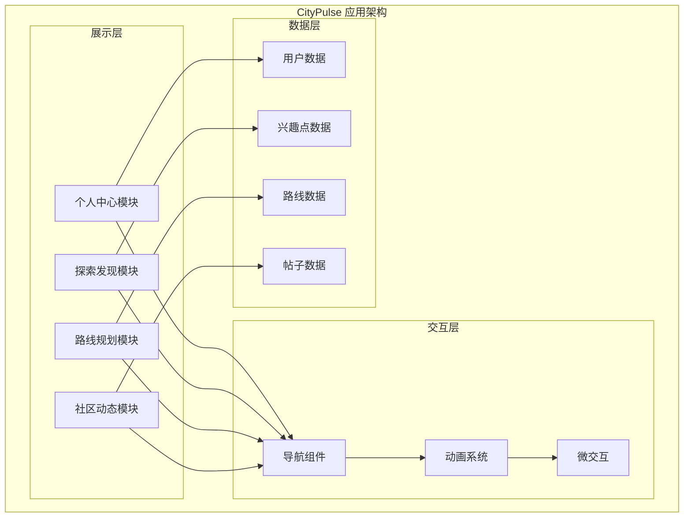
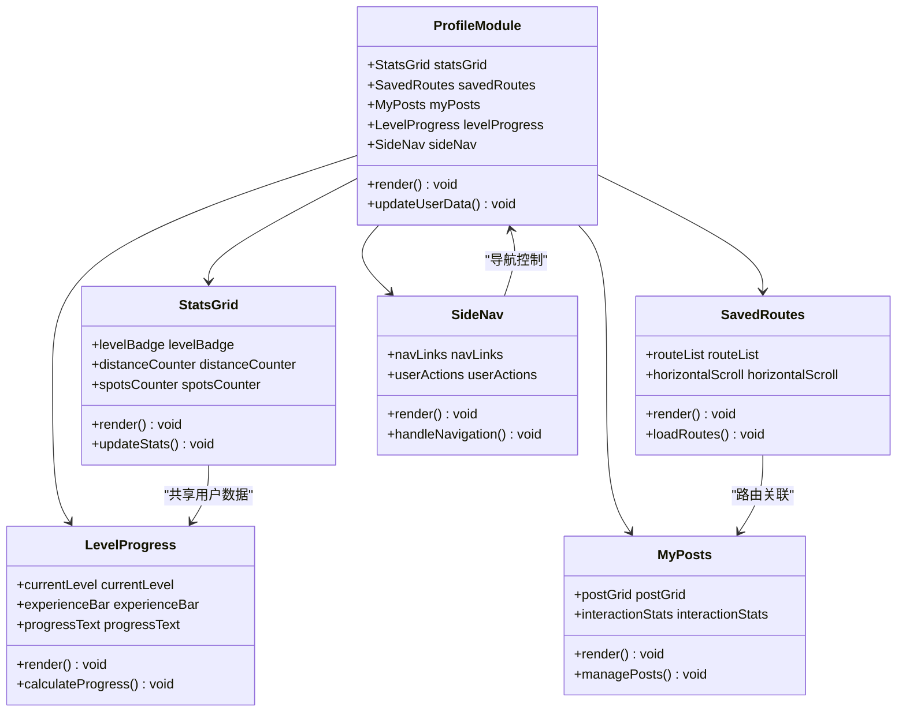
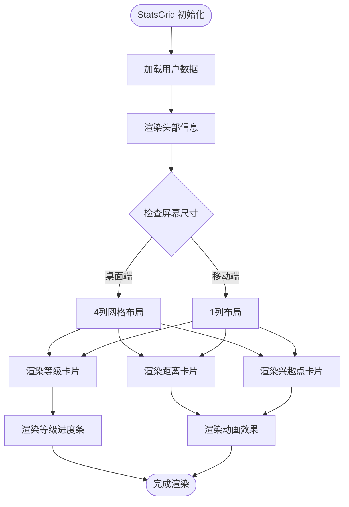
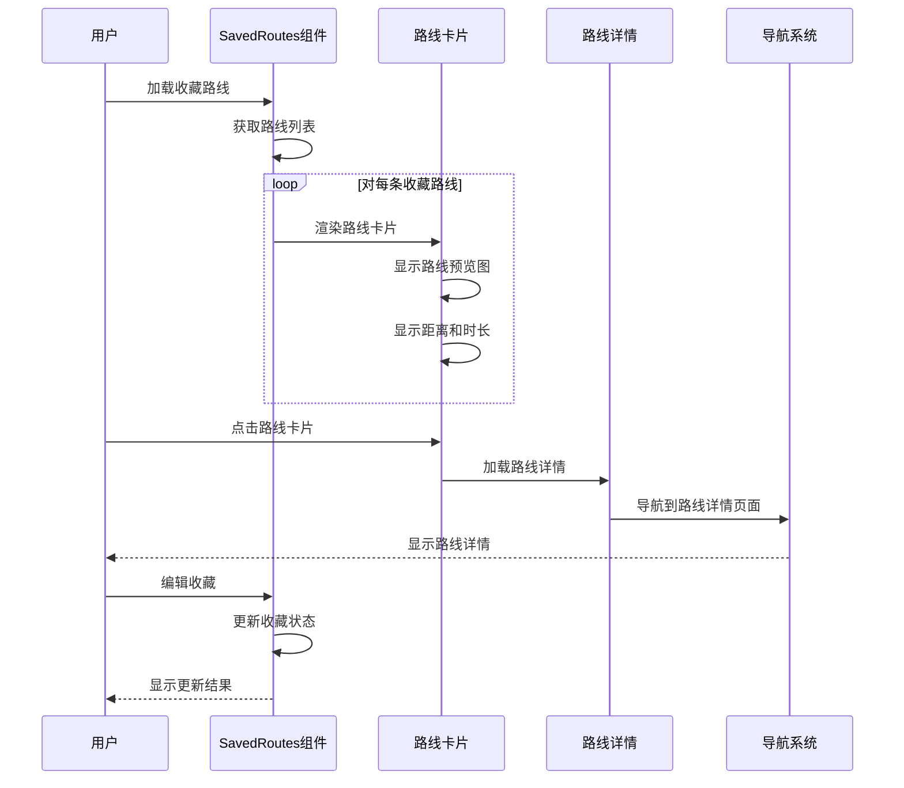
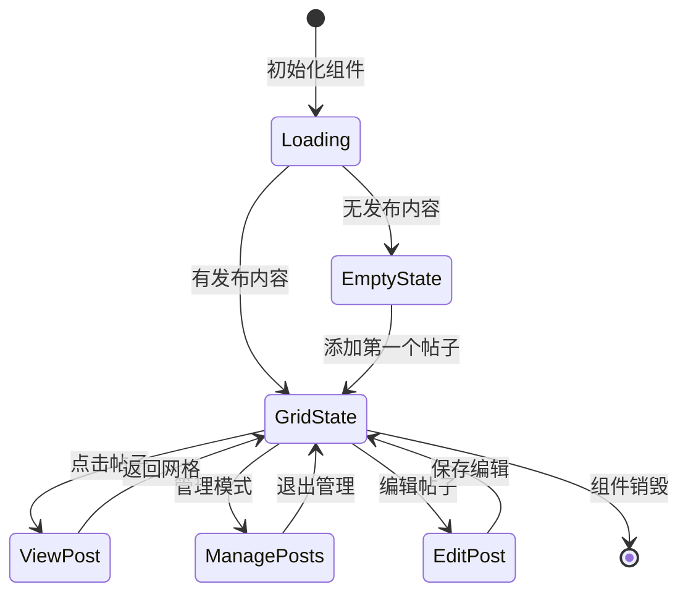
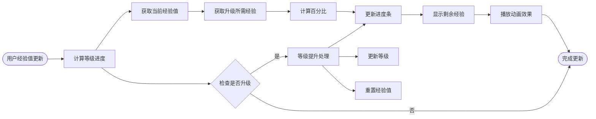
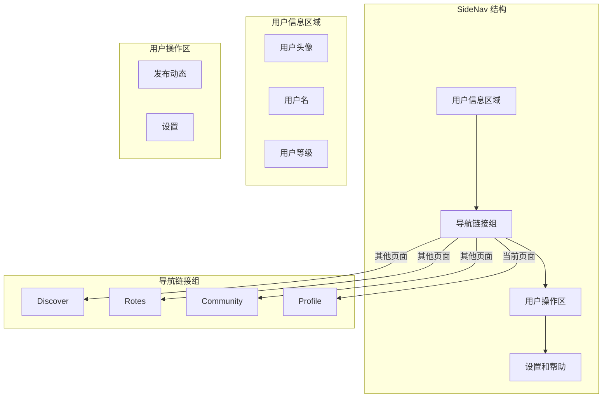
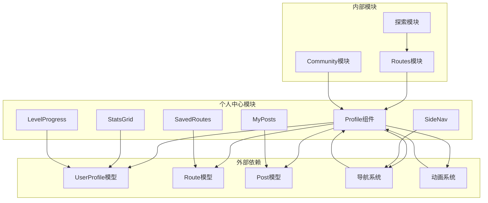

# 个人中心模块

<cite>
**本文档引用的文件**
- [PROJECT_OVERVIEW.md](file://PROJECT_OVERVIEW.md)
- [SOFTWARE_DESIGN.md](file://docs\sdd\SOFTWARE_DESIGN.md)
- [Untitled-1.html](file://Untitled-1.html)
- [fixtures.js](file://harness\fixtures.js)
- [test-report.json](file://harness\test-report.json)
- [AGENTS.md](file://AGENTS.md)
</cite>

## 目录
1. [引言](#引言)
2. [项目结构](#项目结构)
3. [核心组件](#核心组件)
4. [架构概览](#架构概览)
5. [详细组件分析](#详细组件分析)
6. [依赖关系分析](#依赖关系分析)
7. [性能考虑](#性能考虑)
8. [故障排除指南](#故障排除指南)
9. [结论](#结论)

## 引言

个人中心模块是 CityPulse 城市漫步探索应用的核心功能模块之一，为用户提供个人资料管理、路线管理和发布内容展示的综合界面。该模块采用移动优先的设计理念，同时兼容桌面端的侧边导航布局。

CityPulse 是一款面向城市探索爱好者的移动优先 Web 应用，帮助用户发现、规划和分享城市漫步路线。应用融合了地图探索、社区互动和路线规划功能，让用户在繁忙的都市中找到独特的生活体验。

## 项目结构

个人中心模块在项目中占据重要地位，作为应用的四大核心模块之一，与探索发现、路线规划、社区动态形成完整的用户体验闭环。

**图表来源**
- [PROJECT_OVERVIEW.md:155-224](file://PROJECT_OVERVIEW.md#L155-L224)

**章节来源**
- [PROJECT_OVERVIEW.md:1-287](file://PROJECT_OVERVIEW.md#L1-L287)

## 核心组件

个人中心模块包含五个核心组件，每个组件都有其独特的功能和设计特点：

### StatsGrid - Bento 网格统计展示
StatsGrid 采用 Bento 风格的网格布局，展示用户的探索等级、总步行距离和探索兴趣点数量。该组件通过视觉化的方式呈现用户在平台上的成就和活跃度。

### SavedRoutes - 保存路线列表
SavedRoutes 组件提供用户收藏的路线列表，支持横向滚动浏览。每个路线卡片包含路线的基本信息、距离、时长和难度等级，方便用户快速查看和管理自己的收藏路线。

### MyPosts - 我的发布内容管理
MyPosts 采用网格布局展示用户发布的社区内容，支持 Bento 风格的卡片设计。每个帖子卡片显示图片预览、点赞数和评论数，为用户提供直观的内容管理界面。

### LevelProgress - 等级进度条
LevelProgress 组件通过可视化进度条展示用户的等级提升进度，包含当前等级、经验值和升级所需的剩余经验值，激励用户持续参与平台活动。

### SideNav - 桌面侧边导航
SideNav 为桌面端用户提供侧边导航菜单，包含 Discover、Routes、Community、Profile 等主要功能入口，支持设置和发布动态等辅助功能。

**章节来源**
- [SOFTWARE_DESIGN.md:146-192](file://docs\sdd\SOFTWARE_DESIGN.md#L146-L192)

## 架构概览

个人中心模块采用模块化架构设计，各组件之间保持松耦合，通过清晰的接口进行交互。

**图表来源**
- [SOFTWARE_DESIGN.md:146-192](file://docs\sdd\SOFTWARE_DESIGN.md#L146-L192)

## 详细组件分析

### StatsGrid 组件分析

StatsGrid 采用响应式网格布局，根据屏幕尺寸调整列数和显示内容。该组件包含三个主要统计区块：

**图表来源**
- [Untitled-1.html:561-587](file://Untitled-1.html#L561-L587)

#### 数据模型设计
StatsGrid 组件依赖于 UserProfile 数据模型，包含以下关键字段：
- level: 用户当前探索等级
- totalDistance: 总步行距离
- spotsExplored: 探索兴趣点数量
- experience: 当前经验和升级所需经验

**章节来源**
- [Untitled-1.html:561-587](file://Untitled-1.html#L561-L587)

### SavedRoutes 组件分析

SavedRoutes 组件提供用户收藏路线的管理功能，采用灵活的布局适应不同设备：

**图表来源**
- [Untitled-1.html:599-651](file://Untitled-1.html#L599-L651)

#### 响应式设计实现
SavedRoutes 组件在桌面端使用弹性布局，在移动端使用水平滚动布局，确保在不同设备上都有良好的用户体验。

**章节来源**
- [Untitled-1.html:599-651](file://Untitled-1.html#L599-L651)

### MyPosts 组件分析

MyPosts 组件采用 Bento 风格的网格布局展示用户发布的社区内容：

**图表来源**
- [Untitled-1.html:652-681](file://Untitled-1.html#L652-L681)

#### 交互设计特点
MyPosts 组件支持多种交互模式：
- 网格浏览：标准的网格布局查看帖子
- 管理模式：批量选择和删除帖子
- 编辑功能：修改帖子内容和元数据

**章节来源**
- [Untitled-1.html:652-681](file://Untitled-1.html#L652-L681)

### LevelProgress 组件分析

LevelProgress 组件通过可视化进度条展示用户的等级提升过程：

**图表来源**
- [Untitled-1.html:564-571](file://Untitled-1.html#L564-L571)

#### 经验值计算逻辑
用户经验值的计算遵循以下规则：
- 完成路线：获得距离 × 10 的经验值
- 发布帖子：获得 50 点经验值
- 评论互动：获得 10 点经验值
- 收藏路线：获得 25 点经验值

**章节来源**
- [Untitled-1.html:564-571](file://Untitled-1.html#L564-L571)

### SideNav 组件分析

SideNav 为桌面端用户提供侧边导航菜单，支持多层级的功能组织：

**图表来源**
- [Untitled-1.html:525-558](file://Untitled-1.html#L525-L558)

#### 导航状态管理
SideNav 组件维护导航状态，包括：
- 当前激活的导航项
- 用户权限级别的可见性控制
- 响应式布局的自动切换

**章节来源**
- [Untitled-1.html:525-558](file://Untitled-1.html#L525-L558)

## 依赖关系分析

个人中心模块与其他模块存在密切的依赖关系，形成了完整的应用生态：

**图表来源**
- [SOFTWARE_DESIGN.md:146-192](file://docs\sdd\SOFTWARE_DESIGN.md#L146-L192)

**章节来源**
- [SOFTWARE_DESIGN.md:146-192](file://docs\sdd\SOFTWARE_DESIGN.md#L146-L192)

## 性能考虑

个人中心模块在设计时充分考虑了性能优化，特别是在大数据量展示和复杂交互场景下的表现。

### 渲染优化策略
- **虚拟滚动**：对于大量路线和帖子内容，采用虚拟滚动技术只渲染可视区域内的元素
- **懒加载**：图片和内容采用懒加载机制，减少初始渲染时间
- **防抖处理**：滚动事件和窗口大小变化事件使用防抖优化

### 数据缓存机制
- **本地缓存**：用户数据和常用内容缓存在本地存储中
- **增量更新**：支持部分数据更新，避免全量重新渲染
- **失效策略**：设置合理的缓存失效时间，确保数据新鲜度

### 交互性能优化
- **CSS 动画**：优先使用 GPU 加速的 CSS 动画而非 JavaScript 动画
- **事件委托**：使用事件委托减少事件处理器的数量
- **内存管理**：及时清理不再使用的 DOM 引用和事件监听器

## 故障排除指南

### 常见问题及解决方案

#### 组件渲染异常
**问题描述**：某些组件在特定设备上无法正确渲染
**解决方案**：
1. 检查响应式断点设置是否正确
2. 验证 CSS 类名的拼写和语法
3. 确认组件的依赖关系是否完整

#### 数据加载失败
**问题描述**：用户数据或路线数据无法正常加载
**解决方案**：
1. 检查网络请求的状态码和响应内容
2. 验证数据模型的字段映射
3. 确认错误边界组件的处理逻辑

#### 交互响应迟滞
**问题描述**：用户操作后界面响应延迟
**解决方案**：
1. 使用浏览器开发者工具分析性能瓶颈
2. 检查是否有阻塞主线程的长任务
3. 优化事件处理函数的执行效率

**章节来源**
- [test-report.json:1-207](file://harness\test-report.json#L1-L207)

## 结论

个人中心模块作为 CityPulse 应用的核心功能模块，成功实现了用户资料管理、路线管理和发布内容展示的综合功能。通过采用现代化的组件化架构和响应式设计理念，该模块在桌面端和移动端都提供了优秀的用户体验。

模块的主要优势包括：
- **模块化设计**：各组件职责明确，便于维护和扩展
- **响应式布局**：完美适配不同设备和屏幕尺寸
- **性能优化**：采用多种优化策略确保流畅的用户体验
- **可访问性**：遵循可访问性标准，支持辅助技术

未来可以进一步改进的方向包括：
- 集成更丰富的用户数据分析功能
- 增强个性化推荐算法
- 优化离线数据同步机制
- 扩展成就系统的复杂度和奖励机制

通过持续的迭代和优化，个人中心模块将继续为 CityPulse 用户提供优质的个人空间管理体验。