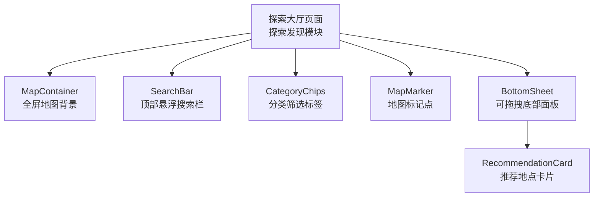
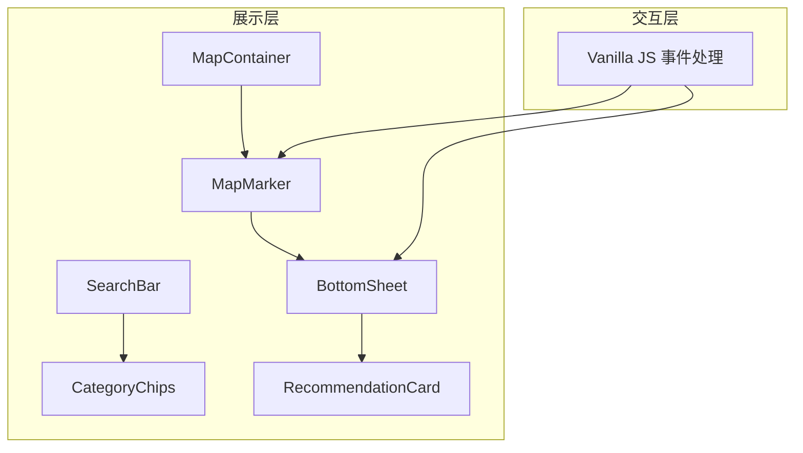
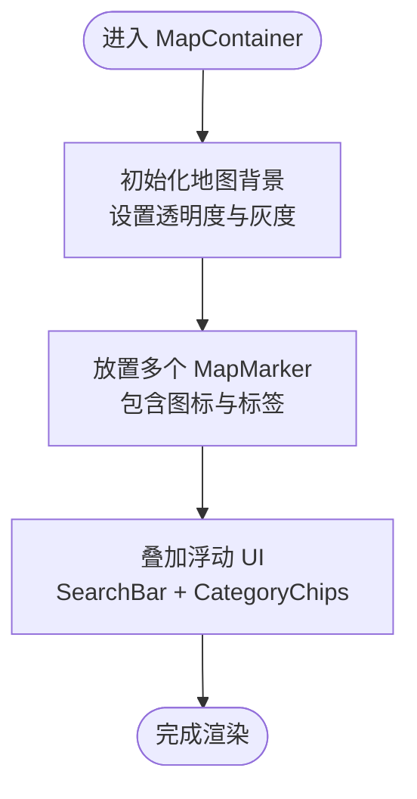
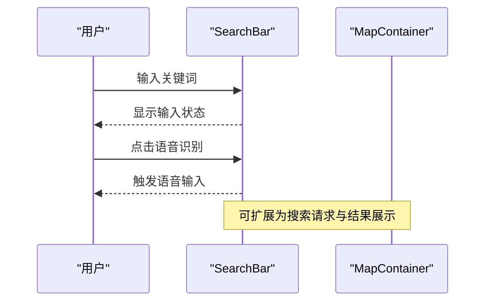
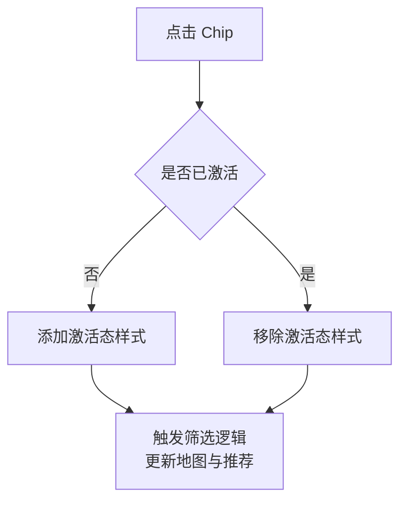
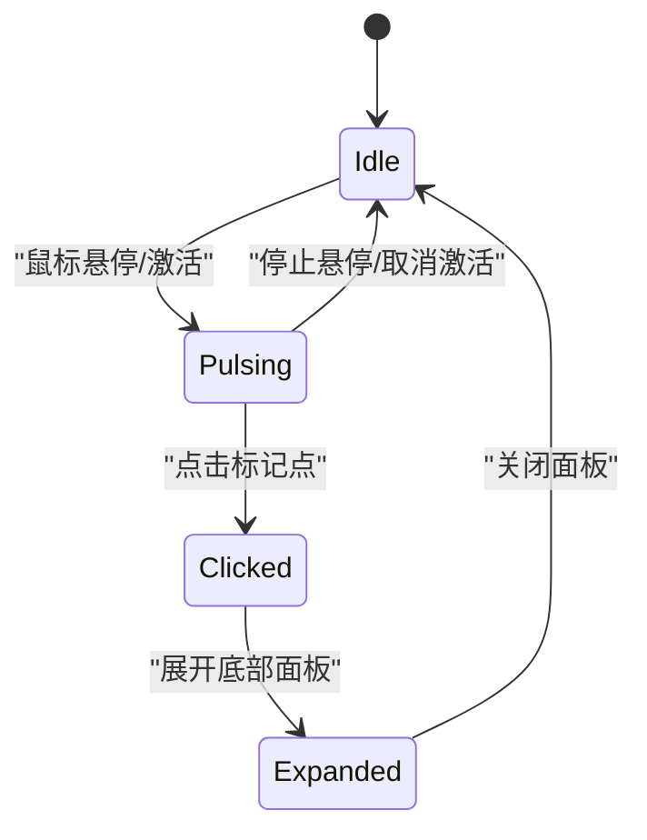
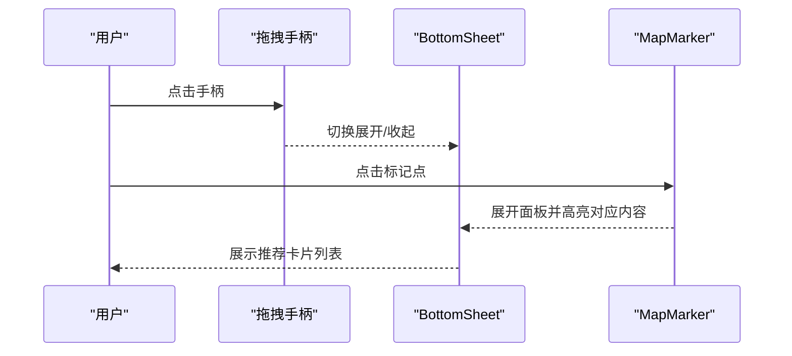
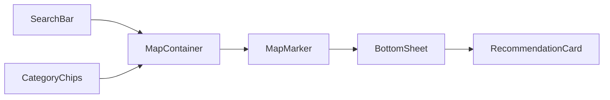

# 探索发现模块

<cite>
**本文引用的文件**
- [PROJECT_OVERVIEW.md](file://PROJECT_OVERVIEW.md)
- [SOFTWARE_DESIGN.md](file://docs/sdd/SOFTWARE_DESIGN.md)
- [Untitled-1.html](file://Untitled-1.html)
- [run-tests.js](file://harness/run-tests.js)
- [fixtures.js](file://harness/fixtures.js)
</cite>

## 目录
1. [引言](#引言)
2. [项目结构](#项目结构)
3. [核心组件](#核心组件)
4. [架构总览](#架构总览)
5. [详细组件分析](#详细组件分析)
6. [依赖关系分析](#依赖关系分析)
7. [性能考虑](#性能考虑)
8. [故障排查指南](#故障排查指南)
9. [结论](#结论)
10. [附录](#附录)

## 引言
本文件聚焦于探索发现模块（Explore Hall）的技术文档，围绕全屏地图实现原理、POI推荐算法、分类筛选系统和底部面板交互逻辑进行深入解析。文档同时说明 MapContainer 组件的实现细节、SearchBar 的搜索功能、CategoryChips 的筛选机制、MapMarker 的脉冲动画效果，以及 BottomSheet 的拖拽交互，并通过组件关系图与用户交互流程图帮助开发者快速理解模块架构与扩展点。

## 项目结构
探索发现模块位于单一 HTML 文件中，采用多页面拼接的方式组织原型页面。探索大厅页面包含全屏地图背景、搜索栏、分类 Chip、地图标记点、可拖拽底部面板与推荐卡片列表等核心元素。该页面使用 Tailwind CSS 作为样式框架，Material Symbols 作为图标库，并通过内联 JavaScript 实现交互逻辑。

图表来源
- [Untitled-1.html:2442-2761](file://Untitled-1.html#L2442-L2761)

章节来源
- [PROJECT_OVERVIEW.md:155-224](file://PROJECT_OVERVIEW.md#L155-L224)
- [SOFTWARE_DESIGN.md:63-95](file://docs/sdd/SOFTWARE_DESIGN.md#L63-L95)

## 核心组件
- MapContainer：全屏地图背景，负责承载地图视图与标记点，提供响应式高度与覆盖层。
- SearchBar：顶部悬浮搜索栏，支持输入与语音识别入口，具备毛玻璃背景与圆角阴影。
- CategoryChips：横向滚动的分类筛选标签，支持多类别选择与视觉状态切换。
- MapMarker：地图标记点，支持脉冲动画与点击事件，用于触发底部面板展示。
- BottomSheet：可拖拽底部面板，支持点击与拖拽交互，提供推荐内容列表。
- RecommendationCard：推荐地点卡片，展示 POI 评分、状态、距离与描述信息。

章节来源
- [SOFTWARE_DESIGN.md:63-95](file://docs/sdd/SOFTWARE_DESIGN.md#L63-L95)
- [Untitled-1.html:2586-2716](file://Untitled-1.html#L2586-L2716)

## 架构总览
探索发现模块采用“展示层 + 交互层”的轻量架构：
- 展示层：HTML 结构 + Tailwind CSS 样式，使用语义化标签与响应式断点。
- 交互层：内联 JavaScript，处理 BottomSheet 拖拽与展开、MapMarker 点击事件、搜索与筛选交互。
- 数据层：当前为静态数据（POI 示例），后续可接入 Mapbox API 与后端服务。

图表来源
- [Untitled-1.html:2586-2761](file://Untitled-1.html#L2586-L2761)

## 详细组件分析

### MapContainer 组件
- 职责：提供全屏地图背景，承载地图标记点与浮动 UI 元素。
- 实现要点：
  - 使用绝对定位与固定高度，确保在不同设备上保持一致的可视高度。
  - 背景图为城市地图图像，设置透明度与灰度以突出标记点。
  - 内嵌多个 MapMarker，每个标记点包含图标与标签气泡。
- 响应式：通过容器高度计算公式适配移动端与桌面端。

图表来源
- [Untitled-1.html:2586-2616](file://Untitled-1.html#L2586-L2616)

章节来源
- [Untitled-1.html:2586-2616](file://Untitled-1.html#L2586-L2616)

### SearchBar 搜索功能
- 职责：提供顶部悬浮搜索栏，支持文本输入与语音识别入口。
- 实现要点：
  - 使用毛玻璃背景与圆角阴影，提升视觉层次。
  - 输入框具备占位符与焦点状态，便于用户输入。
  - 语音识别图标提供便捷入口，增强可用性。
- 交互：当前为静态 UI，未绑定具体搜索逻辑，可扩展为 Mapbox Geocoding 或本地搜索。

图表来源
- [Untitled-1.html:2617-2623](file://Untitled-1.html#L2617-L2623)

章节来源
- [Untitled-1.html:2617-2623](file://Untitled-1.html#L2617-L2623)

### CategoryChips 分类筛选机制
- 职责：提供横向滚动的分类 Chip，支持多类别选择与视觉状态切换。
- 实现要点：
  - 使用水平滚动容器，支持触摸滑动与鼠标滚轮。
  - 激活态 Chip 使用主色背景与白色文字，未激活态使用浅色背景与灰色文字。
  - 通过点击事件切换激活状态，可扩展为过滤地图标记点与推荐列表。
- 响应式：在桌面端保持可见，在移动端通过滚动展示更多分类。

图表来源
- [Untitled-1.html:2624-2642](file://Untitled-1.html#L2624-L2642)

章节来源
- [Untitled-1.html:2624-2642](file://Untitled-1.html#L2624-L2642)

### MapMarker 脉冲动画效果
- 职责：地图标记点，支持脉冲动画与点击事件，用于触发底部面板展示。
- 实现要点：
  - 使用 CSS @keyframes 定义脉冲动画，实现缩放与透明度变化。
  - 激活态标记点（如“正在流行”）使用主色边框与阴影增强视觉引导。
  - 点击标记点触发底部面板展开，可扩展为高亮对应推荐卡片。
- 动画时序：动画周期为 2 秒，无限循环，提升用户注意力。

图表来源
- [Untitled-1.html:2462-2469](file://Untitled-1.html#L2462-L2469)
- [Untitled-1.html:2591-2614](file://Untitled-1.html#L2591-L2614)

章节来源
- [Untitled-1.html:2462-2469](file://Untitled-1.html#L2462-L2469)
- [Untitled-1.html:2591-2614](file://Untitled-1.html#L2591-L2614)

### BottomSheet 拖拽交互
- 职责：可拖拽的底部面板，支持点击与拖拽交互，展示推荐内容列表。
- 实现要点：
  - 使用 transform: translateY 控制面板位置，初始状态隐藏在底部。
  - 点击拖拽手柄切换展开/收起状态，动画时序为 0.4 秒，使用缓动曲线。
  - 点击地图标记点自动展开面板并高亮对应内容。
- 交互流程：点击手柄或标记点触发状态切换，面板内容可滚动浏览。

图表来源
- [Untitled-1.html:2654-2716](file://Untitled-1.html#L2654-L2716)
- [Untitled-1.html:2737-2760](file://Untitled-1.html#L2737-L2760)

章节来源
- [Untitled-1.html:2654-2716](file://Untitled-1.html#L2654-L2716)
- [Untitled-1.html:2737-2760](file://Untitled-1.html#L2737-L2760)

### RecommendationCard 推荐卡片
- 职责：展示 POI 的评分、状态、距离与描述信息，支持点击跳转详情。
- 实现要点：
  - 卡片包含封面图、评分徽章、状态标签与简要描述。
  - 使用圆角与阴影提升层级感，图片采用对象填充以适配不同比例。
  - 可扩展为收藏、分享与导航等功能按钮。

章节来源
- [Untitled-1.html:2666-2715](file://Untitled-1.html#L2666-L2715)

## 依赖关系分析
- 组件耦合：
  - MapContainer 与 MapMarker 存在直接依赖，标记点的点击事件驱动 BottomSheet 展开。
  - SearchBar 与 CategoryChips 通过筛选逻辑间接影响 MapContainer 的内容呈现。
  - BottomSheet 与 RecommendationCard 为组合关系，面板承载卡片列表。
- 外部依赖：
  - 样式依赖：Tailwind CSS CDN、Material Symbols 字体。
  - 地图与 POI：当前为静态图像与示例数据，后续可接入 Mapbox GL JS 与 Mapbox Directions API。

图表来源
- [Untitled-1.html:2586-2716](file://Untitled-1.html#L2586-L2716)

章节来源
- [SOFTWARE_DESIGN.md:63-95](file://docs/sdd/SOFTWARE_DESIGN.md#L63-L95)

## 性能考虑
- 渲染性能：
  - 使用 transform: translateY 替代改变布局属性，避免强制重排。
  - 动画使用 CSS keyframes，减少 JavaScript 计算开销。
- 资源优化：
  - 地图背景图采用压缩与灰度处理，降低视觉噪音并提升可读性。
  - 滚动容器使用 hide-scrollbar 方案，避免滚动条占用空间。
- 交互流畅性：
  - 底部面板动画采用缓动曲线，提升用户体验。
  - 悬停与点击状态使用过渡类，确保状态切换顺滑。

## 故障排查指南
- 设计系统不一致：
  - 检查主色、辅助色与字体是否正确加载，参考测试夹具中的设计 Token。
- 响应式问题：
  - 确认移动端底部导航与桌面端侧边导航的显示条件（md:hidden、hidden md:flex）。
- 交互异常：
  - 检查事件监听器是否存在，确认 BottomSheet 的 transform 切换逻辑。
- 可访问性：
  - 确保图片具备 alt 或 data-alt 属性，输入框具备占位符或 aria-label。
- 测试执行：
  - 使用测试运行器验证各套件，生成报告并定位失败项。

章节来源
- [run-tests.js:86-338](file://harness/run-tests.js#L86-L338)
- [fixtures.js:6-135](file://harness/fixtures.js#L6-L135)

## 结论
探索发现模块通过简洁的 HTML 结构与内联 JavaScript 实现了全屏地图、搜索筛选、脉冲标记与可拖拽面板等核心交互。模块采用轻量架构，易于扩展与维护。后续可接入 Mapbox 地图与后端服务，进一步完善 POI 推荐算法与交互体验。

## 附录
- 组件清单与职责详见软件设计文档中的模块设计部分。
- 页面结构与断点策略参考项目概览文档。

章节来源
- [SOFTWARE_DESIGN.md:63-161](file://docs/sdd/SOFTWARE_DESIGN.md#L63-L161)
- [PROJECT_OVERVIEW.md:155-334](file://PROJECT_OVERVIEW.md#L155-L334)