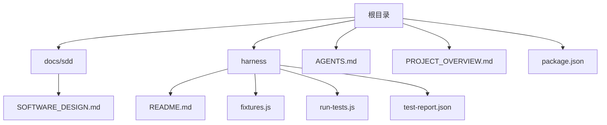
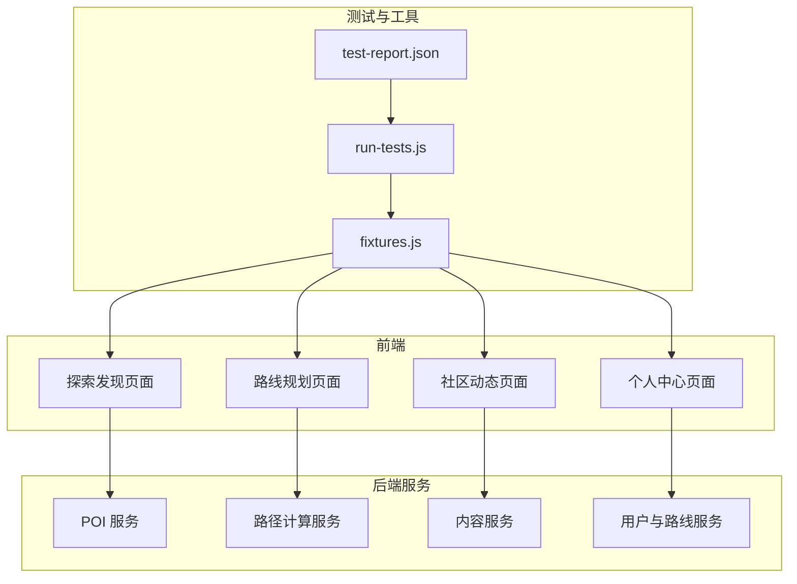
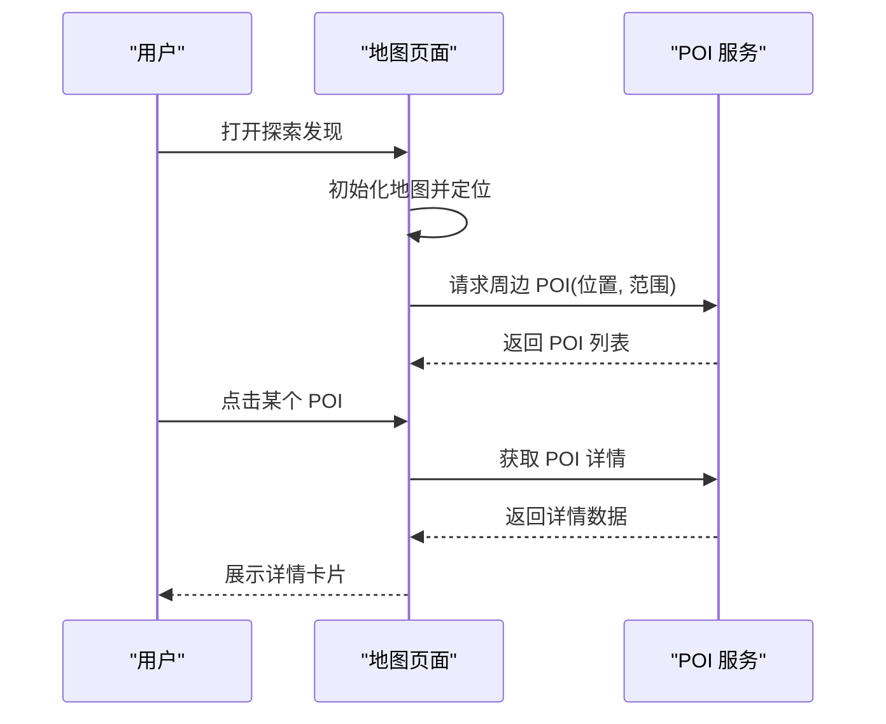
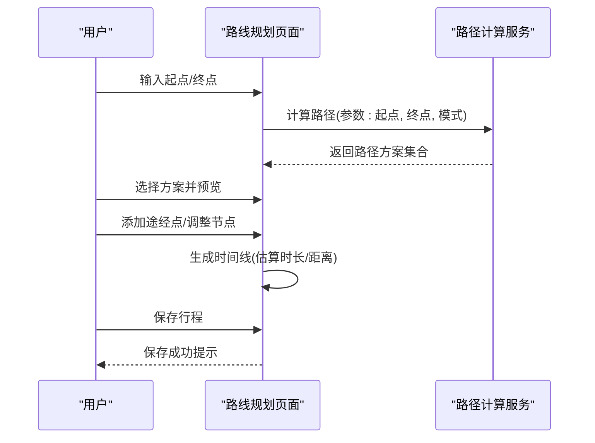
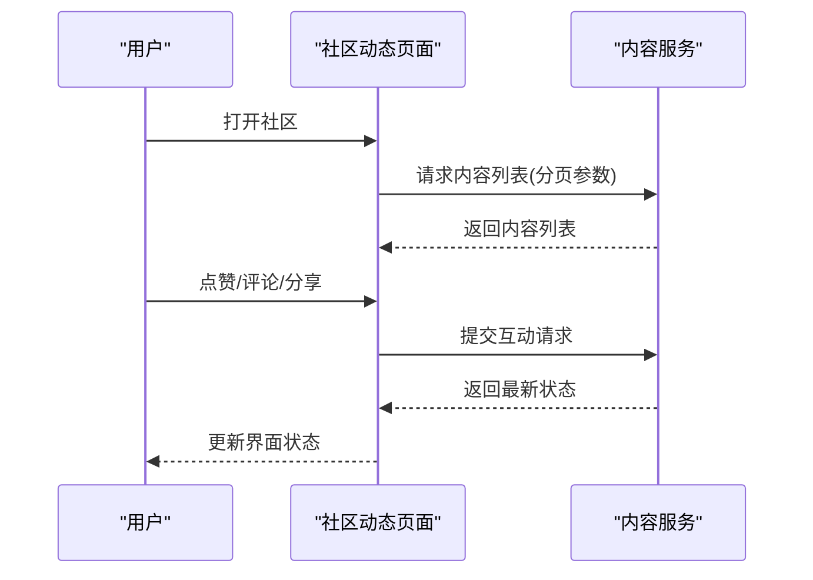
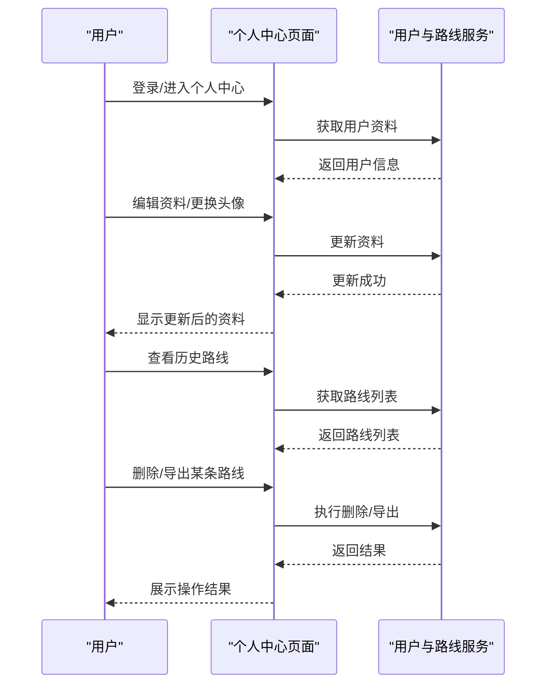
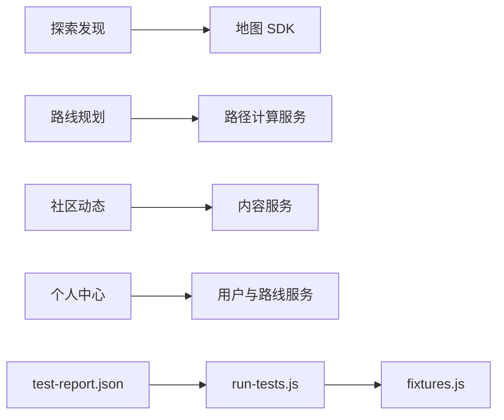

# 核心功能模块

<cite>
**本文档引用的文件**
- [AGENTS.md](file://AGENTS.md)
- [PROJECT_OVERVIEW.md](file://PROJECT_OVERVIEW.md)
- [SOFTWARE_DESIGN.md](file://docs\sdd\SOFTWARE_DESIGN.md)
- [README.md](file://harness\README.md)
- [fixtures.js](file://harness\fixtures.js)
- [run-tests.js](file://harness\run-tests.js)
- [test-report.json](file://harness\test-report.json)
- [package.json](file://package.json)
</cite>

## 目录
1. [简介](#简介)
2. [项目结构](#项目结构)
3. [核心组件](#核心组件)
4. [架构总览](#架构总览)
5. [详细组件分析](#详细组件分析)
6. [依赖分析](#依赖分析)
7. [性能考虑](#性能考虑)
8. [故障排除指南](#故障排除指南)
9. [结论](#结论)
10. [附录](#附录)

## 简介
本文件面向“城市漫步探索应用”的核心功能模块，系统梳理四大模块：探索发现（全屏地图 + POI 推荐）、路线规划（路线详情 + 时间线行程）、社区动态（内容信息流 + 互动功能）、个人中心（用户资料 + 路线管理）。文档从架构设计、模块职责、数据模型、交互流程、API 规范与扩展点等维度进行说明，并结合测试夹具与运行脚本，给出可操作的开发与扩展建议。

## 项目结构
仓库当前呈现为一个轻量级工程骨架，包含以下关键部分：
- 文档与设计：软件设计文档、项目概览、代理与智能体相关说明
- 测试夹具与运行：测试夹具、测试运行器、测试报告
- 包管理：包配置文件
- 概览与入口：Harness 入口说明

图表来源
- [SOFTWARE_DESIGN.md](file://docs\sdd\SOFTWARE_DESIGN.md)
- [README.md](file://harness\README.md)
- [fixtures.js](file://harness\fixtures.js)
- [run-tests.js](file://harness\run-tests.js)
- [test-report.json](file://harness\test-report.json)
- [package.json](file://package.json)

章节来源
- [PROJECT_OVERVIEW.md](file://PROJECT_OVERVIEW.md)
- [SOFTWARE_DESIGN.md](file://docs\sdd\SOFTWARE_DESIGN.md)
- [README.md](file://harness\README.md)

## 核心组件
基于现有文档，核心模块可抽象为以下四个功能域：

- 探索发现模块
  - 功能：全屏地图展示与 POI 推荐
  - 关键点：地图渲染、POI 数据接入、推荐算法接口、交互事件处理
  - 用户流程：打开应用 → 地图初始化 → 加载周边 POI → 用户点击/滑动 → 展示详情或导航

- 路线规划模块
  - 功能：生成并展示步行/骑行路线，支持时间线行程
  - 关键点：路径计算服务、路线可视化、时间线渲染、行程编辑与保存
  - 用户流程：选择起点终点 → 计算路线 → 预览路线 → 添加途经点 → 生成时间线 → 保存行程

- 社区动态模块
  - 功能：内容信息流与互动（点赞、评论、分享）
  - 关键点：内容分页加载、互动状态同步、实时更新机制
  - 用户流程：进入社区 → 滚动加载内容 → 互动操作 → 本地状态与服务端同步

- 个人中心模块
  - 功能：用户资料管理与历史路线管理
  - 关键点：用户信息持久化、头像上传、路线列表与详情、偏好设置
  - 用户流程：登录/注册 → 查看资料 → 编辑资料 → 查看历史路线 → 删除或导出

章节来源
- [SOFTWARE_DESIGN.md](file://docs\sdd\SOFTWARE_DESIGN.md)
- [PROJECT_OVERVIEW.md](file://PROJECT_OVERVIEW.md)

## 架构总览
整体采用“前端页面 + 后端服务 + 测试夹具”的分层结构。前端负责视图与交互，后端提供数据与业务能力，Harness 提供测试夹具与运行器，用于验证核心流程。

图表来源
- [fixtures.js](file://harness\fixtures.js)
- [run-tests.js](file://harness\run-tests.js)
- [test-report.json](file://harness\test-report.json)

章节来源
- [SOFTWARE_DESIGN.md](file://docs\sdd\SOFTWARE_DESIGN.md)
- [README.md](file://harness\README.md)

## 详细组件分析

### 探索发现模块
- 功能特性
  - 全屏地图：支持缩放、平移、定位到用户位置
  - POI 推荐：根据用户位置与偏好返回附近兴趣点
  - 交互反馈：点击 POI 展示详情卡片，支持收藏与导航
- 用户交互流程
  - 初始化地图 → 加载周边 POI → 用户选择 POI → 打开详情 → 收藏/导航
- 数据模型
  - POI 实体：包含坐标、名称、类型、评分、图片链接、描述
  - 用户偏好：兴趣标签、距离范围、评分阈值
- 实现要点
  - 地图 SDK 集成与权限申请
  - POI 列表分页与缓存策略
  - 详情页与导航跳转的路由集成
- 扩展点
  - 推荐算法插件化（协同过滤/内容过滤）
  - 多源 POI 数据聚合（本地+第三方）

图表来源
- [SOFTWARE_DESIGN.md](file://docs\sdd\SOFTWARE_DESIGN.md)

章节来源
- [SOFTWARE_DESIGN.md](file://docs\sdd\SOFTWARE_DESIGN.md)

### 路线规划模块
- 功能特性
  - 起点/终点输入与自动补全
  - 路径计算与多方案对比
  - 路线可视化与途经点添加
  - 时间线行程：按时间顺序展示各节点耗时与说明
- 用户交互流程
  - 输入起点/终点 → 选择路径方案 → 预览路线 → 添加途经点 → 生成时间线 → 保存行程
- 数据模型
  - 路线实体：轨迹点序列、总时长、总距离、海拔变化
  - 时间线节点：节点序号、停留时间、说明文字、POI 关联
- 实现要点
  - 路径计算服务调用与错误处理
  - 轨迹绘制与交互（拖拽、删除、重排）
  - 时间线渲染与滚动对齐
- 扩展点
  - 多模式路径（步行/骑行/驾车）切换
  - 个性化配速与休息点策略

图表来源
- [SOFTWARE_DESIGN.md](file://docs\sdd\SOFTWARE_DESIGN.md)

章节来源
- [SOFTWARE_DESIGN.md](file://docs\sdd\SOFTWARE_DESIGN.md)

### 社区动态模块
- 功能特性
  - 内容信息流：图文/视频/话题标签
  - 互动功能：点赞、评论、分享、收藏
  - 实时更新：新内容推送与离线缓存
- 用户交互流程
  - 进入社区 → 滚动加载 → 点赞/评论 → 分享 → 收藏
- 数据模型
  - 内容项：标题、正文、作者、时间、标签、媒体资源
  - 互动状态：点赞数、是否已点赞、评论列表、分享次数
- 实现要点
  - 分页加载与下拉刷新
  - 本地状态与服务端一致性校验
  - 评论列表的展开/折叠与回复
- 扩展点
  - 互动行为埋点与统计
  - 内容审核与推荐算法

图表来源
- [SOFTWARE_DESIGN.md](file://docs\sdd\SOFTWARE_DESIGN.md)

章节来源
- [SOFTWARE_DESIGN.md](file://docs\sdd\SOFTWARE_DESIGN.md)

### 个人中心模块
- 功能特性
  - 用户资料：昵称、头像、性别、生日、简介
  - 路线管理：历史路线列表、详情查看、删除、导出
  - 偏好设置：通知开关、语言、主题
- 用户交互流程
  - 登录/注册 → 查看资料 → 编辑资料 → 查看历史路线 → 删除或导出
- 数据模型
  - 用户实体：基础信息、认证令牌、偏好设置
  - 路线实体：创建时间、路线详情、访问权限
- 实现要点
  - 用户认证与会话管理
  - 头像上传与裁剪
  - 路线列表分页与筛选
- 扩展点
  - 第三方账号绑定
  - 路线导出格式扩展（GPX/KML/CSV）

图表来源
- [SOFTWARE_DESIGN.md](file://docs\sdd\SOFTWARE_DESIGN.md)

章节来源
- [SOFTWARE_DESIGN.md](file://docs\sdd\SOFTWARE_DESIGN.md)

## 依赖分析
- 模块内聚与耦合
  - 探索发现与路线规划在地图与路径计算上存在共享依赖
  - 社区动态与个人中心通过用户态与内容态形成弱耦合
- 外部依赖
  - 地图 SDK、路径计算服务、内容存储与用户认证服务
- 测试夹具与运行
  - fixtures.js 提供测试数据与环境准备
  - run-tests.js 负责执行测试并生成 test-report.json

图表来源
- [fixtures.js](file://harness\fixtures.js)
- [run-tests.js](file://harness\run-tests.js)
- [test-report.json](file://harness\test-report.json)

章节来源
- [fixtures.js](file://harness\fixtures.js)
- [run-tests.js](file://harness\run-tests.js)
- [test-report.json](file://harness\test-report.json)

## 性能考虑
- 地图与 POI
  - 使用分页与懒加载，控制单次请求数量；启用缓存减少重复请求
- 路线计算
  - 对多方案进行本地排序，避免频繁网络请求；限制途经点数量
- 社区动态
  - 下拉刷新与上拉加载分离，避免重复触发；评论列表虚拟化
- 个人中心
  - 头像压缩与 CDN 加速；路线列表分页与差量更新
- 测试性能
  - 使用 fixtures.js 快速构建测试场景，run-tests.js 并行执行用例，缩短回归周期

## 故障排除指南
- 地图初始化失败
  - 检查权限与网络状态；确认地图 SDK 版本兼容性
- POI 无数据
  - 校验位置参数与范围；检查服务端限流与缓存
- 路线计算异常
  - 捕获服务端错误码并提示；回退到默认方案
- 社区动态加载失败
  - 断网重试与本地缓存兜底；记录错误日志
- 个人中心资料更新失败
  - 校验必填字段与格式；区分网络错误与业务错误
- 测试失败
  - 查看 test-report.json 中的失败用例与堆栈；使用 fixtures.js 重现问题

章节来源
- [test-report.json](file://harness\test-report.json)
- [run-tests.js](file://harness\run-tests.js)

## 结论
本项目以模块化设计为核心，围绕“探索发现、路线规划、社区动态、个人中心”四大功能域构建了清晰的前后端分工与测试体系。通过标准化的数据模型与交互流程，配合可扩展的推荐与路径计算能力，能够快速迭代并满足城市漫步场景下的多样化需求。建议后续完善 API 规范与错误码定义，增强监控与埋点，持续优化性能与用户体验。

## 附录
- 开发与测试建议
  - 使用 fixtures.js 构建稳定可复现的测试场景
  - run-tests.js 作为 CI/CD 的执行入口，确保回归质量
  - package.json 中声明依赖版本，避免环境漂移
- 参考文件
  - 设计文档与项目概览为模块边界与职责划分提供依据
  - Harness 相关文件为自动化测试与质量保障提供支撑

章节来源
- [package.json](file://package.json)
- [README.md](file://harness\README.md)
- [SOFTWARE_DESIGN.md](file://docs\sdd\SOFTWARE_DESIGN.md)
- [PROJECT_OVERVIEW.md](file://PROJECT_OVERVIEW.md)