# 社区动态模块

<cite>
**本文档引用的文件**
- [PROJECT_OVERVIEW.md](file://PROJECT_OVERVIEW.md)
- [SOFTWARE_DESIGN.md](file://docs\sdd\SOFTWARE_DESIGN.md)
- [Untitled-1.html](file://Untitled-1.html)
- [run-tests.js](file://harness\run-tests.js)
- [README.md](file://harness\README.md)
</cite>

## 目录
1. [引言](#引言)
2. [项目结构](#项目结构)
3. [核心组件](#核心组件)
4. [架构概览](#架构概览)
5. [详细组件分析](#详细组件分析)
6. [依赖关系分析](#依赖关系分析)
7. [性能考虑](#性能考虑)
8. [故障排除指南](#故障排除指南)
9. [结论](#结论)

## 引言

社区动态模块是 CityPulse 城市漫步探索应用的核心社交功能模块，为用户提供发现、分享和互动城市漫步体验的平台。该模块采用移动优先的设计理念，融合了瀑布流布局、智能筛选系统和丰富的视觉设计规范。

### 核心特性

- **信息流设计**：基于瀑布流布局的动态内容展示
- **智能筛选系统**：支持按热度、关注和附近地区的内容筛选
- **多类型内容**：涵盖路线分享、隐藏宝藏、拍照圣地等多种内容类型
- **响应式设计**：适配桌面端和移动端的差异化体验
- **发布功能**：集成的动态发布和社交互动机制

## 项目结构

社区动态模块位于 CityPulse 应用的模块化架构中，作为四大核心模块之一，与其他模块协同工作：

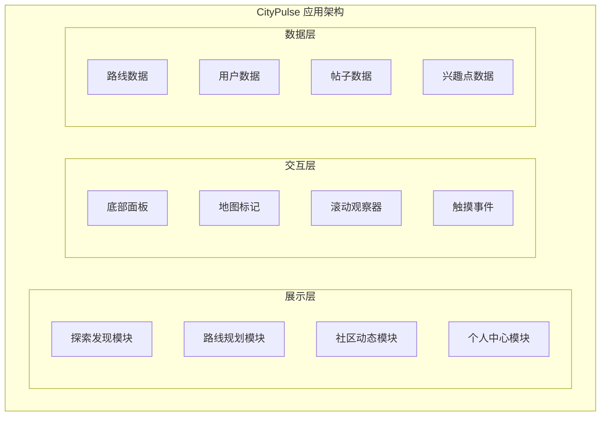

**图表来源**
- [SOFTWARE_DESIGN.md:28-49](file://docs\sdd\SOFTWARE_DESIGN.md#L28-L49)

### 模块职责

社区动态模块的主要职责包括：
- 提供用户生成内容的信息流展示
- 实现智能的内容筛选和分类系统
- 支持用户发布和互动功能
- 维护社区氛围和用户参与度

**章节来源**
- [SOFTWARE_DESIGN.md:122-136](file://docs\sdd\SOFTWARE_DESIGN.md#L122-L136)

## 核心组件

### 内容筛选系统

社区动态模块的核心筛选系统提供了三种主要的内容视角：

#### FilterTabs 组件
- **Trending 标签**：展示当前最热门的内容
- **Following 标签**：显示关注用户的最新动态  
- **Nearby 标签**：基于地理位置的内容推荐

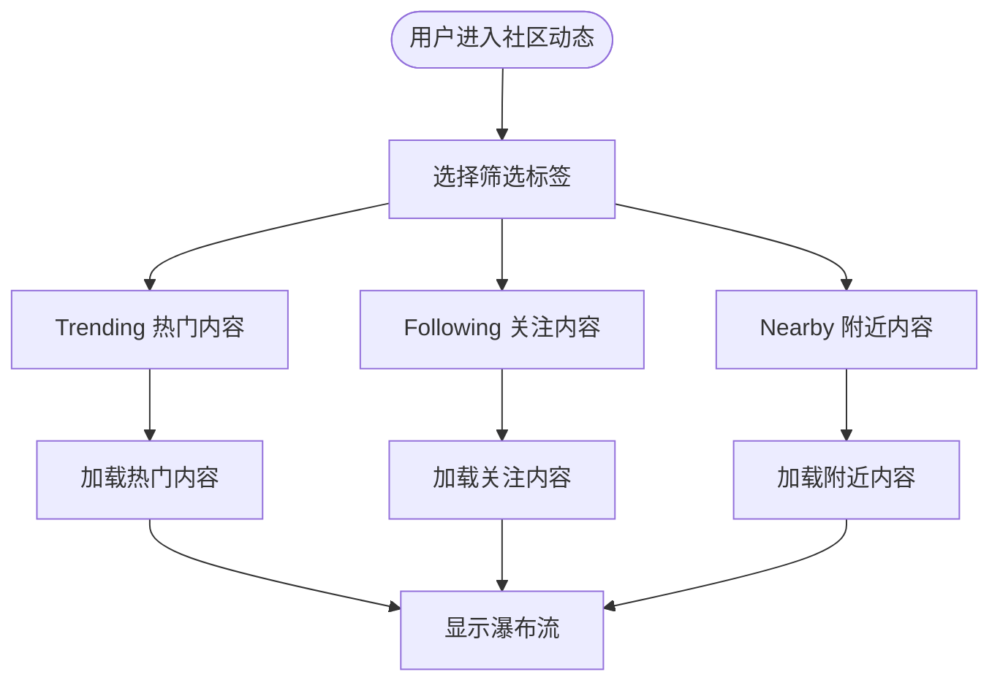

**图表来源**
- [Untitled-1.html:1208-1225](file://Untitled-1.html#L1208-L1225)

### 瀑布流布局系统

#### MasonryGrid 组件
采用 CSS 瀑布流布局实现不等高卡片的优雅排列：

- **桌面端**：4 列布局
- **平板端**：3 列布局  
- **移动端**：2 列布局

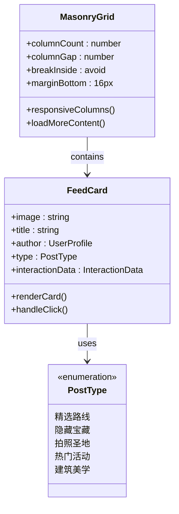

**图表来源**
- [Untitled-1.html:1022-1046](file://Untitled-1.html#L1022-L1046)
- [SOFTWARE_DESIGN.md:137-145](file://docs\sdd\SOFTWARE_DESIGN.md#L137-L145)

### 内容卡片系统

#### FeedCard 组件
每个内容卡片都包含完整的社交互动元素：

- **封面图片**：吸引注意力的视觉元素
- **标签系统**：基于内容类型的彩色标签
- **作者信息**：用户头像和用户名
- **互动数据**：点赞、收藏、评论数量

#### ArticleCard 组件（移动端）
专为移动端优化的文章卡片设计：

- **简洁布局**：适应小屏幕的紧凑设计
- **垂直信息流**：适合移动端滚动浏览
- **增强的可读性**：优化的字体大小和行间距

### 发布功能系统

#### PostFAB 组件
悬浮操作按钮提供便捷的内容发布入口：

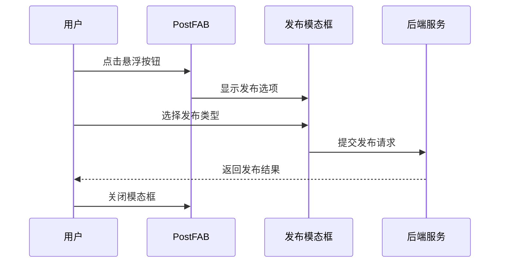

**图表来源**
- [Untitled-1.html:1378-1380](file://Untitled-1.html#L1378-L1380)

**章节来源**
- [SOFTWARE_DESIGN.md:130-136](file://docs\sdd\SOFTWARE_DESIGN.md#L130-L136)

## 架构概览

### 技术架构

社区动态模块采用现代化的前端技术栈，确保优秀的性能和用户体验：

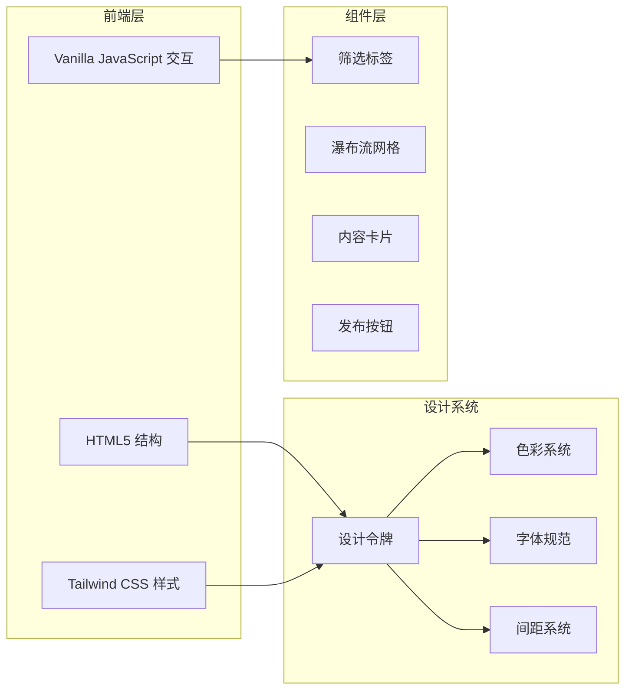

**图表来源**
- [SOFTWARE_DESIGN.md:51-60](file://docs\sdd\SOFTWARE_DESIGN.md#L51-L60)

### 数据流架构

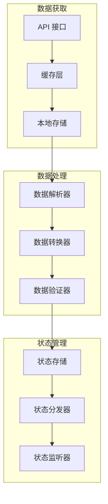

**图表来源**
- [SOFTWARE_DESIGN.md:73-81](file://docs\sdd\SOFTWARE_DESIGN.md#L73-L81)

## 详细组件分析

### FilterTabs 内容筛选机制

#### 筛选逻辑实现

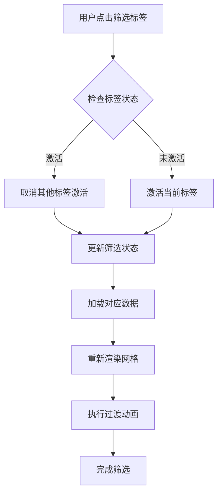

**图表来源**
- [Untitled-1.html:1726-1740](file://Untitled-1.html#L1726-L1740)

#### 视觉反馈系统

筛选标签采用渐进式的视觉反馈机制：
- **激活状态**：使用主色调和强调阴影
- **悬停效果**：平滑的颜色过渡和缩放动画
- **指示器**：底部的激活指示条

### MasonryGrid 瀑布流布局

#### 布局算法

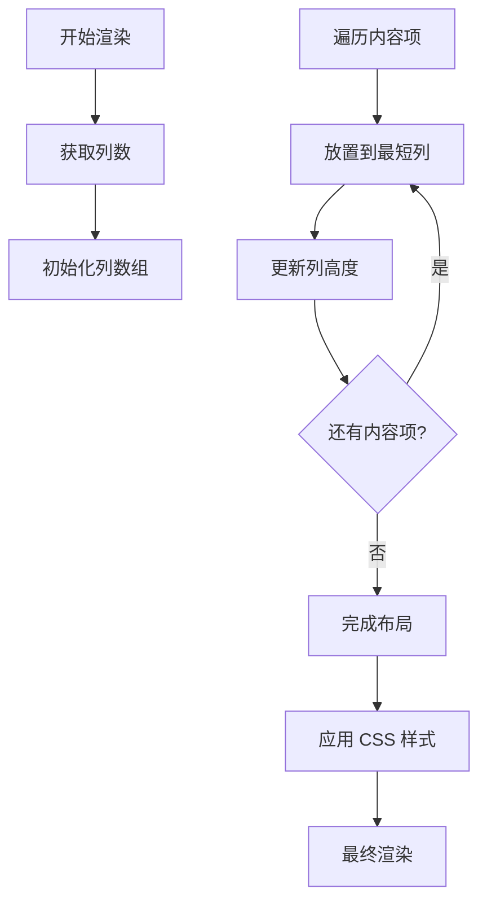

**图表来源**
- [Untitled-1.html:1022-1046](file://Untitled-1.html#L1022-L1046)

#### 响应式断点

| 断点 | 屏幕宽度 | 列数 | 间距 |
|------|----------|------|------|
| Mobile | < 768px | 2列 | 16px |
| Tablet | 768px - 1024px | 3列 | 16px |
| Desktop | > 1024px | 4列 | 16px |

### FeedCard 内容卡片设计

#### 卡片组件结构

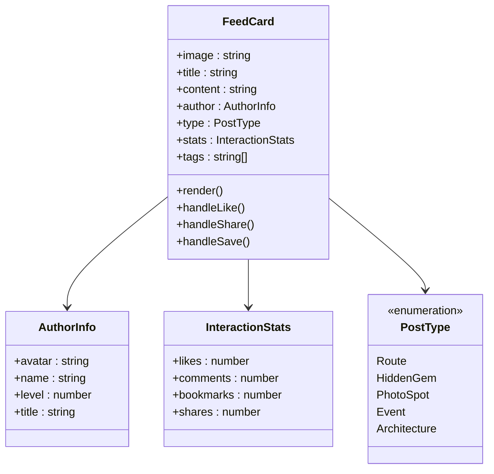

**图表来源**
- [SOFTWARE_DESIGN.md:280-295](file://docs\sdd\SOFTWARE_DESIGN.md#L280-L295)

#### 视觉设计规范

| 内容类型 | 标签颜色 | 图标 | 背景透明度 |
|----------|----------|------|------------|
| 精选路线 | primary-container | route | 90% |
| 隐藏宝藏 | secondary | local_cafe | 90% |
| 拍照圣地 | tertiary-container | photo_camera | 90% |
| 热门活动 | primary | event | 90% |
| 建筑美学 | secondary-container | apartment | 90% |

### ArticleCard 文章卡片设计

#### 移动端优化

文章卡片针对移动端进行了专门优化：

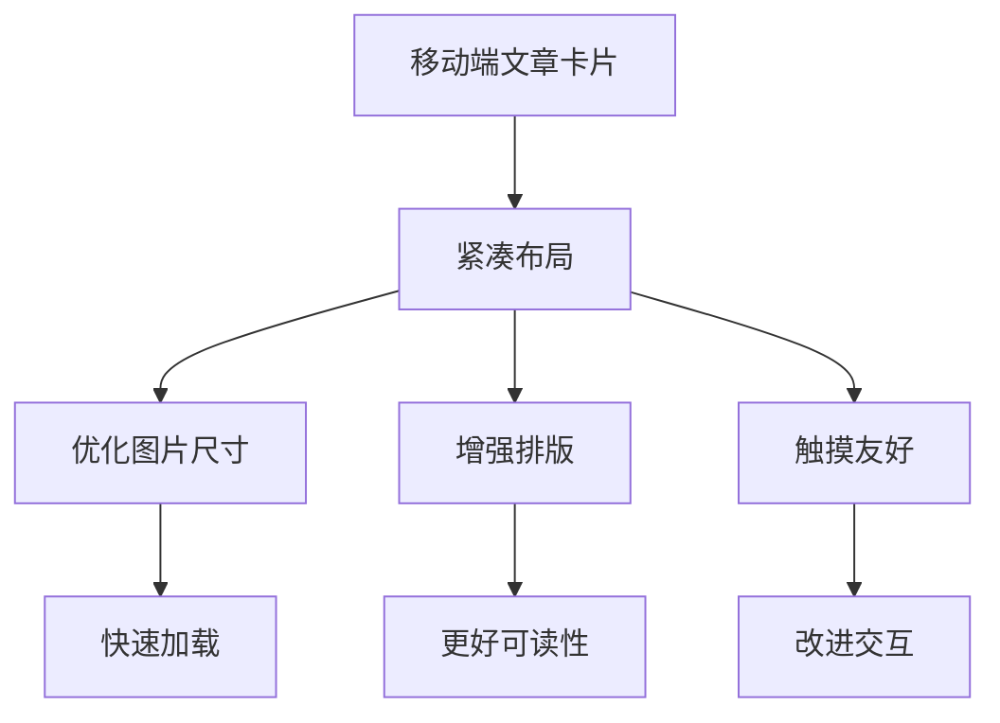

**图表来源**
- [Untitled-1.html:1584-1691](file://Untitled-1.html#L1584-L1691)

### PostFAB 发布按钮实现

#### 按钮交互流程

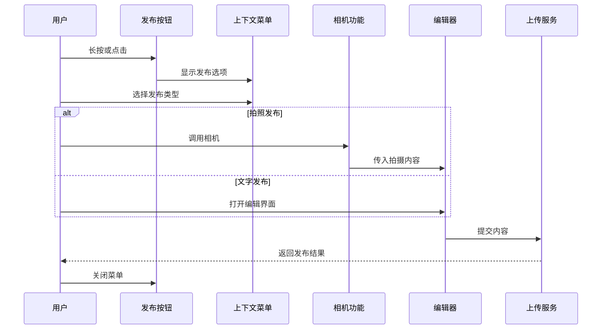

**图表来源**
- [Untitled-1.html:1378-1380](file://Untitled-1.html#L1378-L1380)

**章节来源**
- [SOFTWARE_DESIGN.md:130-145](file://docs\sdd\SOFTWARE_DESIGN.md#L130-L145)

## 依赖关系分析

### 组件依赖图

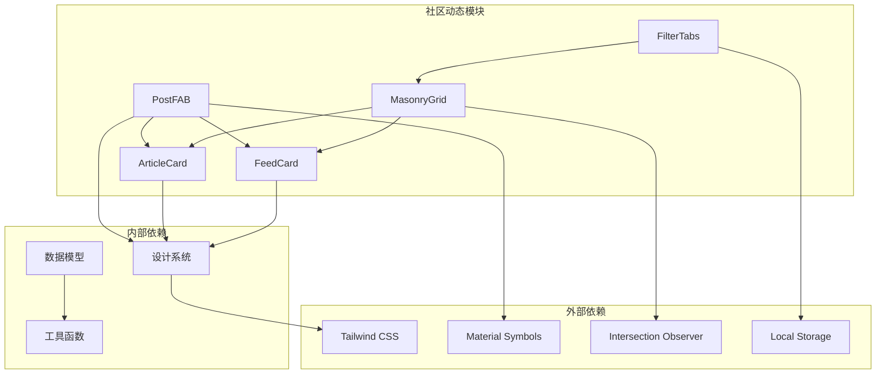

**图表来源**
- [SOFTWARE_DESIGN.md:122-136](file://docs\sdd\SOFTWARE_DESIGN.md#L122-L136)

### 数据依赖关系

社区动态模块的数据流遵循清晰的层次结构：

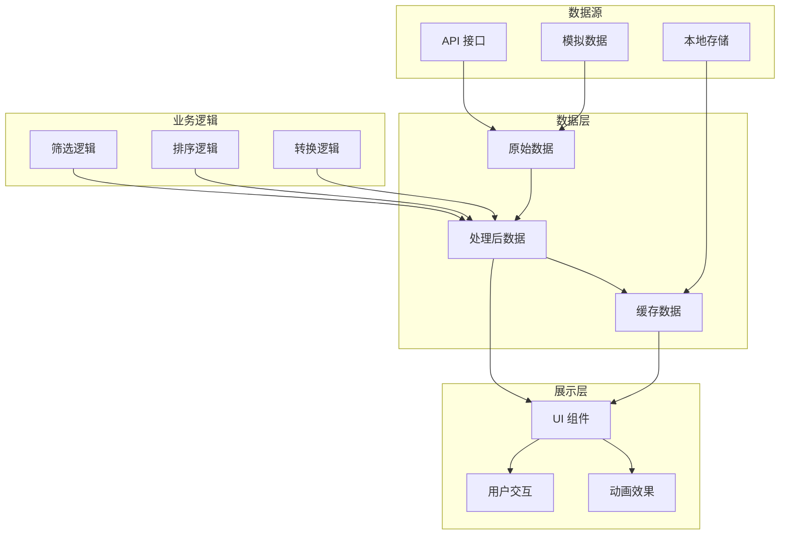

**图表来源**
- [SOFTWARE_DESIGN.md:73-81](file://docs\sdd\SOFTWARE_DESIGN.md#L73-L81)

**章节来源**
- [SOFTWARE_DESIGN.md:122-161](file://docs\sdd\SOFTWARE_DESIGN.md#L122-L161)

## 性能考虑

### 瀑布流性能优化

社区动态模块采用了多项性能优化策略：

#### 懒加载机制
- **图片懒加载**：使用 Intersection Observer 实现智能图片加载
- **内容分页**：无限滚动配合分页加载减少初始负载
- **虚拟滚动**：大量内容时采用虚拟滚动技术

#### 内存管理
- **DOM 复用**：卡片组件的高效复用机制
- **事件委托**：减少事件监听器的数量
- **垃圾回收**：及时清理不再使用的 DOM 节点

### 响应式性能

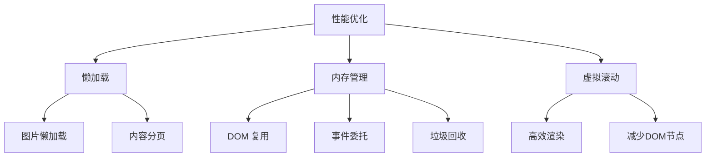

### 加载性能指标

| 指标 | 移动端 | 桌面端 | 目标值 |
|------|--------|--------|--------|
| 首屏加载时间 | < 2s | < 1s | < 1.5s |
| 内容渲染延迟 | < 100ms | < 50ms | < 80ms |
| 瀑布流布局计算 | < 50ms | < 25ms | < 40ms |
| 交互响应时间 | < 100ms | < 50ms | < 80ms |

## 故障排除指南

### 常见问题诊断

#### 瀑布流布局异常

**症状**：卡片重叠或布局错乱
**可能原因**：
- 图片加载完成时机不一致
- CSS 样式冲突
- JavaScript 执行错误

**解决方案**：
1. 检查图片尺寸设置
2. 验证 CSS 样式优先级
3. 查看浏览器控制台错误信息

#### 筛选功能失效

**症状**：点击筛选标签无响应
**可能原因**：
- 事件监听器绑定失败
- 状态更新逻辑错误
- DOM 元素不存在

**解决方案**：
1. 确认 DOM 元素加载完成
2. 检查事件监听器绑定
3. 验证状态更新函数

### 性能问题排查

#### 加载缓慢

**诊断步骤**：
1. 使用浏览器开发者工具分析网络请求
2. 检查图片资源大小和格式
3. 监控内存使用情况

**优化建议**：
- 压缩图片资源
- 实施缓存策略
- 减少不必要的 DOM 操作

**章节来源**
- [run-tests.js:86-338](file://harness\run-tests.js#L86-L338)

### 测试验证

社区动态模块通过全面的测试套件确保质量：

#### 设计系统合规性测试
- 颜色令牌一致性检查
- 字体规范验证
- 响应式设计测试

#### 交互功能测试
- JavaScript 功能验证
- 事件监听器测试
- 动画效果检查

#### 可访问性测试
- 语义化 HTML 验证
- 键盘导航支持
- 屏幕阅读器兼容性

**章节来源**
- [README.md:1-27](file://harness\README.md#L1-L27)

## 结论

社区动态模块作为 CityPulse 应用的核心社交功能，成功实现了以下目标：

### 技术成就

- **优秀的用户体验**：流畅的瀑布流布局和智能筛选系统
- **响应式设计**：完美适配各种设备和屏幕尺寸
- **高性能实现**：优化的渲染机制和内存管理
- **可维护架构**：清晰的组件分离和数据流设计

### 设计亮点

- **品牌一致性**：严格遵循设计系统规范
- **视觉层次**：清晰的内容分类和层级结构
- **交互反馈**：丰富的微交互和动画效果
- **无障碍设计**：全面的可访问性支持

### 未来发展方向

1. **框架迁移**：从纯 HTML 迁移到现代前端框架
2. **性能优化**：实施更高级的缓存和预加载策略
3. **功能扩展**：增加更多社交互动功能
4. **数据分析**：集成用户行为分析和个性化推荐

社区动态模块为 CityPulse 应用奠定了坚实的社交基础，为用户创造了一个充满活力的城市探索社区。