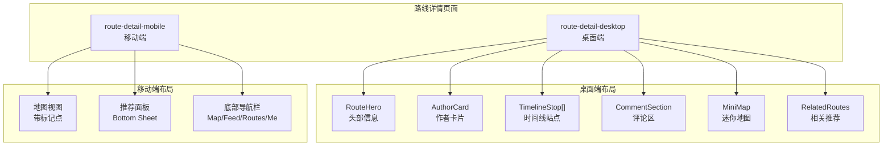
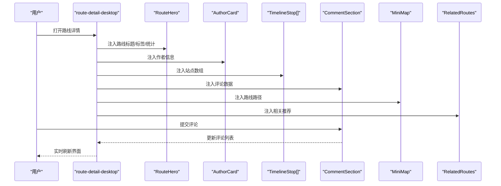
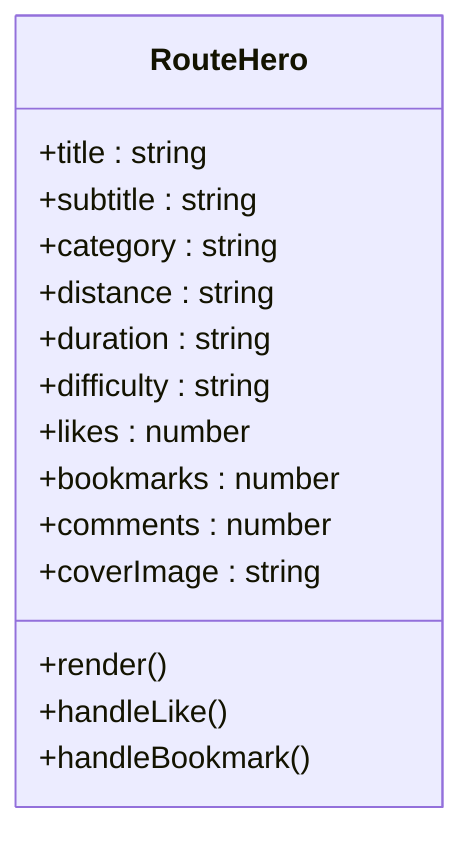
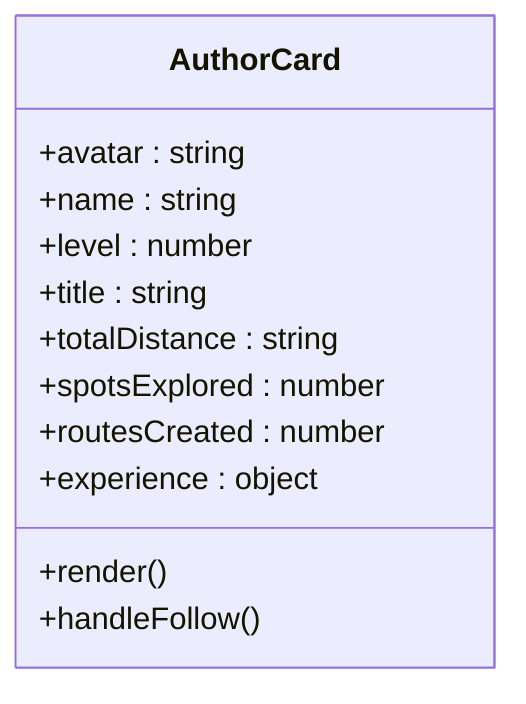
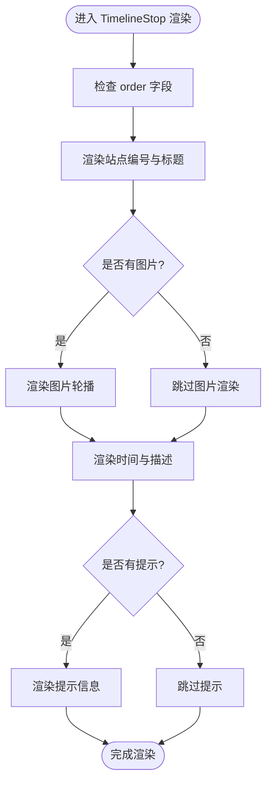
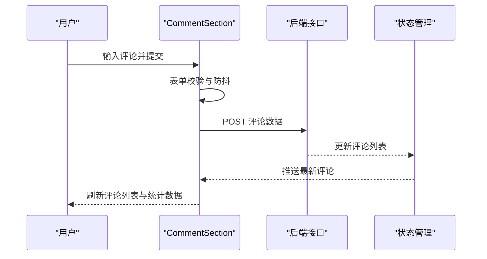
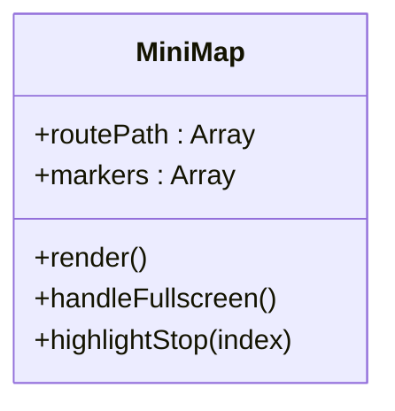
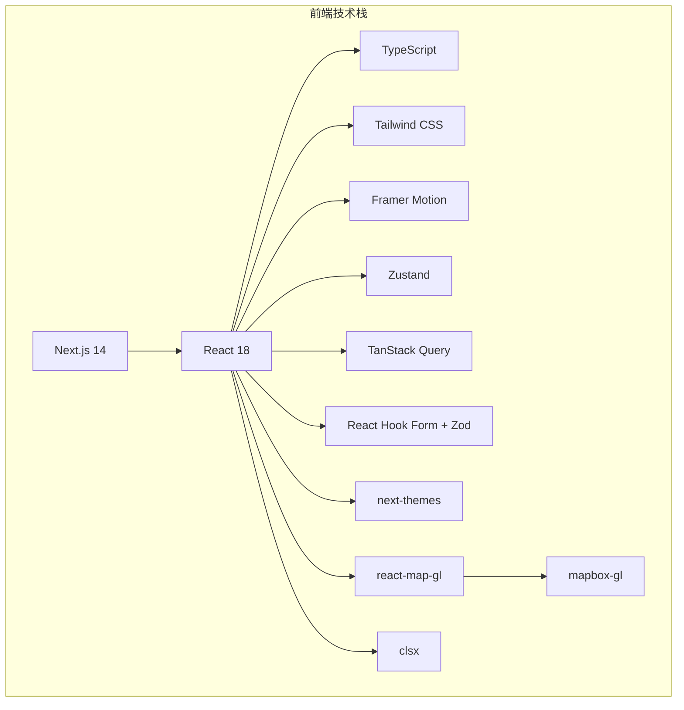

# 路线规划模块

<cite>
**本文引用的文件**
- [SOFTWARE_DESIGN.md](file://docs\sdd\SOFTWARE_DESIGN.md)
- [PROJECT_OVERVIEW.md](file://PROJECT_OVERVIEW.md)
- [package.json](file://package.json)
- [next.config.js](file://next.config.js)
- [tailwind.config.ts](file://tailwind.config.ts)
- [Untitled-1.html](file://Untitled-1.html)
- [fixtures.js](file://harness\fixtures.js)
</cite>

## 目录
1. [引言](#引言)
2. [项目结构](#项目结构)
3. [核心组件](#核心组件)
4. [架构总览](#架构总览)
5. [详细组件分析](#详细组件分析)
6. [依赖分析](#依赖分析)
7. [性能考虑](#性能考虑)
8. [故障排除指南](#故障排除指南)
9. [结论](#结论)
10. [附录](#附录)

## 引言
本文件为路线规划模块的技术文档，聚焦于路线详情展示、时间线行程系统、评论互动功能与相关推荐机制。文档将深入解析 RouteHero 组件的头部信息展示、AuthorCard 的作者资料卡片、TimelineStop 的时间线站点组件、CommentSection 的评论区实现，以及 MiniMap 的迷你地图功能。同时提供数据流图与组件依赖关系、响应式布局适配方案，并对比桌面端与移动端的实现策略与用户体验差异。

## 项目结构
路线规划模块位于“路线详情”页面中，分为桌面端与移动端两种布局形态，分别对应页面标识 route-detail-desktop 与 route-detail-mobile。该模块采用组件化设计，围绕 RouteHero、AuthorCard、TimelineStop、CommentSection、MiniMap、RelatedRoutes 等组件协同工作，形成完整的路线信息呈现与交互闭环。

图表来源
- [SOFTWARE_DESIGN.md: 96-120:96-120](file://docs\sdd\SOFTWARE_DESIGN.md#L96-L120)
- [PROJECT_OVERVIEW.md: 158-214:158-214](file://PROJECT_OVERVIEW.md#L158-L214)

章节来源
- [SOFTWARE_DESIGN.md: 96-120:96-120](file://docs\sdd\SOFTWARE_DESIGN.md#L96-L120)
- [PROJECT_OVERVIEW.md: 158-214:158-214](file://PROJECT_OVERVIEW.md#L158-L214)

## 核心组件
- RouteHero：展示路线标题、标签与统计信息（距离、时长、难度等）
- AuthorCard：展示作者头像、等级、称号与统计信息
- TimelineStop：按序号排列的站点组件，包含图片、时间、描述与提示
- CommentSection：评论输入与评论列表的组合组件
- MiniMap：侧边栏迷你地图，展示路线路径
- RelatedRoutes：相关推荐列表，用于引导用户浏览相似路线

章节来源
- [SOFTWARE_DESIGN.md: 104-110:104-110](file://docs\sdd\SOFTWARE_DESIGN.md#L104-L110)
- [SOFTWARE_DESIGN.md: 112-120:112-120](file://docs\sdd\SOFTWARE_DESIGN.md#L112-L120)

## 架构总览
路线详情页面的数据流遵循“Route Data → 组件”的单向数据流，确保各组件职责清晰、耦合度低。桌面端采用多列布局，右侧侧边栏承载 MiniMap 与 RelatedRoutes；移动端采用地图视图与 Bottom Sheet 推荐面板的组合。

图表来源
- [SOFTWARE_DESIGN.md: 112-120:112-120](file://docs\sdd\SOFTWARE_DESIGN.md#L112-L120)

章节来源
- [SOFTWARE_DESIGN.md: 112-120:112-120](file://docs\sdd\SOFTWARE_DESIGN.md#L112-L120)

## 详细组件分析

### RouteHero 组件
- 职责：展示路线标题、标签与统计数据（距离、时长、难度）
- 数据来源：Route 对象中的 title、subtitle、category、distance、duration、difficulty、likes、bookmarks、comments 等字段
- 交互要点：支持收藏、点赞等操作，与评论区联动更新统计数据
- 响应式策略：桌面端采用大字号标题与统计卡片布局，移动端采用紧凑标题与统计徽标

图表来源
- [SOFTWARE_DESIGN.md: 228-247:228-247](file://docs\sdd\SOFTWARE_DESIGN.md#L228-L247)

章节来源
- [SOFTWARE_DESIGN.md: 104-105:104-105](file://docs\sdd\SOFTWARE_DESIGN.md#L104-L105)
- [SOFTWARE_DESIGN.md: 228-247:228-247](file://docs\sdd\SOFTWARE_DESIGN.md#L228-L247)

### AuthorCard 组件
- 职责：展示作者头像、等级、称号与累计距离、兴趣点数量、路线数量等统计
- 数据来源：UserProfile 对象中的 avatar、level、title、totalDistance、spotsExplored、routesCreated、experience 等字段
- 交互要点：支持跳转至作者主页或关注作者
- 响应式策略：桌面端采用卡片式布局，移动端采用紧凑信息行

图表来源
- [SOFTWARE_DESIGN.md: 262-278:262-278](file://docs\sdd\SOFTWARE_DESIGN.md#L262-L278)

章节来源
- [SOFTWARE_DESIGN.md: 105-106:105-106](file://docs\sdd\SOFTWARE_DESIGN.md#L105-L106)
- [SOFTWARE_DESIGN.md: 262-278:262-278](file://docs\sdd\SOFTWARE_DESIGN.md#L262-L278)

### TimelineStop 组件
- 职责：按顺序展示路线站点，包含站点编号、图片、时间、描述与提示
- 数据来源：RouteStop 数组中的 order、name、time、description、images、tips 等字段
- 交互要点：支持点击展开详情、查看图片轮播
- 响应式策略：桌面端使用时间线虚线连接，移动端采用堆叠卡片与滑动切换

图表来源
- [SOFTWARE_DESIGN.md: 249-260:249-260](file://docs\sdd\SOFTWARE_DESIGN.md#L249-L260)

章节来源
- [SOFTWARE_DESIGN.md: 106-107:106-107](file://docs\sdd\SOFTWARE_DESIGN.md#L106-L107)
- [SOFTWARE_DESIGN.md: 249-260:249-260](file://docs\sdd\SOFTWARE_DESIGN.md#L249-L260)

### CommentSection 组件
- 职责：提供评论输入框与评论列表，支持点赞、回复与实时刷新
- 数据来源：评论数组与用户信息，结合 RouteHero 的统计数据联动
- 交互要点：表单校验、提交防抖、列表懒加载与无限滚动
- 响应式策略：桌面端采用独立评论区，移动端采用底部弹出式输入

图表来源
- [SOFTWARE_DESIGN.md: 107-108:107-108](file://docs\sdd\SOFTWARE_DESIGN.md#L107-L108)

章节来源
- [SOFTWARE_DESIGN.md: 107-108:107-108](file://docs\sdd\SOFTWARE_DESIGN.md#L107-L108)

### MiniMap 组件
- 职责：在侧边栏展示路线路径，支持全屏查看与交互缩放
- 数据来源：路线坐标序列与站点标记点
- 交互要点：点击站点高亮、全屏切换、脉冲动画标记
- 响应式策略：桌面端固定侧边栏，移动端折叠为按钮触发

图表来源
- [SOFTWARE_DESIGN.md: 108-109:108-109](file://docs\sdd\SOFTWARE_DESIGN.md#L108-L109)

章节来源
- [SOFTWARE_DESIGN.md: 108-109:108-109](file://docs\sdd\SOFTWARE_DESIGN.md#L108-L109)

### RelatedRoutes 组件
- 职责：根据当前路线生成相关推荐，引导用户浏览相似路线
- 数据来源：推荐算法或静态数据源，结合 Route 对象的 category、location、tags 等字段
- 交互要点：卡片式展示、点击跳转详情页
- 响应式策略：桌面端采用网格布局，移动端采用横向滚动

章节来源
- [SOFTWARE_DESIGN.md: 109-110:109-110](file://docs\sdd\SOFTWARE_DESIGN.md#L109-L110)

## 依赖分析
- 技术栈依赖：Next.js 14、React 18、TypeScript、Tailwind CSS、Framer Motion、Zustand、@tanstack/react-query、react-hook-form、zod、next-themes、react-map-gl、mapbox-gl、clsx
- 地图与地理：Mapbox GL JS 与 react-map-gl 提供地图渲染与交互；Mapbox Directions API 支持步行导航路线计算
- 状态管理：Zustand 管理全局 UI 状态（如 Bottom Sheet 展开状态、当前 Tab、FAB 菜单）
- 数据获取：TanStack Query（React Query）处理无限滚动、缓存与乐观更新
- 表单与校验：React Hook Form + Zod 实现评论与路线创建等表单的验证与管理
- 暗色模式：next-themes 配合 Tailwind 的 darkMode: "class" 实现系统/手动切换

图表来源
- [package.json: 11-25:11-25](file://package.json#L11-L25)
- [PROJECT_OVERVIEW.md: 40-113:40-113](file://PROJECT_OVERVIEW.md#L40-L113)

章节来源
- [package.json: 11-25:11-25](file://package.json#L11-L25)
- [PROJECT_OVERVIEW.md: 40-113:40-113](file://PROJECT_OVERVIEW.md#L40-L113)

## 性能考虑
- 首屏性能：利用 Next.js App Router 的 SSR/SSG 混合渲染，提升 SEO 与首屏加载速度
- 资源优化：Tailwind JIT 编译减少 CSS 体积；Cloudinary CDN 加速图片传输
- 状态与数据：Zustand 轻量状态管理减少 Provider 嵌套；TanStack Query 缓存与乐观更新降低网络请求
- 地图性能：Mapbox GL 使用 WebGL 渲染，支持自定义脉冲标记动画；合理控制标记数量与层级
- 响应式性能：移动端采用 Bottom Sheet 与地图视图切换，避免一次性渲染过多 DOM 节点

## 故障排除指南
- 地图不显示或标记异常
  - 检查 Mapbox 访问密钥与 react-map-gl 初始化参数
  - 确认地图容器尺寸与样式，避免 0 高宽导致渲染失败
- 评论提交失败
  - 校验表单字段与 Zod Schema，确认必填项与格式
  - 检查 TanStack Query 的 mutation 与错误处理回调
- Bottom Sheet 拖拽异常
  - 确认 Framer Motion 的 useDrag 与 animate 配置
  - 检查触摸事件与 CSS pointer-events 设置
- 响应式布局错位
  - 校验 Tailwind 断点与栅格系统，确保桌面端与移动端类名正确
  - 检查 Sticky 定位与 Fixed 定位元素的层级与偏移

章节来源
- [PROJECT_OVERVIEW.md: 225-244:225-244](file://PROJECT_OVERVIEW.md#L225-L244)
- [tailwind.config.ts: 3-126:3-126](file://tailwind.config.ts#L3-L126)

## 结论
路线规划模块通过清晰的组件划分与数据流设计，实现了从路线头部信息到时间线站点、从评论互动到迷你地图与相关推荐的完整体验。桌面端强调信息密度与操作效率，移动端注重触控友好与沉浸式探索。借助 Next.js、Tailwind CSS、Mapbox GL 与现代前端状态管理方案，系统在性能、可维护性与用户体验之间取得了良好平衡。

## 附录
- 页面与组件映射
  - route-detail-desktop：RouteHero、AuthorCard、TimelineStop[]、CommentSection、MiniMap、RelatedRoutes
  - route-detail-mobile：地图视图、Bottom Sheet 推荐面板、底部导航栏
- 响应式断点与布局
  - 移动端：< 768px（单列 + 底部导航）
  - 平板端：768px - 1024px（双列 + 底部导航）
  - 桌面端：> 1024px（多列 + 侧边导航）

章节来源
- [SOFTWARE_DESIGN.md: 316-334:316-334](file://docs\sdd\SOFTWARE_DESIGN.md#L316-L334)
- [PROJECT_OVERVIEW.md: 158-214:158-214](file://PROJECT_OVERVIEW.md#L158-L214)
- [fixtures.js: 42](file://harness\fixtures.js#L42)
- [fixtures.js: 72](file://harness\fixtures.js#L72)