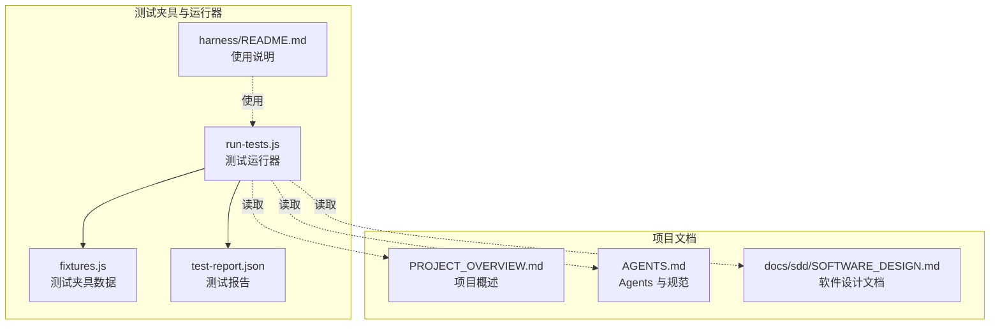
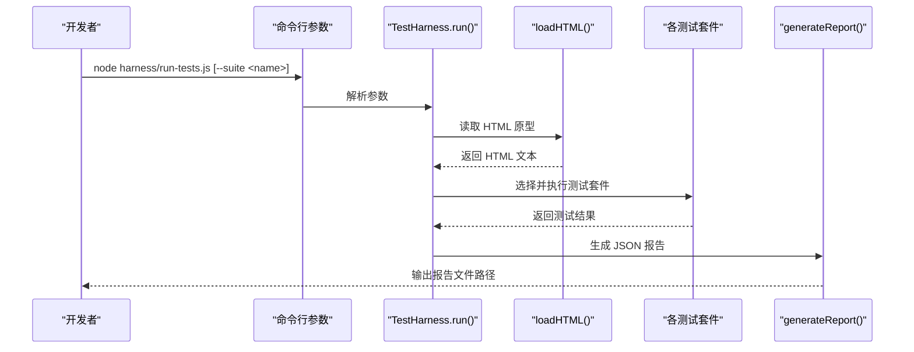
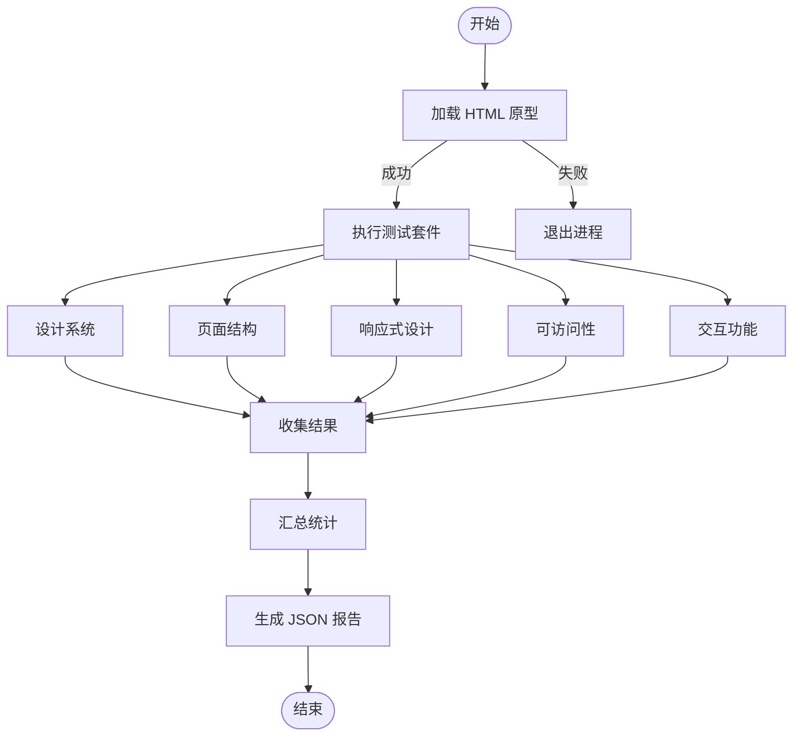
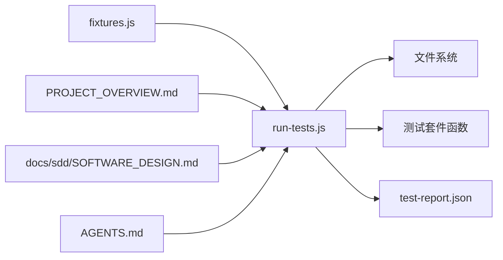

# 测试与质量保证

<cite>
**本文引用的文件**
- [harness/README.md](file://harness/README.md)
- [harness/fixtures.js](file://harness/fixtures.js)
- [harness/run-tests.js](file://harness/run-tests.js)
- [harness/test-report.json](file://harness/test-report.json)
- [PROJECT_OVERVIEW.md](file://PROJECT_OVERVIEW.md)
- [AGENTS.md](file://AGENTS.md)
- [docs/sdd/SOFTWARE_DESIGN.md](file://docs/sdd/SOFTWARE_DESIGN.md)
</cite>

## 目录
1. [引言](#引言)
2. [项目结构](#项目结构)
3. [核心组件](#核心组件)
4. [架构总览](#架构总览)
5. [详细组件分析](#详细组件分析)
6. [依赖关系分析](#依赖关系分析)
7. [性能考量](#性能考量)
8. [故障排查指南](#故障排查指南)
9. [结论](#结论)
10. [附录](#附录)

## 引言
本文件为“城市漫步探索应用”（CityPulse）的测试与质量保证指南，聚焦于测试工具配置、测试夹具数据结构、测试运行器使用方法、测试夹具中定义的组件与页面结构验证规则、测试运行流程与报告生成机制，以及质量检查流程、自动化测试策略与手动测试指导。文档同时提供测试用例编写规范、测试数据管理与结果分析方法，旨在帮助测试工程师与开发者建立完善的质量保障体系，确保代码质量与用户体验。

## 项目结构
- 测试夹具与运行器位于 harness 目录：
  - fixtures.js：定义设计 Token、页面清单、导航项、卡片类型、示例路线与 POI 数据等测试夹具。
  - run-tests.js：测试运行器，负责加载 HTML 原型、执行多套测试（设计系统、页面结构、响应式、可访问性、交互），汇总结果并生成 JSON 报告。
  - test-report.json：测试报告输出文件，记录时间戳、文件路径、统计摘要与每条测试明细。
  - README.md：测试夹具与运行器使用说明。
- 项目文档与背景：
  - PROJECT_OVERVIEW.md：项目概述、技术选型、设计系统、页面结构与交互模式。
  - AGENTS.md：项目 Agents 与技能说明，以及文件结构与编码规范。
  - docs/sdd/SOFTWARE_DESIGN.md：软件设计文档，包含模块设计、共享组件规范、数据模型、响应式与动画规范等。

图表来源
- [harness/run-tests.js:1-417](file://harness/run-tests.js#L1-L417)
- [harness/fixtures.js:1-136](file://harness/fixtures.js#L1-L136)
- [harness/test-report.json:1-207](file://harness/test-report.json#L1-L207)
- [harness/README.md:1-27](file://harness/README.md#L1-L27)
- [PROJECT_OVERVIEW.md:1-287](file://PROJECT_OVERVIEW.md#L1-L287)
- [AGENTS.md:1-59](file://AGENTS.md#L1-L59)
- [docs/sdd/SOFTWARE_DESIGN.md:1-378](file://docs/sdd/SOFTWARE_DESIGN.md#L1-L378)

章节来源
- [harness/README.md:1-27](file://harness/README.md#L1-L27)
- [PROJECT_OVERVIEW.md:1-287](file://PROJECT_OVERVIEW.md#L1-L287)
- [AGENTS.md:1-59](file://AGENTS.md#L1-L59)
- [docs/sdd/SOFTWARE_DESIGN.md:1-378](file://docs/sdd/SOFTWARE_DESIGN.md#L1-L378)

## 核心组件
- 测试运行器（TestHarness）
  - 负责加载 HTML 原型、执行测试套件、收集结果、生成 JSON 报告。
  - 支持按套件运行（设计系统、页面结构、响应式、可访问性、交互）。
- 测试夹具（fixtures.js）
  - 定义设计 Token、字体、间距 Token、页面清单、底部/侧边导航项、卡片类型、示例路线与 POI 数据。
- 测试报告（test-report.json）
  - 记录时间戳、文件路径、通过/失败/警告数量与详细测试项。

章节来源
- [harness/run-tests.js:48-401](file://harness/run-tests.js#L48-L401)
- [harness/fixtures.js:6-136](file://harness/fixtures.js#L6-L136)
- [harness/test-report.json:1-207](file://harness/test-report.json#L1-L207)

## 架构总览
测试系统采用“夹具驱动 + 运行器执行 + 报告输出”的轻量架构，运行器从 HTML 原型中解析并断言设计系统、页面结构、响应式、可访问性与交互特性，最终输出结构化报告。

图表来源
- [harness/run-tests.js:343-416](file://harness/run-tests.js#L343-L416)

## 详细组件分析

### 测试夹具（fixtures.js）数据结构与验证规则
- 设计 Token
  - 颜色 Token：primary、primaryContainer、secondary、secondaryContainer、surface、onSurface、background、error、outline、outlineVariant。
  - 字体 Token：headline、body。
  - 间距 Token：xs、sm、md、gutter、lg、xl、2xl、margin-mobile、margin-desktop。
- 页面清单（expectedPages）
  - 桌面端/移动端页面 ID、名称、标记字符串、期望组件集合。
- 导航项
  - 底部导航项：map、forum、route、account_circle。
  - 侧边导航项：explore、map、group、person。
- 卡片类型（cardTypes）
  - 类型、图标、颜色类名。
- 示例数据
  - sampleRoutes：示例路线标题、地点、距离、时长、难度、站点列表。
  - samplePOIs：示例 POI 名称、类别、评分、距离、状态。

验证规则（基于运行器中的断言逻辑）
- 设计系统合规性
  - 颜色存在性与一致性（如 primary 颜色出现次数阈值）。
  - 字体家族与 Material Symbols 加载。
  - Tailwind CDN 存在。
- 页面结构
  - 标记字符串存在（用于识别各页面段落）。
  - DOCTYPE 数量与页面数量匹配。
  - lang 属性与 viewport meta 存在。
- 响应式设计
  - 底部导航存在且移动端隐藏。
  - 桌面端侧边栏模式。
  - 响应式内边距与网格。
  - 底部导航项数量校验。
- 可访问性
  - 图片 alt 或 data-alt 属性。
  - 表单输入 label 或 placeholder/aria-label。
  - 按钮内容非空。
  - 语义化 HTML 元素数量。
  - 焦点状态可见性。
- 交互功能
  - 存在 JavaScript 代码块。
  - 存在事件监听。
  - 存在 Bottom Sheet、滚动交互、hover/active/transition 等微交互。
  - CSS @keyframes 动画存在。

章节来源
- [harness/fixtures.js:6-136](file://harness/fixtures.js#L6-L136)
- [harness/run-tests.js:88-338](file://harness/run-tests.js#L88-L338)

### 测试运行器（run-tests.js）流程与报告生成
- 加载 HTML 原型
  - 从相对路径读取 HTML 文件，失败则终止。
- 测试套件
  - 设计系统、页面结构、响应式、可访问性、交互。
- 结果收集
  - pass/fail/warn 三类状态，累计总数并记录明细。
- 报告生成
  - 生成 JSON 文件，包含时间戳、文件路径、统计摘要与明细。

图表来源
- [harness/run-tests.js:343-401](file://harness/run-tests.js#L343-L401)

章节来源
- [harness/run-tests.js:48-401](file://harness/run-tests.js#L48-L401)

### 测试报告（test-report.json）结构与解读
- 字段
  - timestamp：测试完成时间。
  - file：HTML 原型路径。
  - summary：passed、failed、warnings、total。
  - details：每条测试的 status、name、message。
- 用法
  - 作为质量门禁与回归对比依据；可结合 CI/CD 自动化输出。

章节来源
- [harness/test-report.json:1-207](file://harness/test-report.json#L1-L207)

### 使用方法与套件说明
- 运行全部测试
  - node harness/run-tests.js
- 运行指定套件
  - node harness/run-tests.js --suite design-system
  - node harness/run-tests.js --suite responsive
  - node harness/run-tests.js --suite accessibility
  - node harness/run-tests.js --suite interactions
- 套件含义
  - design-system：设计系统合规性（颜色、字体、间距、CDN）。
  - responsive：响应式设计（导航、网格、内边距）。
  - accessibility：可访问性（alt、label、语义化、焦点）。
  - interactions：交互功能（事件、Bottom Sheet、滚动、微交互、动画）。

章节来源
- [harness/README.md:6-27](file://harness/README.md#L6-L27)
- [harness/run-tests.js:353-369](file://harness/run-tests.js#L353-L369)

### 质量检查流程与自动化策略
- 质量检查流程
  - 代码变更后，先运行设计系统合规性检查，确保颜色、字体、间距 Token 未被破坏。
  - 在本地或 CI 中运行全部测试套件，生成报告并对比历史结果。
  - 对失败项进行修复与回归测试。
- 自动化策略
  - 在 CI 中集成测试运行器，设置“测试通过”为合并前提。
  - 将报告文件作为制品保留，便于追溯与审计。
  - 对关键断言（如颜色一致性、页面标记、响应式类名）设置阈值，避免回归。

章节来源
- [harness/README.md:1-27](file://harness/README.md#L1-L27)
- [PROJECT_OVERVIEW.md:116-154](file://PROJECT_OVERVIEW.md#L116-L154)
- [docs/sdd/SOFTWARE_DESIGN.md:163-224](file://docs/sdd/SOFTWARE_DESIGN.md#L163-L224)

### 手动测试指导
- 设计系统
  - 手动核对颜色、字体、间距 Token 是否与设计系统一致。
- 页面结构
  - 打开 HTML 原型，确认各页面标记字符串是否存在，页面数量与预期一致。
- 响应式
  - 在不同设备尺寸下查看导航、网格与内边距表现。
- 可访问性
  - 检查图片 alt、表单 label、按钮内容、语义化元素与焦点状态。
- 交互
  - 点击、滚动、Hover、Active 状态是否符合预期，是否存在微交互与动画。

章节来源
- [harness/run-tests.js:88-338](file://harness/run-tests.js#L88-L338)
- [PROJECT_OVERVIEW.md:155-224](file://PROJECT_OVERVIEW.md#L155-L224)
- [docs/sdd/SOFTWARE_DESIGN.md:316-366](file://docs/sdd/SOFTWARE_DESIGN.md#L316-L366)

### 测试用例编写规范
- 命名规范
  - 使用“模块-子模块-断言点”命名，例如 section-路线详情-桌面。
- 断言粒度
  - 将复杂断言拆分为多个细粒度测试，便于定位问题。
- 数据驱动
  - 使用 fixtures.js 中的数据作为断言输入，确保测试可重复。
- 报告一致性
  - 统一使用 pass/fail/warn 三类状态，message 描述清晰。

章节来源
- [harness/run-tests.js:67-83](file://harness/run-tests.js#L67-L83)
- [harness/fixtures.js:6-136](file://harness/fixtures.js#L6-L136)

### 测试数据管理
- 设计 Token 与页面清单集中维护于 fixtures.js，便于跨套件复用。
- 示例数据（sampleRoutes、samplePOIs）用于模拟真实业务场景，建议在断言中覆盖典型字段与边界值。
- 建议定期同步设计系统文档与 fixtures.js，确保测试数据与设计保持一致。

章节来源
- [harness/fixtures.js:6-136](file://harness/fixtures.js#L6-L136)
- [PROJECT_OVERVIEW.md:116-154](file://PROJECT_OVERVIEW.md#L116-L154)
- [docs/sdd/SOFTWARE_DESIGN.md:226-312](file://docs/sdd/SOFTWARE_DESIGN.md#L226-L312)

### 结果分析方法
- 指标解读
  - passed：通过项，代表设计/结构/交互符合预期。
  - failed：失败项，需立即修复。
  - warnings：潜在风险项，建议关注（如非标准属性使用）。
- 报告对比
  - 对比历史报告，观察趋势变化，识别回归。
- 问题定位
  - 根据 details 中的 name 与 message 快速定位 HTML 片段与断言点。

章节来源
- [harness/test-report.json:1-207](file://harness/test-report.json#L1-L207)
- [harness/run-tests.js:384-401](file://harness/run-tests.js#L384-L401)

## 依赖关系分析
- 运行器依赖
  - 文件系统：读取 HTML 原型与写入报告。
  - 套件函数：按套件名称分派执行。
- 夹具依赖
  - 设计 Token、页面清单、导航项、卡片类型、示例数据用于断言。
- 文档依赖
  - 设计系统与页面结构文档为断言提供权威依据。

图表来源
- [harness/run-tests.js:14-416](file://harness/run-tests.js#L14-L416)
- [harness/fixtures.js:6-136](file://harness/fixtures.js#L6-L136)
- [PROJECT_OVERVIEW.md:1-287](file://PROJECT_OVERVIEW.md#L1-L287)
- [docs/sdd/SOFTWARE_DESIGN.md:1-378](file://docs/sdd/SOFTWARE_DESIGN.md#L1-L378)
- [AGENTS.md:1-59](file://AGENTS.md#L1-L59)

章节来源
- [harness/run-tests.js:14-416](file://harness/run-tests.js#L14-L416)
- [harness/fixtures.js:6-136](file://harness/fixtures.js#L6-L136)
- [PROJECT_OVERVIEW.md:1-287](file://PROJECT_OVERVIEW.md#L1-L287)
- [docs/sdd/SOFTWARE_DESIGN.md:1-378](file://docs/sdd/SOFTWARE_DESIGN.md#L1-L378)
- [AGENTS.md:1-59](file://AGENTS.md#L1-L59)

## 性能考量
- 测试性能
  - 运行器为一次性扫描与字符串匹配，性能开销低，适合在本地与 CI 中频繁执行。
- 报告体积
  - JSON 报告包含详细明细，建议在 CI 中保留并归档，以便回溯。
- 断言粒度
  - 将复杂断言拆分，减少单次失败影响范围，提高定位效率。

## 故障排查指南
- HTML 文件无法加载
  - 检查 HTML 文件路径与权限；确认文件存在且可读。
- 套件名称错误
  - 使用 --suite 指定有效套件名（design-system、page-structure、responsive、accessibility、interactions）。
- 断言失败
  - 根据报告中的 name 与 message 定位 HTML 片段，对照设计系统与页面结构文档修正。
- 报告缺失
  - 确认运行器执行完成并输出报告路径；检查工作目录权限。

章节来源
- [harness/run-tests.js:348-369](file://harness/run-tests.js#L348-L369)
- [harness/test-report.json:1-207](file://harness/test-report.json#L1-L207)

## 结论
本测试与质量保证体系以 fixtures.js 为核心数据源，通过 run-tests.js 的多套测试覆盖设计系统、页面结构、响应式、可访问性与交互，最终生成 test-report.json 作为质量证据。结合 PROJECT_OVERVIEW.md 与 SOFTWARE_DESIGN.md 的权威文档，团队可在本地与 CI 中高效执行自动化测试，快速定位问题并持续改进质量。

## 附录
- 套件清单
  - design-system：设计系统合规性。
  - page-structure：页面结构与标记。
  - responsive：响应式设计。
  - accessibility：可访问性。
  - interactions：交互功能。
- 相关文档
  - 设计系统与页面结构：PROJECT_OVERVIEW.md、SOFTWARE_DESIGN.md。
  - Agents 与规范：AGENTS.md。

章节来源
- [harness/README.md:21-27](file://harness/README.md#L21-L27)
- [PROJECT_OVERVIEW.md:116-224](file://PROJECT_OVERVIEW.md#L116-L224)
- [docs/sdd/SOFTWARE_DESIGN.md:163-366](file://docs/sdd/SOFTWARE_DESIGN.md#L163-L366)
- [AGENTS.md:1-59](file://AGENTS.md#L1-L59)