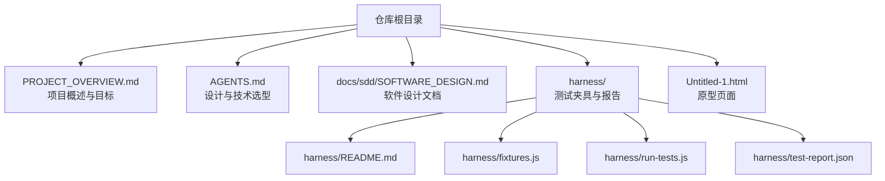
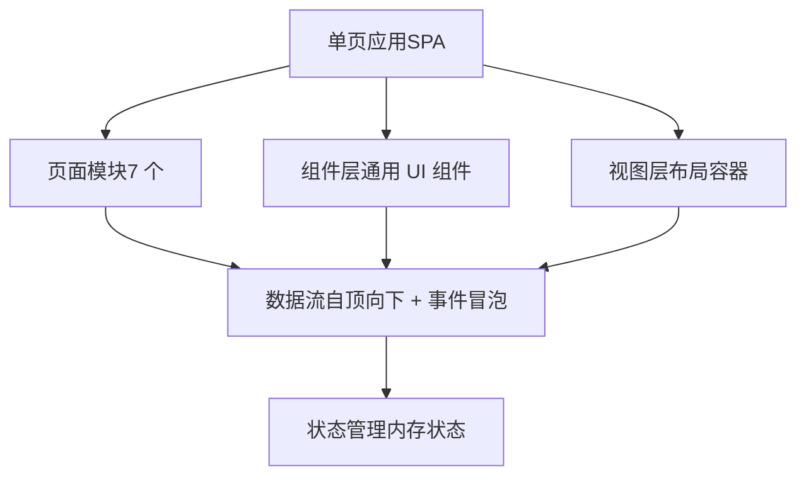
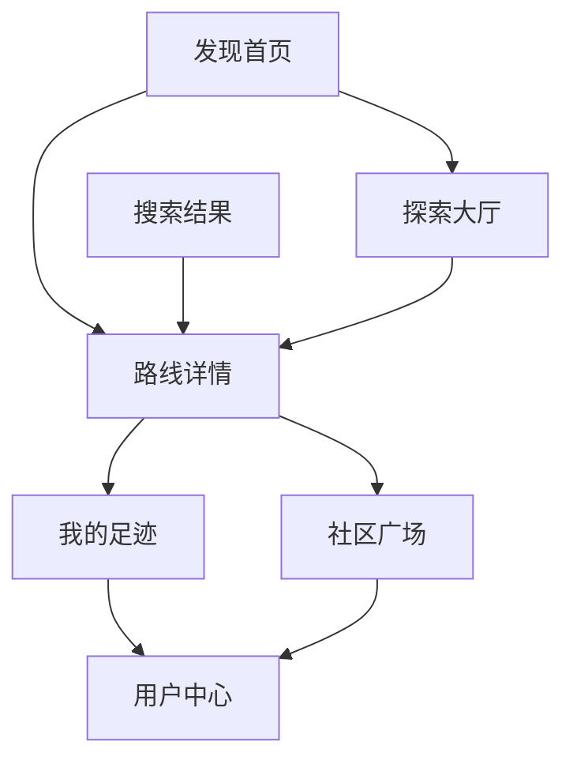
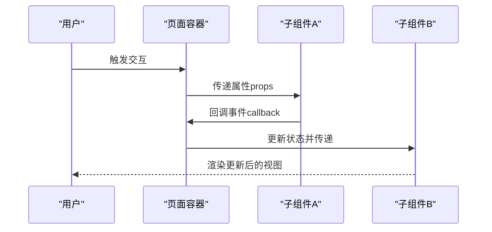
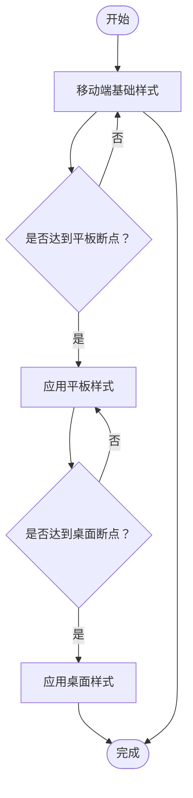
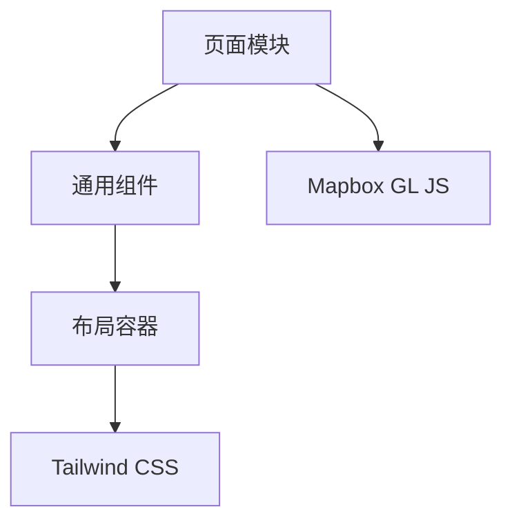

# 系统架构设计

<cite>
**本文引用的文件**
- [AGENTS.md](file://AGENTS.md)
- [PROJECT_OVERVIEW.md](file://PROJECT_OVERVIEW.md)
- [SOFTWARE_DESIGN.md](file://docs/sdd/SOFTWARE_DESIGN.md)
- [README.md](file://harness/README.md)
- [Untitled-1.html](file://Untitled-1.html)
</cite>

## 目录
1. [引言](#引言)
2. [项目结构](#项目结构)
3. [核心组件](#核心组件)
4. [架构总览](#架构总览)
5. [详细组件分析](#详细组件分析)
6. [依赖分析](#依赖分析)
7. [性能考量](#性能考量)
8. [故障排查指南](#故障排查指南)
9. [结论](#结论)
10. [附录](#附录)

## 引言
本项目为“城市漫步探索”应用的 UI 原型与设计说明文档集合，采用单页应用（SPA）与组件化设计思路，结合纯 HTML 与 Tailwind CSS 实现，覆盖 7 个页面模块，支持桌面端与移动端双端体验。系统以“移动优先”为核心设计原则，通过响应式断点策略与组件复用机制实现跨设备一致体验；同时强调模块划分清晰、职责单一、可扩展性强，便于后续引入前端框架或服务端渲染。

## 项目结构
仓库包含以下关键文档与原型文件：
- 顶层概述与目标：PROJECT_OVERVIEW.md
- 设计与技术选型：AGENTS.md
- 软件设计文档：docs/sdd/SOFTWARE_DESIGN.md
- 测试夹具与报告：harness/README.md、fixtures.js、run-tests.js、test-report.json
- 原型页面：Untitled-1.html

**图表来源**
- [PROJECT_OVERVIEW.md](file://PROJECT_OVERVIEW.md)
- [AGENTS.md](file://AGENTS.md)
- [SOFTWARE_DESIGN.md](file://docs/sdd/SOFTWARE_DESIGN.md)
- [README.md](file://harness/README.md)
- [Untitled-1.html](file://Untitled-1.html)

**章节来源**
- [PROJECT_OVERVIEW.md](file://PROJECT_OVERVIEW.md)
- [AGENTS.md](file://AGENTS.md)
- [SOFTWARE_DESIGN.md](file://docs/sdd/SOFTWARE_DESIGN.md)
- [README.md](file://harness/README.md)
- [Untitled-1.html](file://Untitled-1.html)

## 核心组件
基于现有文档，系统由以下核心组件构成：
- 页面层（7 个页面模块）
  - 发现首页（Discover Home）
  - 路线详情（Route Detail）
  - 我的足迹（My Footprints）
  - 社区广场（Community Square）
  - 用户中心（User Center）
  - 搜索结果（Search Results）
  - 探索大厅（Explore Hall）
- 组件层（通用 UI 组件）
  - 导航栏（Navigation Bar）
  - 底部标签栏（Bottom Tab Bar）
  - 卡片组件（Card）
  - 头像组件（Avatar）
  - 图标与按钮（Icon & Button）
  - 模态与对话框（Modal & Dialog）
- 视图层（视图容器与布局）
  - 全屏地图视图（Fullscreen Map View）
  - 推荐面板（Recommendation Panel）
  - 列表视图（List View）
  - 详情视图（Detail View）

这些组件遵循“移动优先”的设计原则，通过 Tailwind CSS 的响应式工具类实现断点适配，并以语义化 HTML 结构承载内容与交互。

**章节来源**
- [AGENTS.md](file://AGENTS.md)
- [PROJECT_OVERVIEW.md](file://PROJECT_OVERVIEW.md)
- [SOFTWARE_DESIGN.md](file://docs/sdd/SOFTWARE_DESIGN.md)
- [Untitled-1.html](file://Untitled-1.html)

## 架构总览
系统采用“单页应用 + 组件化设计”的整体架构模式，页面间通过 SPA 路由切换实现无刷新跳转；组件层通过可复用的 UI 组件与布局容器实现高内聚低耦合；数据流以“自顶向下传递 + 事件冒泡”的方式组织，状态管理以轻量级内存状态为主，避免复杂状态库带来的额外成本。

[此图为概念性架构示意，不直接映射具体源码文件，故无图表来源]

## 详细组件分析

### 页面模块与职责划分
- 发现首页（Discover Home）
  - 职责：展示精选路线、热门活动与探索入口，引导用户进入探索流程。
  - 关键交互：卡片点击、搜索入口、导航跳转。
- 路线详情（Route Detail）
  - 职责：呈现路线的完整信息、图片集、用户评价与操作按钮（收藏、分享、开始探索）。
  - 关键交互：图片轮播、评分与评论、底部操作面板。
- 我的足迹（My Footprints）
  - 职责：展示用户已探索的路线与成就，支持筛选与排序。
  - 关键交互：列表项点击、筛选器、导出与分享。
- 社区广场（Community Square）
  - 职责：聚合用户动态、话题讨论与热门分享，支持发帖与互动。
  - 关键交互：动态列表、点赞与评论、发布入口。
- 用户中心（User Center）
  - 职责：用户资料编辑、设置项、账户安全与偏好管理。
  - 关键交互：表单提交、头像上传、设置开关。
- 搜索结果（Search Results）
  - 职责：根据关键词返回路线、地点与用户的搜索结果，支持排序与筛选。
  - 关键交互：输入联想、结果列表、过滤器。
- 探索大厅（Explore Hall）
  - 职责：全屏地图探索 + 底部推荐面板，支持 POI 标注与导航。
  - 关键交互：地图缩放与平移、POI 点击、底部面板展开/收起。

**图表来源**
- [PROJECT_OVERVIEW.md](file://PROJECT_OVERVIEW.md)

**章节来源**
- [PROJECT_OVERVIEW.md](file://PROJECT_OVERVIEW.md)

### 组件交互模式与数据流向
- 组件交互模式
  - 父子组件通信：通过属性（props）向下传递数据，通过回调（callbacks）向上反馈事件。
  - 兄弟组件通信：通过共享父组件状态或事件总线进行协调。
  - 页面级通信：通过 SPA 路由参数与查询字符串传递上下文。
- 数据流向
  - 自顶向下：页面容器将状态与行为注入到子组件，保证数据一致性。
  - 事件冒泡：用户交互触发事件，逐层向上传递至页面容器处理，必要时回传给兄弟组件。
- 状态管理策略
  - 内存状态：以轻量级内存对象存储用户会话、临时表单与界面状态。
  - 本地持久化：对用户偏好与离线缓存使用浏览器存储（如 localStorage）。
  - 服务端同步：在需要时通过异步请求更新远端状态并刷新本地视图。

[此图为概念性交互示意，不直接映射具体源码文件，故无图表来源]

**章节来源**
- [SOFTWARE_DESIGN.md](file://docs/sdd/SOFTWARE_DESIGN.md)

### 响应式设计与断点策略
- 移动优先：以移动端断点为基础，逐步增强到平板与桌面端。
- 断点策略：采用 Tailwind CSS 的默认断点体系，配合语义化布局与弹性网格实现自适应。
- 交互优化：针对触摸设备优化按钮尺寸、点击区域与滚动体验；在桌面端提供键盘快捷键与悬停反馈。

[此图为概念性断点流程示意，不直接映射具体源码文件，故无图表来源]

**章节来源**
- [AGENTS.md](file://AGENTS.md)
- [SOFTWARE_DESIGN.md](file://docs/sdd/SOFTWARE_DESIGN.md)

### 系统边界与模块划分原则
- 系统边界
  - 前端边界：以 SPA 页面与组件为边界，负责视图渲染与用户交互。
  - 后端边界：通过 API 接口与服务端交互，当前原型阶段以静态数据与模拟接口为主。
- 模块划分原则
  - 单一职责：每个页面与组件聚焦于特定业务能力。
  - 可复用性：通用组件抽象为可复用模块，减少重复开发。
  - 可测试性：通过清晰的输入输出与事件接口，便于单元测试与集成测试。

**章节来源**
- [SOFTWARE_DESIGN.md](file://docs/sdd/SOFTWARE_DESIGN.md)

### 扩展性考虑
- 技术栈演进：当前为纯前端原型，未来可引入现代前端框架（如 React/Vue）与状态管理库（如 Zustand/Redux），以提升复杂度下的可维护性。
- 性能扩展：引入懒加载、代码分割与缓存策略，优化首屏加载与交互流畅度。
- 可访问性：完善语义化标记与键盘导航，满足无障碍访问要求。
- 国际化：预留多语言资源与文本提取机制，支持国际化扩展。

**章节来源**
- [SOFTWARE_DESIGN.md](file://docs/sdd/SOFTWARE_DESIGN.md)

## 依赖分析
- 组件耦合
  - 页面与组件：页面作为容器，依赖通用组件组合实现功能。
  - 组件与布局：通用组件依赖布局容器实现响应式排版。
- 外部依赖
  - 样式框架：Tailwind CSS 提供原子化样式与响应式工具类。
  - 地图集成：探索大厅页面集成地图服务（如 Mapbox GL JS），用于 POI 标注与导航。
- 潜在风险
  - 组件循环依赖：避免父子组件互相依赖导致的渲染死锁。
  - 状态分散：在复杂场景下，建议引入集中式状态管理降低耦合。

[此图为概念性依赖示意，不直接映射具体源码文件，故无图表来源]

**章节来源**
- [AGENTS.md](file://AGENTS.md)
- [PROJECT_OVERVIEW.md](file://PROJECT_OVERVIEW.md)

## 性能考量
- 渲染性能
  - 使用虚拟 DOM 或轻量级组件模型，减少不必要的重渲染。
  - 对长列表采用分页或虚拟滚动，降低一次性渲染压力。
- 网络性能
  - 图片懒加载与压缩，结合 CDN 加速静态资源。
  - API 请求合并与缓存策略，减少重复请求。
- 交互性能
  - 防抖与节流：对高频事件（如滚动、输入）进行节流处理。
  - 无阻塞主线程：将耗时任务拆分为微任务或 Web Worker。

[本节为通用性能指导，不直接分析具体文件，故无章节来源]

## 故障排查指南
- 测试夹具与报告
  - 使用测试运行脚本与夹具文件组织自动化测试，生成测试报告以便问题定位。
- 常见问题
  - 样式冲突：检查 Tailwind 工具类使用是否与组件样式冲突。
  - 交互异常：确认事件绑定与回调函数是否正确传递至父组件。
  - 地图初始化失败：检查地图服务密钥与网络环境，确保资源可访问。
- 调试建议
  - 使用浏览器开发者工具定位渲染与网络问题。
  - 对关键路径增加日志与错误边界，提升可观测性。

**章节来源**
- [README.md](file://harness/README.md)

## 结论
该系统以“移动优先”的设计理念与“单页应用 + 组件化设计”模式构建，通过清晰的页面模块划分与通用组件复用，实现了跨设备的一致体验。当前原型阶段以纯 HTML 与 Tailwind CSS 快速验证交互与视觉效果，后续可在保持架构稳定性的前提下引入现代前端技术栈，进一步提升可维护性与扩展性。

## 附录
- 原型页面参考：用于快速验证页面布局与交互逻辑。
- 设计与技术选型：明确技术决策与设计原则，指导后续开发。

**章节来源**
- [Untitled-1.html](file://Untitled-1.html)
- [AGENTS.md](file://AGENTS.md)