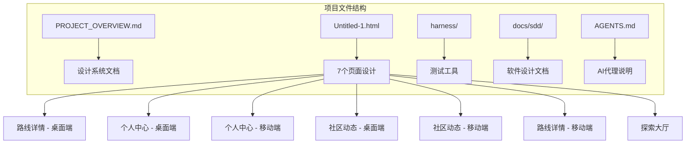
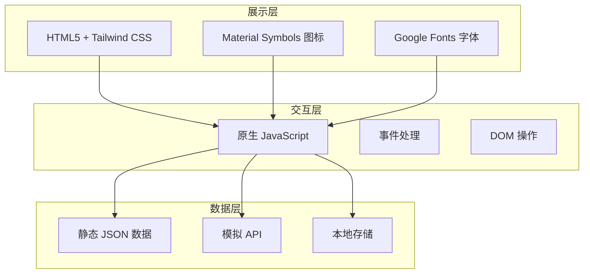
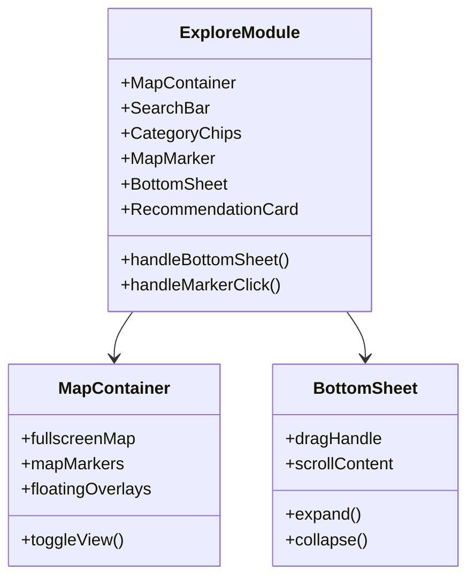
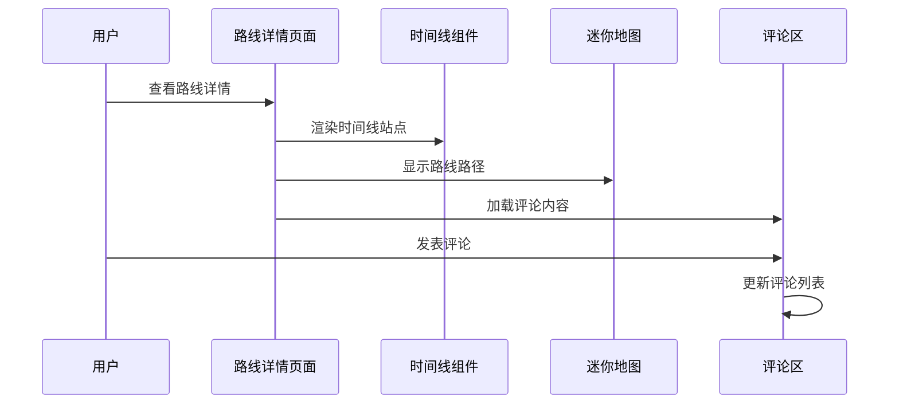
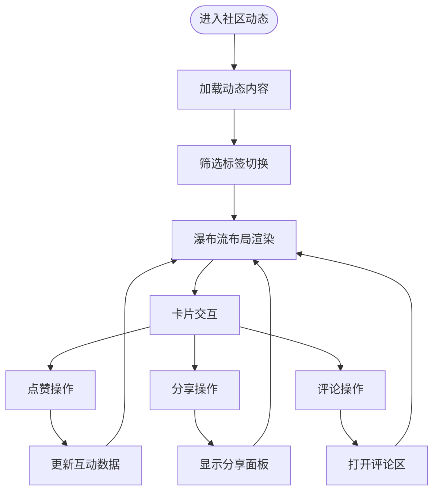
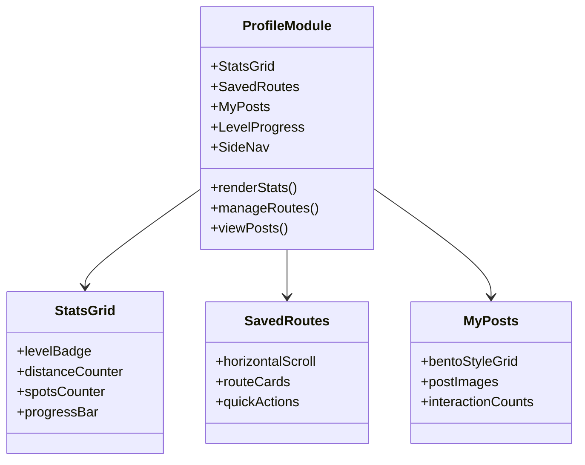
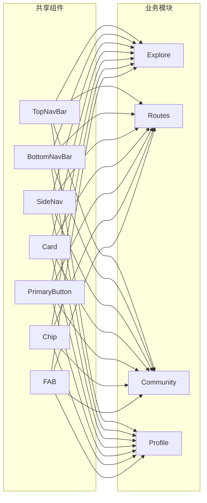
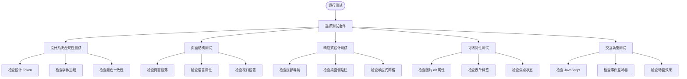

# 项目概览

<cite>
**本文档引用的文件**
- [PROJECT_OVERVIEW.md](file://PROJECT_OVERVIEW.md)
- [SOFTWARE_DESIGN.md](file://docs/sdd/SOFTWARE_DESIGN.md)
- [AGENTS.md](file://AGENTS.md)
- [Untitled-1.html](file://Untitled-1.html)
- [run-tests.js](file://harness/run-tests.js)
- [fixtures.js](file://harness/fixtures.js)
</cite>

## 目录
1. [项目简介](#项目简介)
2. [项目结构](#项目结构)
3. [核心组件](#核心组件)
4. [架构总览](#架构总览)
5. [详细组件分析](#详细组件分析)
6. [依赖关系分析](#依赖关系分析)
7. [性能考虑](#性能考虑)
8. [故障排除指南](#故障排除指南)
9. [结论](#结论)
10. [附录](#附录)

## 项目简介
CityPulse 是一款面向城市探索爱好者的移动优先 Web 应用，帮助用户发现、规划和分享城市漫步路线。应用融合了地图探索、社区互动和路线规划功能，让用户在繁忙的都市中找到独特的生活体验。

### 品牌定位
- **名称**: CityPulse（城市脉动）
- **风格**: Corporate Modern + Soft-Tech Twist
- **个性**: 乐观、可靠、连接者
- **目标用户**: 25-35 岁城市探索爱好者、社交连接者
- **核心价值**: 发现城市中的隐藏宝藏，规划个性化漫步路线，与社区分享体验

### 技术选型
项目采用 HTML5 + Tailwind CSS + 原生 JavaScript 的轻量级技术栈，实现快速原型开发和高效迭代。通过 CDN 方式引入 Tailwind CSS 和 Material Symbols，减少构建工具依赖，专注于设计系统和交互体验。

**章节来源**
- [PROJECT_OVERVIEW.md: 7-25:7-25](file://PROJECT_OVERVIEW.md#L7-L25)

## 项目结构
项目采用单一 HTML 文件包含所有页面的设计，通过多段 DOCTYPE 声明实现多页面结构。每个页面都包含完整的 HTML 结构、样式定义和 JavaScript 交互逻辑。

**图表来源**
- [Untitled-1.html: 1-2761:1-2761](file://Untitled-1.html#L1-L2761)
- [PROJECT_OVERVIEW.md: 155-224:155-224](file://PROJECT_OVERVIEW.md#L155-L224)

### 页面组织方式
项目将所有页面内容整合在一个 HTML 文件中，使用注释标记区分不同页面，便于维护和版本控制。每个页面都包含独立的样式定义和交互逻辑，确保页面间的隔离性。

**章节来源**
- [Untitled-1.html: 1-2761:1-2761](file://Untitled-1.html#L1-L2761)
- [AGENTS.md: 30-59:30-59](file://AGENTS.md#L30-L59)

## 核心组件
基于设计系统文档，项目包含四大核心模块：探索发现、路线规划、社区动态、个人中心。

### 模块职责
- **探索发现模块**: 全屏地图展示 + POI 推荐
- **路线规划模块**: 路线详情展示 + 时间线行程  
- **社区动态模块**: 社区内容信息流
- **个人中心模块**: 用户资料 + 路线管理 + 发布管理

### 组件清单
每个模块都包含特定的组件集合，如探索大厅包含 MapContainer、SearchBar、CategoryChips、MapMarker、BottomSheet、RecommendationCard 等组件。

**章节来源**
- [SOFTWARE_DESIGN.md: 63-161:63-161](file://docs/sdd/SOFTWARE_DESIGN.md#L63-L161)

## 架构总览
项目采用分层架构设计，从展示层到交互层再到数据层形成清晰的层次结构。

**图表来源**
- [SOFTWARE_DESIGN.md: 24-60:24-60](file://docs/sdd/SOFTWARE_DESIGN.md#L24-L60)

### 技术栈特点
- **展示层**: 使用 Tailwind CSS 实现原子化样式，支持响应式设计
- **交互层**: 原生 JavaScript 实现轻量级交互，避免复杂框架依赖
- **数据层**: 使用静态数据和模拟 API，便于原型开发和测试

**章节来源**
- [SOFTWARE_DESIGN.md: 24-60:24-60](file://docs/sdd/SOFTWARE_DESIGN.md#L24-L60)

## 详细组件分析

### 探索发现模块分析
探索大厅是应用的核心入口，提供全屏地图浏览和 POI 推荐功能。

**图表来源**
- [SOFTWARE_DESIGN.md: 65-95:65-95](file://docs/sdd/SOFTWARE_DESIGN.md#L65-L95)

#### 交互流程
探索大厅的核心交互包括底部面板的展开/收起、地图标记点击事件、分类筛选等功能。

**章节来源**
- [SOFTWARE_DESIGN.md: 79-95:79-95](file://docs/sdd/SOFTWARE_DESIGN.md#L79-L95)

### 路线规划模块分析
路线规划模块包含桌面端和移动端两种视图，提供详细的路线信息展示。

**图表来源**
- [SOFTWARE_DESIGN.md: 96-121:96-121](file://docs/sdd/SOFTWARE_DESIGN.md#L96-L121)

#### 数据流设计
路线数据通过多个组件进行传递和渲染，形成清晰的数据流向：Route Data → RouteHero → AuthorCard → TimelineStop[] → CommentSection → MiniMap → RelatedRoutes。

**章节来源**
- [SOFTWARE_DESIGN.md: 112-121:112-121](file://docs/sdd/SOFTWARE_DESIGN.md#L112-L121)

### 社区动态模块分析
社区动态模块提供瀑布流布局的信息流展示，支持多种内容类型的卡片。

**图表来源**
- [SOFTWARE_DESIGN.md: 122-145:122-145](file://docs/sdd/SOFTWARE_DESIGN.md#L122-L145)

#### 卡片类型规范
社区动态包含五种卡片类型，每种类型都有特定的颜色方案和图标标识，如精选路线、隐藏宝藏、拍照圣地、热门活动、建筑美学等。

**章节来源**
- [SOFTWARE_DESIGN.md: 137-145:137-145](file://docs/sdd/SOFTWARE_DESIGN.md#L137-L145)

### 个人中心模块分析
个人中心模块提供用户资料管理和内容展示功能。

**图表来源**
- [SOFTWARE_DESIGN.md: 146-161:146-161](file://docs/sdd/SOFTWARE_DESIGN.md#L146-L161)

**章节来源**
- [SOFTWARE_DESIGN.md: 146-161:146-161](file://docs/sdd/SOFTWARE_DESIGN.md#L146-L161)

## 依赖关系分析
项目采用松耦合的设计，各模块间通过清晰的接口进行交互。

**图表来源**
- [SOFTWARE_DESIGN.md: 163-224:163-224](file://docs/sdd/SOFTWARE_DESIGN.md#L163-L224)

### 组件复用策略
项目通过共享组件规范实现组件复用，包括导航组件、通用组件等，确保设计系统的一致性。

**章节来源**
- [SOFTWARE_DESIGN.md: 163-224:163-224](file://docs/sdd/SOFTWARE_DESIGN.md#L163-L224)

## 性能考虑
项目采用多项性能优化策略，确保在各种设备上的流畅体验。

### 响应式设计策略
- **断点策略**: Mobile (< 768px)、Tablet (768px-1024px)、Desktop (> 1024px)
- **容器宽度**: 最大内容宽度 1280px，移动端边距 16px，桌面端边距 32px
- **网格系统**: 桌面端路线详情使用 12 列网格，统计 Bento Grid 使用 4 列，社区瀑布流根据屏幕尺寸调整列数

### 动画与交互优化
- **微交互规范**: 按钮点击 scale(0.95)、卡片悬停增强阴影、图片悬停 scale(1.05)、页面滚动时间线揭示、底部面板 translateY 滑动、地图标记脉冲动画
- **CSS 动画**: 使用 @keyframes 实现脉冲效果，优化视觉反馈
- **滚动优化**: Intersection Observer 实现时间线站点的懒加载和动画触发

**章节来源**
- [SOFTWARE_DESIGN.md: 316-378:316-378](file://docs/sdd/SOFTWARE_DESIGN.md#L316-L378)

## 故障排除指南
项目提供了完善的测试工具和错误排查机制。

### 测试套件
项目包含五个测试套件，用于验证设计系统合规性、页面结构、响应式设计、可访问性和交互功能。

**图表来源**
- [run-tests.js: 86-338:86-338](file://harness/run-tests.js#L86-L338)

### 常见问题诊断
- **设计系统不合规**: 检查颜色、字体、间距 Token 是否正确应用
- **页面结构缺失**: 确认所有必需的页面段落都存在
- **响应式问题**: 验证移动端和桌面端的样式类使用
- **可访问性问题**: 确保所有交互元素都有适当的标签和焦点状态
- **交互功能异常**: 检查事件监听器和动画效果的实现

**章节来源**
- [run-tests.js: 86-338:86-338](file://harness/run-tests.js#L86-L338)

## 结论
CityPulse 项目展现了优秀的前端架构设计和用户体验理念。通过 HTML5 + Tailwind CSS + 原生 JavaScript 的技术组合，实现了轻量级但功能完备的城市漫步探索应用原型。

### 项目优势
- **技术简洁性**: 采用最小化技术栈，降低学习成本和维护复杂度
- **设计系统完整性**: 建立了完整的色彩体系、字体规范和间距系统
- **响应式设计**: 覆盖多端适配，提供一致的用户体验
- **测试驱动**: 完善的测试工具链确保代码质量

### 未来发展建议
- **框架迁移**: 从纯 HTML 迁移到 React/Vue + Vite，提升开发效率
- **地图集成**: 接入高德/Google Maps API 实现真实地图功能
- **后端服务**: 构建 Node.js + Express API + PostgreSQL 的完整后端
- **用户认证**: 实现 JWT/OAuth2.0 社交登录系统
- **实时功能**: 集成 WebSocket 实现实时评论和通知
- **PWA 支持**: 添加 Service Worker 实现离线缓存功能

## 附录

### 快速开始指南
1. **环境要求**
   - 现代浏览器（Chrome、Firefox、Safari、Edge）
   - 稳定的网络连接
   - 支持 JavaScript 的设备

2. **基本使用**
   - 直接打开 `Untitled-1.html` 文件即可使用
   - 支持移动端触摸操作
   - 所有功能均为前端实现，无需服务器

3. **开发约定**
   - 所有页面使用 `lang="zh-CN"` 中文语言标记
   - 使用 Tailwind CDN 而非构建工具
   - 颜色必须使用设计 Token（不用硬编码色值）
   - 标题字体: Plus Jakarta Sans，正文字体: Inter
   - 图标: Material Symbols Outlined
   - 移动端优先，使用 `md:` 前缀做桌面端适配

**章节来源**
- [AGENTS.md: 52-59:52-59](file://AGENTS.md#L52-L59)

### 数据模型概览
项目定义了四个核心数据模型：Route（路线）、RouteStop（路线站点）、UserProfile（用户）、Post（社区动态）、POI（兴趣点），每个模型都有明确的字段定义和类型约束。

**章节来源**
- [SOFTWARE_DESIGN.md: 226-312:226-312](file://docs/sdd/SOFTWARE_DESIGN.md#L226-L312)