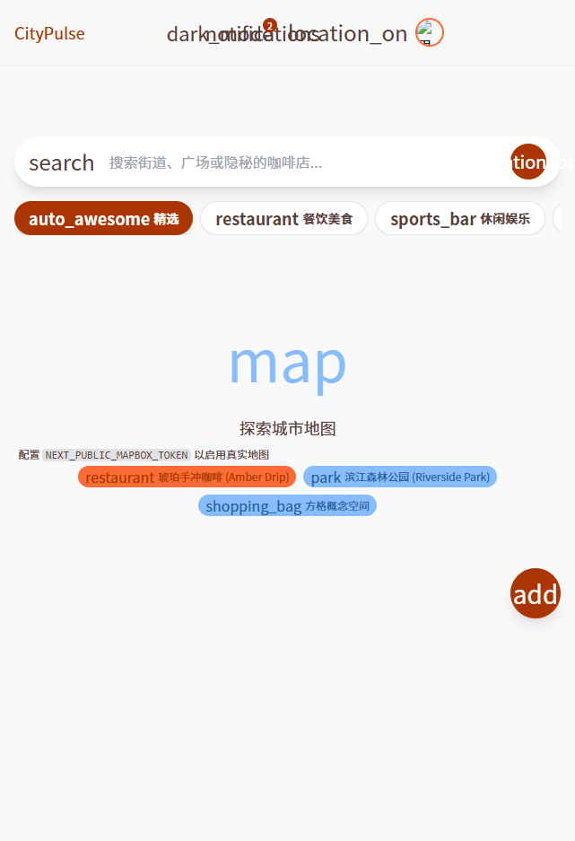
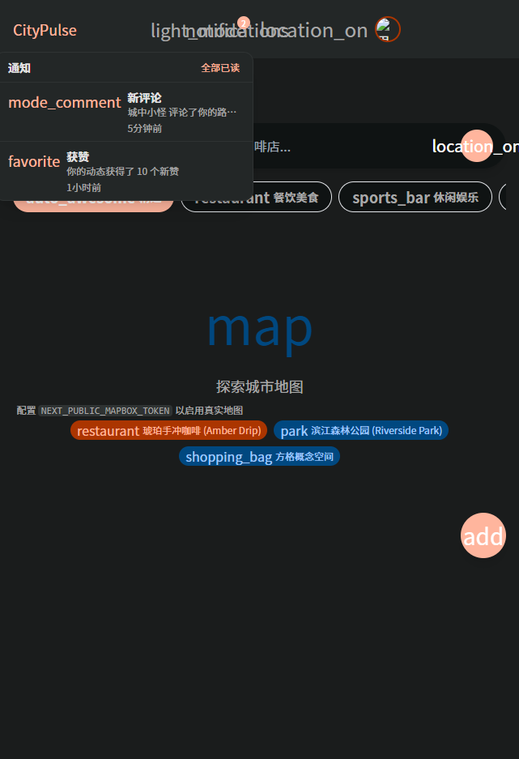

<div align="center">

# 🧭 CityPulse · 城市脉动

**发现城市中的隐藏宝藏，规划个性化漫步路线，与社区分享体验。**

一款面向城市探索爱好者的移动优先 Web 应用，融合地图探索、路线规划与社区互动。

[](https://github.com/Haotianhanyue/CityPulse/actions/workflows/ci.yml)


</div>

<table>
  <tr>
    <td align="center"><br><sub>亮色模式</sub></td>
    <td align="center"><br><sub>暗色模式</sub></td>
  </tr>
</table>

---

## ✨ 功能特性

- 🗺️ **探索大厅** — 全屏 Mapbox 地图 + 脉冲 POI 标记 + 可拖拽底部面板；定位、地点搜索（Geocoding）、按距离排序
- 🛣️ **路线规划** — 路线列表/筛选/搜索、时间线行程详情、步行导航（Directions）
- 👥 **社区动态** — 瀑布流 Feed + 无限滚动（`useInfiniteQuery` + IntersectionObserver）+ 实时在线人数
- 👤 **个人中心** — 等级进度、Bento 统计、保存路线与发布内容
- ❤️ **人性化交互** — Toast 轻提示、乐观点赞/收藏、评论、关注、回到顶部、骨架/空/错三态
- 🔐 **认证** — NextAuth（GitHub / Google OAuth + 开发用 Credentials）+ JWT + 中间件守卫
- 📲 **PWA** — Service Worker 离线缓存 + 离线兜底页 + 安装到主屏 + Web Push + 相机拍照 + Web Share
- 🌗 **暗色模式** — next-themes + CSS 变量整体切换，组件无需 `dark:` 变体
- ⚡ **性能** — mapbox-gl 懒加载，首页首屏 JS 仅 ~140 kB

> 所有外部服务（Mapbox / Redis / Meilisearch / Cloudinary / Web Push / OAuth）均采用
> **「配置即启用、未配置则优雅降级」**，因此**零配置即可完整运行**。

## 🛠 技术栈

| 层次 | 技术 |
|------|------|
| 框架 | Next.js 14（App Router）· React 18 · TypeScript 5 |
| 样式 / 动画 | Tailwind CSS · Framer Motion · Material Symbols |
| 状态 | Zustand（UI 状态）· TanStack Query（服务端状态）|
| 数据 | Prisma · PostgreSQL + PostGIS（开发可零配置回退 mock）|
| 地图 | Mapbox GL JS · Directions / Geocoding API |
| 认证 | NextAuth.js（OAuth + JWT）|
| 实时 | Socket.IO（通知 / 在线状态）|
| 测试 | Vitest（单元）· Playwright（E2E 冒烟）|

## 🚀 快速开始

### 方式一：零配置（仅浏览，读路径回退 mock）

```bash
npm install
npm run dev          # http://localhost:3000
```

### 方式二：完整功能（含登录 / 写操作 / 真实数据库）

```bash
npm install
docker compose up -d         # 启动 PostgreSQL + PostGIS
npm run db:generate          # 生成 Prisma Client
npm run db:migrate           # 应用迁移（首次创建 PostGIS 扩展）
npm run db:seed              # 用示例数据填库
npm run dev
```

按需配置 `.env`（复制 `.env.example`）以启用地图等外部服务。

## ⚙️ 环境变量

| 变量 | 用途 | 未配置时 |
|------|------|----------|
| `DATABASE_URL` | PostgreSQL 连接串 | 读路径回退 mock，写操作不可用 |
| `NEXT_PUBLIC_MAPBOX_TOKEN` | 地图 / Directions / Geocoding | 地图占位、搜索/导航提示 |
| `NEXT_PUBLIC_MAPBOX_STYLE` | 自定义地图样式（可选） | 默认 light-v11 |
| `GITHUB_* / GOOGLE_*` | OAuth 登录 | 仅保留开发用 Credentials |
| `UPSTASH_REDIS_REST_URL/TOKEN` | Redis 缓存 | 进程内内存缓存 |
| `MEILI_HOST / MEILI_API_KEY` | Meilisearch 搜索 | 仓储层本地过滤 |
| `CLOUDINARY_CLOUD_NAME/UPLOAD_PRESET` | 图片上传 | `/api/upload` 返回 501 |
| `NEXT_PUBLIC_VAPID_PUBLIC_KEY` + `VAPID_PRIVATE_KEY` | Web Push | 「开启推送」提示未配置 |

## 🏗 架构

### 数据流（五层读路径）

服务端状态统一走 TanStack Query；读路径恒为五层，仓储层在数据库不可用时回退 mock：

```
Prisma → repository → normalize → API route → api-client → hook → 页面
  src/lib/db.ts   src/lib/repository.ts   src/lib/normalize.ts
                  src/app/api/*           src/lib/api-client.ts   src/hooks/*
```

- 服务端组件可直接 `await getX()`（如路线详情）；客户端页面用 Query hook。
- 返回结构始终为 `src/types` 展示模型（`Paginated<T>` / `Collection<T>`）。

### 目录结构

```
src/
├── app/                  # App Router 路由 + API Route Handlers
├── components/           # UI 组件（ui/ 基础组件 · layout/ 导航 · 业务组件）
├── hooks/                # TanStack Query hooks
├── lib/                  # 数据/服务层
│   ├── repository.ts     #   读路径 + mock 回退
│   ├── normalize.ts      #   Prisma 行 → 展示模型
│   ├── api-client.ts     #   浏览器 fetch 封装
│   ├── cache.ts          #   缓存（内存 / Upstash）
│   ├── search.ts         #   搜索（Meilisearch / 本地）
│   ├── mapbox.ts geo.ts  #   地图 / 空间计算
│   ├── push.ts share.ts  #   Web Push / Web Share
│   └── cloudinary.ts     #   图片上传
├── store/                # Zustand（UI 状态 + 乐观交互）
├── data/mock.ts          # mock 数据（同时作为回退源）
└── types/                # TypeScript 类型
prisma/                   # schema + seed
scripts/                  # 占位资源生成等脚本
e2e/                      # Playwright 冒烟测试
.claude/                  # Claude Code agents & skills
docs/                     # SDD / 部署文档
```

## 🧪 测试

```bash
npm run test         # Vitest 监听模式
npm run test:run     # Vitest 跑一次（CI 用）
npm run test:e2e     # Playwright E2E（对生产构建跑冒烟用例）
```

- **单元（Vitest）**：距离计算、时间格式化、归一化映射、**仓储层 mock 回退**、推送提示。
- **E2E（Playwright）**：探索/社区/路线/详情/认证守卫 5 场景 × 桌面+移动双端。

## 📦 常用脚本

| 命令 | 说明 |
|------|------|
| `npm run dev` / `build` / `start` | 开发 / 构建 / 生产 |
| `npm run typecheck` | `tsc --noEmit` 类型检查 |
| `npm run lint` | ESLint（next/core-web-vitals）|
| `npm run test:run` / `test:e2e` | 单元 / E2E 测试 |
| `npm run gen:placeholders` | 由品牌色合成占位图片资源 |
| `npm run db:migrate` / `db:deploy` | 迁移（开发 / 生产） |
| `npm run db:seed` / `db:reset` | 填充 / 重置数据 |
| `npm run db:studio` | Prisma Studio |

## 🚢 部署

一键推公网：仓库含 `vercel.json`（`prisma generate && next build`），导入 Vercel + 配好
`DATABASE_URL`/`NEXTAUTH_*` 即可得到 `https://<项目>.vercel.app`。

详见 **[docs/DEPLOYMENT.md](docs/DEPLOYMENT.md)**：Vercel 部署、本地 Docker 起步、生产迁移、PostGIS 升级路径、外部服务配置。

CI（[.github/workflows/ci.yml](.github/workflows/ci.yml)）在每次 push / PR 执行：
**Typecheck → Test → Build**，在真实 PostgreSQL + PostGIS 服务上校验 schema 与 seed，并跑 Playwright E2E 冒烟。

## 🤖 AI 资产（Claude Code）

`.claude/` 下提供与本仓库架构对齐的 agents 与 skills：

- **Agents**：`citypulse-frontend`（前端）· `citypulse-api`（后端）· `citypulse-reviewer`（审查）
- **Skills**：`/citypulse-ui` · `/citypulse-page` · `/citypulse-api` · `/citypulse-data`（五层读路径配方）

## 📱 微信小程序

`miniprogram/` 是用 **Taro (React + TypeScript)** 编写的微信小程序版本，复用同一套类型、
设计 Token 与 `/api/*` 数据契约（含 mock 回退），地图改用小程序原生 `<map>`。

```bash
cd miniprogram && npm install && npm run dev:weapp
# 然后用「微信开发者工具」导入 miniprogram/ 目录预览
```

详见 [miniprogram/README.md](miniprogram/README.md)。

## 📚 文档

- [PROJECT_OVERVIEW.md](PROJECT_OVERVIEW.md) — 项目简介、技术选型、设计系统、实现状态
- [docs/sdd/SOFTWARE_DESIGN.md](docs/sdd/SOFTWARE_DESIGN.md) — 软件设计文档
- [AGENTS.md](AGENTS.md) — AI 协作约定与编码规范
